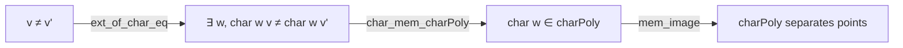

### Technical Brief: `BoundedContinuousFunctionChar.lean`

---

#### **1. Key Definitions & Theorems**

| Name | Type / Signature | Purpose |
|------|------------------|---------|
| `char` | `char (he : Continuous e) (hL : Continuous (p : V × W ↦ L p.1 p.2)) (w : W) : V →ᵇ ℂ` | Defines a bounded continuous function $v \mapsto e(L(v, w))$, where $e$ is a continuous additive character and $L$ is a continuous bilinear map. |
| `char_apply` | `char he hL w v = e (L v w)` | Simplifies application of `char`. |
| `char_zero_eq_one` | `char he hL 0 = 1` | Shows that `char` at zero is the constant function 1. |
| `char_add_eq_mul` | `char he hL (x + y) = char he hL x * char he hL y` | `char` turns addition in $W$ into multiplication in $(V →ᵇ ℂ)$. |
| `char_neg` | `char he hL (-w) = star (char he hL w)` | Compatibility with involution (`star`). |
| `ext_of_char_eq` | `(e ≠ 1) → (∀ v ≠ 0, L v ≠ 0) → (∀ w, char w v = char w v') → v = v'` | Separation of points: if all `char w` agree on $v, v'$, then $v = v'$, under non-degeneracy assumptions. |
| `charMonoidHom` | `Multiplicative W →* (V →ᵇ ℂ)` | Monoid homomorphism induced by `char`. |
| `charAlgHom` | `AddMonoidAlgebra ℂ W →ₐ[ℂ] (V →ᵇ ℂ)` | Algebra homomorphism extending `charMonoidHom`. |
| `charAlgHom_apply` | `charAlgHom w v = ∑ a ∈ w.support, w a * e(L v a)` | Explicit formula for algebra homomorphism on finite sums. |
| `star_mem_range_charAlgHom` | `x ∈ range charAlgHom → star x ∈ range charAlgHom` | Range of `charAlgHom` is closed under `star`. |
| `charPoly` | `StarSubalgebra ℂ (V →ᵇ ℂ)` | Star-subalgebra generated by `char he hL w` for $w : W$. |
| `mem_charPoly` | Characterization of membership in `charPoly` via finite sums. |
| `char_mem_charPoly` | `char he hL w ∈ charPoly he hL` | Each `char w` lies in the star-subalgebra. |
| `separatesPoints_charPoly` | Under non-degeneracy, `charPoly` separates points in $V$. | |

---

#### **2. Naming Conventions**

- **Prefixes**:
  - `char_`: for functions and constructions built from `char`.
  - `star_`: for properties involving the `star` involution (e.g., `star_mem_`, `Circle.star_addChar`).
- **Suffixes**:
  - `_apply`: for lemmas simplifying application of a definition.
  - `_eq_`: for equalities (e.g., `char_add_eq_mul`, `char_zero_eq_one`).
  - `_mem_`: for membership lemmas (e.g., `star_mem_range_`, `char_mem_charPoly`).
- **Functional suffixes**:
  - `_hom`: for monoid/algebra homomorphisms (`charMonoidHom`, `charAlgHom`).
  - `_poly`: for star-subalgebra constructions (`charPoly`).

---

#### **3. Tactic Stack**

Frequently used tactics in proofs:
- `simp` / `simp only`: for rewriting using lemmas and simplifying expressions.
- `ext`: extensionality for functions.
- `rw`: rewriting with equalities.
- `refine`: constructing proofs with holes to be filled later.
- `calc`: calculational proofs for inequalities/equalities.
- `grind`: for automated solving of linear arithmetic in `AddChar`/`Circle` context.
- `contrapose!`: for contrapositive reasoning.
- `obtain ⟨…⟩`: destructing existential or conjunction hypotheses.
- `let … := …`: local definitions.
- `rw [← …]`: rewriting backwards to match target form.

---

#### **4. Proof Logic**

- **Structure of proofs**:
  - Most proofs follow a pattern: *unfold → simplify → apply known lemmas → conclude*.
  - `ext_of_char_eq` uses **contrapositive reasoning**: assume $v \ne v'$, construct $w$ and $a$ such that `char w (a • v) ≠ char w (a • v')`.
  - `star_mem_range_charAlgHom` constructs preimage under `charAlgHom` using `Finsupp.mapRange`, `embDomain`, and symmetry via $w \mapsto -w$.
  - `separatesPoints_charPoly` reduces to `ext_of_char_eq` and uses image characterization of `charPoly`.

- **Induction / recursion**: Not used directly; relies on algebraic properties of `AddMonoidAlgebra` and `Finsupp`.

- **Key logical flow**:
  1. Define `char` as bounded continuous function.
  2. Show algebraic properties (monoid, star).
  3. Lift to algebra homomorphism.
  4. Prove closure under `star`.
  5. Define `charPoly` as star-subalgebra.
  6. Prove separation of points.

---

#### **5. Imports**

| Module | Purpose |
|--------|---------|
| `Mathlib.Algebra.MonoidAlgebra.Basic` | For `AddMonoidAlgebra`, `lift`, `Finsupp`, etc. |
| `Mathlib.Analysis.Complex.Circle` | For `Circle.exp`, `AddChar`, `Circle.star_addChar`, etc. |
| `Mathlib.Analysis.InnerProductSpace.Basic` | For topological vector space structure (though not inner product-specific here). |
| `Mathlib.Topology.ContinuousMap.Bounded.Star` | For `BoundedContinuousFunction`, `star`, `toContinuousMapStarₐ`. |

---

#### **6. Mermaid Diagrams**

##### **Dependency Graph (Module Level)**

```mermaid
graph TD
  BoundedContinuousFunctionChar --> MonoidAlgebra
  BoundedContinuousFunctionChar --> Circle
  BoundedContinuousFunctionChar --> InnerProductSpace
  BoundedContinuousFunctionChar --> BoundedContinuousMapStar

  MonoidAlgebra -->["Finsupp, AddMonoidAlgebra"]
  Circle -->["AddChar, Circle.exp"]
  BoundedContinuousMapStar -->["BoundedContinuousFunction, star"]
```

##### **Overview of Theory Flow**

```mermaid
graph LR
  A[Continuous AddChar e] --> B[char w v = e(L v w)]
  C[Continuous Bilinear L] --> B
  B --> D[char : W → V →ᵇ ℂ]
  D --> E[charMonoidHom : W →* V →ᵇ ℂ]
  E --> F[charAlgHom : AddMonoidAlgebra ℂ W →ₐ V →ᵇ ℂ]
  F --> G[charPoly : StarSubalgebra ℂ (V →ᵇ ℂ)]
  G --> H[Separates Points]
  D --> I[star-closed range]
  I --> G
```

##### **Separation of Points Logic**



---

#### **7. Summary**

This module formalizes the construction of **characteristic functions** in the context of bounded continuous functions, generalizing the classical Fourier-analytic notion. It builds from:
- a continuous additive character $e : \mathbb{R} \to \mathbb{S}^1$,
- a continuous bilinear map $L : V \times W \to \mathbb{R}$,

to define:
- a family of bounded continuous functions `char w`,
- a monoid/algebra homomorphism into `V →ᵇ ℂ`,
- a star-subalgebra `charPoly` generated by these functions,
- and proves key properties: closure under `star`, separation of points.

This is foundational for harmonic analysis on topological vector spaces and measure-theoretic characteristic functions (e.g., in probability on locally convex spaces).
