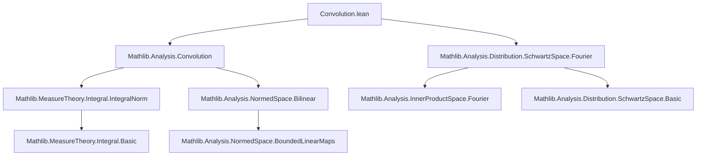

### Technical Brief: Fourier Transform of Convolution in Lean 4

---

#### **1. Key Definitions & Theorems**

| Name | Type / Signature | Purpose |
|------|------------------|---------|
| `SchwartzMap.convolution` | `𝕜 →ₗ[𝕜] 𝓢(E, F₁) →ₗ[𝕜] 𝓢(E, F₂) →L[𝕜] 𝓢(E, F₃)` | Defines convolution on Schwartz maps via Fourier transform: `fourierInv ∘ pairing ∘ (𝓕 ⊗ 𝓕)` |
| `Real.fourier_bilin_convolution_eq_integral` | `𝓕 (f₁ ⋆[B] f₂) ξ = ∫ y, ∫ x, 𝐞 (-inner (y + x) ξ) • B (f₁ x) (f₂ y)` | Expresses Fourier transform of convolution as a symmetric double integral |
| `Real.fourier_bilin_convolution_eq` | `𝓕 (f₁ ⋆[B] f₂) ξ = B (𝓕 f₁ ξ) (𝓕 f₂ ξ)` | Main theorem: Fourier transform turns convolution into bilinear pairing of Fourier transforms |
| `Real.fourier_smul_convolution_eq` | `𝓕 (f₁ ⋆[lsmul ℂ ℂ] f₂) ξ = (𝓕 f₁ ξ) • (𝓕 f₂ ξ)` | Scalar multiplication variant (ℂ-valued convolution) |
| `Real.fourier_mul_convolution_eq` | `𝓕 (f₁ ⋆[mul ℂ R] f₂) ξ = (𝓕 f₁ ξ) * (𝓕 f₂ ξ)` | Multiplication variant in a normed ring `R` |
| `SchwartzMap.fourier_convolution` | `𝓕 (convolution B f g) = pairing B (𝓕 f) (𝓕 g)` | Fourier transform of Schwartz convolution equals pairing of Fourier transforms |
| `SchwartzMap.convolution_apply` | `convolution B f g x = (f ⋆[B] g) x` | Shows Schwartz convolution coincides with classical function convolution |

---

#### **2. Naming Conventions**

- **Prefixes**:
  - `fourier_`: Relates to Fourier transform properties (`fourier_bilin_convolution_eq`, `fourier_convolution`, etc.)
  - `convolution_`: Pertains to convolution definitions or properties (`convolution`, `convolution_apply`, `convolution_flip`, `convolution_continuous_left`)
  - `integrable_`: Used for integrability lemmas (`integrable_prod_sub`)
- **Suffixes**:
  - `_eq`: Theorems stating equality (e.g., `fourier_bilin_convolution_eq`)
  - `_integral`: When the expression involves integrals (`fourier_bilin_convolution_eq_integral`)
  - `_left` / `_right`: Continuity/associativity in arguments (`convolution_continuous_left`)
- **Bilinear variants**:
  - `B.flip`: Flip argument order in bilinear maps
  - `pairing B`: Bilinear pairing induced by `B`

---

#### **3. Tactic Stack**

Frequently used tactics in this file:

| Tactic | Usage |
|--------|-------|
| `rw` / `congr` / `ext` | Rewriting definitions, extensionality, and equality proofs |
| `simp_rw` / `simp` | Simplification with rewrite rules, especially for `smul`, `integral`, and `inner` |
| `grw` | Goal-directed rewriting (from `Mathlib.Tactic.Grw`) |
| `filter_upwards` | Measurability and a.e. arguments |
| `convert` / `congr 1` | Matching goals up to definitional equality |
| `rfl` | Reflexivity for definitional equalities |
| `grind` | Automatic solving of simple arithmetic/linear algebra goals |
| `measurability` | Proving measurability of functions/sets |
| `integral_integral_swap` | Swapping order of integration (Fubini/Tonelli) |
| `integral_sub_right_eq_self` | Change of variables in integrals |
| `integral_congr_ae` | Equality up to almost everywhere |

---

#### **4. Proof Logic**

The logical flow follows a standard pattern for Fourier-analytic convolution identities:

1. **Integrability & Continuity Setup**  
   Prove integrability of the convolution integrand using `integrable_prod_sub`, relying on continuity and integrability of inputs.

2. **Symmetrization via Fubini**  
   Use `integral_integral_swap` to rewrite the Fourier integral in symmetric form (swap `x` and `y`), enabling decomposition.

3. **Exponential Decomposition**  
   Apply identity:  
   $$
   \exp(-i\langle y+x, \xi\rangle) = \exp(-i\langle y,\xi\rangle) \cdot \exp(-i\langle x,\xi\rangle)
   $$
   to factor the kernel.

4. **Linearity & Pulling Scalars Out of Integrals**  
   Use `map_smul`, `integral_smul`, and bilinearity of `B` to separate integrals.

5. **Factorization into Fourier Transforms**  
   Recognize each integral as the Fourier transform of one function, yielding:
   $$
   \mathcal{F}(f_1 \star_B f_2)(\xi) = B(\mathcal{F}f_1(\xi), \mathcal{F}f_2(\xi))
   $$

6. **Extension to Schwartz Functions**  
   Define convolution on Schwartz maps via Fourier transform (since Schwartz space is stable under `𝓕`), then verify consistency with classical convolution using `fourierInv_fourier_eq` and integrability estimates.

7. **Continuity & Smoothness**  
   Use `fourierInvCLM`, `fourierCLM`, and continuity of bilinear maps to ensure Schwartz space closure.

---

#### **5. Imports & Dependencies**

| Module | Role |
|--------|------|
| `Mathlib.Analysis.Convolution` | Core convolution theory, bilinear convolutions `⋆[B]`, flip, continuity lemmas |
| `Mathlib.Analysis.Distribution.SchwartzSpace.Fourier` | Fourier transform on Schwartz space (`𝓕`, `𝓕⁻`, `fourierCLM`, `fourierInvCLM`, `pairing`) |
| `Mathlib.MeasureTheory.Integral.IntegralNorm` | Integrability and norm estimates (used in `integrable_prod_sub`) |
| `Mathlib.Analysis.InnerProductSpace.Basic` | Properties of inner product spaces, especially `inner_add_left`, `inner_sub_left` |
| `Mathlib.Analysis.NormedSpace.Bilinear` | Bounded bilinear maps (`→L[𝕜] →L[𝕜]`), operator norms, `le_opNorm₂` |
| `Mathlib.Analysis.SpecialFunctions.Exp` | Exponential character `𝐞`, additive characters, `AddChar.map_add_eq_mul` |

---

#### **6. Mermaid Diagrams**

##### **Dependency Graph (Module-Level)**



##### **Overview of Theoretical Flow**

```mermaid
flowchart LR
  A[Classical Convolution f₁ ⋆[B] f₂] -->|Fourier Transform| B[𝓕(f₁ ⋆[B] f₂)]
  C[Fourier Transforms 𝓕f₁, 𝓕f₂] -->|Bilinear Pairing B| D[B(𝓕f₁, 𝓕f₂)]
  B <-->|Main Theorem| D
  E[Schwartz Maps 𝓢(E, F)] -->|Define via Fourier| F[Schwartz Convolution]
  F -->|Consistency Check| A
  G[Integrability & Continuity] -->|Fubini, Change of Variables| B
```

---

#### **7. Summary**

This file formalizes the **Fourier transform of convolution** in two settings:

- **Classical functions** (`Real.fourier_bilin_convolution_eq`):  
  $$
  \mathcal{F}(f_1 \star_B f_2) = B \circ (\mathcal{F}f_1 \times \mathcal{F}f_2)
  $$
  with variants for scalar multiplication and ring multiplication.

- **Schwartz maps** (`SchwartzMap.convolution` & `SchwartzMap.fourier_convolution`):  
  Defines convolution intrinsically on Schwartz space using Fourier transform, then proves it matches the classical definition (`convolution_apply`).

The proofs rely heavily on:
- Fubini/Tonelli for integral swaps,
- Change of variables in integrals,
- Bilinearity and continuity of `B`,
- Stability of Schwartz space under Fourier transform.

This is foundational for harmonic analysis on Euclidean spaces and underpins Plancherel, Parseval, and uncertainty principles.
