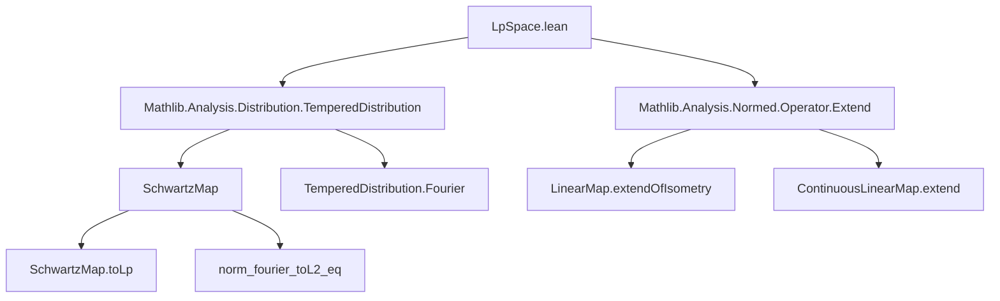
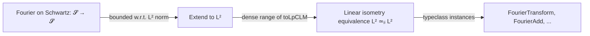

### Technical Brief: `LpSpace.lean`

---

#### **1. Key Definitions & Theorems**

| Name | Type / Signature | Purpose |
|------|------------------|---------|
| `fourierTransformₗᵢ` | `(Lp (α := E) F 2) ≃ₗᵢ[ℂ] (Lp (α := E) F 2)` | Defines the Fourier transform on $L^2(E, F)$ as a **linear isometry equivalence** over $\mathbb{C}$. Constructed via extension of the Schwartz-space Fourier transform. |
| `instFourierTransform` | `FourierTransform (Lp (α := E) F 2) (Lp (α := E) F 2)` | Installs the Fourier transform as a typeclass instance. |
| `instFourierAdd`, `instFourierSMul`, `instContinuousFourier`, etc. | Various `Fourier*` typeclasses | Encode algebraic and topological compatibility of the Fourier transform (additivity, scalar multiplication, continuity). |
| `norm_fourier_eq` | `∀ f, ‖𝓕 f‖ = ‖f‖` | **Plancherel’s theorem**: Fourier transform preserves $L^2$-norm. |
| `inner_fourier_eq` | `∀ f g, ⟪𝓕 f, 𝓕 g⟫ = ⟪f, g⟫` | Fourier transform preserves inner product (unitarity). |
| `SchwartzMap.toLp_fourier_eq` | `𝓕 (f.toLp 2) = (𝓕 f).toLp 2` | Shows agreement of Fourier transforms on Schwartz functions when viewed in $L^2$. |
| `SchwartzMap.toLp_fourierInv_eq` | `𝓕⁻ (f.toLp 2) = (𝓕⁻ f).toLp 2` | Same for inverse Fourier transform. |
| `fourier_toTemperedDistribution_eq` | `𝓕 (f : 𝓢'(E, F)) = (𝓕 f : Lp (α := E) F 2)` | Shows that the tempered distribution Fourier transform and $L^2$ Fourier transform coincide on $L^2$. |
| `fourierInv_toTemperedDistribution_eq` | `𝓕⁻ (f : 𝓢'(E, F)) = (𝓕⁻ f : Lp (α := E) F 2)` | Same for inverse transform. |

---

#### **2. Naming Conventions**

- **Prefixes**:
  - `fourier*`: Fourier transform-related definitions (`fourierTransformₗᵢ`, `fourier_toTemperedDistribution_eq`, `fourierInv_*`).
  - `inst*`: Typeclass instances (`instFourierTransform`, `instFourierAdd`, etc.).
  - `toLp*`: Embedding of functions into $L^p$ spaces (`toLp_fourier_eq`, `toLpCLM`).
  - `norm_*`, `inner_*`: Norm/inner product properties.

- **Suffixes**:
  - `ₗᵢ`: Linear isometry equivalence (`fourierTransformₗᵢ`).
  - `CLM`: Continuous linear maps (`toLpCLM`, `fourierCLM`, `toTemperedDistributionCLM`).
  - `Inv`: Inverse operations (`fourierInv`, `fourierInv_add`, `fourierInvSMul`, etc.).

---

#### **3. Tactic Stack**

- **Core tactics**:
  - `apply LinearMap.extendOfNorm_eq` — used to extend maps from dense subspaces (e.g., Schwartz functions) to $L^2$.
  - `rw [one_mul]`, `simp`, `convert`, `congr`, `exact`, `apply`, `intro`, `set`.
  - `apply isClosed_eq` — used in density arguments (closedness of equalizer).
  - `apply DenseRange.induction_on` — standard for proving properties on $L^p$ by density of Schwartz functions.

- **No heavy automation** (e.g., `aesop`, `ring`, `norm_num`) — proofs are mostly structural and rely on functional-analytic lemmas.

---

#### **4. Proof Logic**

- **General strategy**:
  1. **Define** the Fourier transform on $L^2$ by extending the Schwartz-space Fourier transform using `extendOfIsometry`.
  2. **Verify** algebraic/analytic properties (linearity, continuity, isometry) via properties of the extension.
  3. **Prove agreement** on dense subspaces (e.g., Schwartz functions) using:
     - `extendOfNorm_eq` (for norm-preserving extensions),
     - `DenseRange.induction_on` (for properties defined on $L^2$).
  4. **Lift** identities from Schwartz space to $L^2$ and tempered distributions using continuity and density.

- **Induction pattern**:
  - For theorems about $L^2$ functions: `DenseRange.induction_on` over `SchwartzMap.denseRange_toLpCLM`.
  - For equalities of continuous maps: `apply isClosed_eq` + continuity.

---

#### **5. Imports & Dependencies**

| Import | Role |
|--------|------|
| `Mathlib.Analysis.Distribution.TemperedDistribution` | Tempered distributions, Fourier transform on $\mathcal{S}'$, continuity, duality. |
| `Mathlib.Analysis.Normed.Operator.Extend` | Tools for extending bounded linear maps from dense subspaces (`extendOfIsometry`, `extendOfNorm_eq`). |

**Key supporting theories** (used via `open`):
- `SchwartzMap`: Schwartz functions and their $L^p$-embeddings.
- `FourierTransform`: Fourier transform on Schwartz space and distributions.
- `ComplexInnerProductSpace`: Inner product structure on $L^2$.

---

#### **6. Mermaid Diagrams**

##### **Dependency Graph (Module-Level)**



##### **Overview of Theoretical Flow**

```mermaid
flowchart LR
  S[Schwartz Space 𝓢(E, F)] -->|Fourier transform| S
  S -->|toLp 2| L2[L²(E, F)]
  L2 -->|extendOfIsometry| L2
  S -->|toTemperedDistribution| SD[Schwartz Distributions 𝓢']
  SD -->|Fourier on 𝓢'| SD
  L2 -->|toTemperedDistribution| SD
  L2 <-->|Plancherel| L2
  SD <-->|agree on L²| L2
```

##### **Structure of `fourierTransformₗᵢ` Construction**



---

#### **7. Summary**

This file constructs the **Fourier transform on $L^2(E, F)$** as a **unitary operator**, leveraging:
- The Fourier transform on Schwartz functions,
- Density of Schwartz functions in $L^2$,
- Extension of bounded linear maps.

It then verifies that this operator:
- Respects algebraic structure (addition, scalar multiplication),
- Is continuous,
- Coincides with the Fourier transform on tempered distributions when restricted to $L^2$.

The formalization is typical of modern functional analysis in Lean: structural, modular, and heavily reliant on typeclasses and density arguments.

--- 

*End of Technical Brief.*
