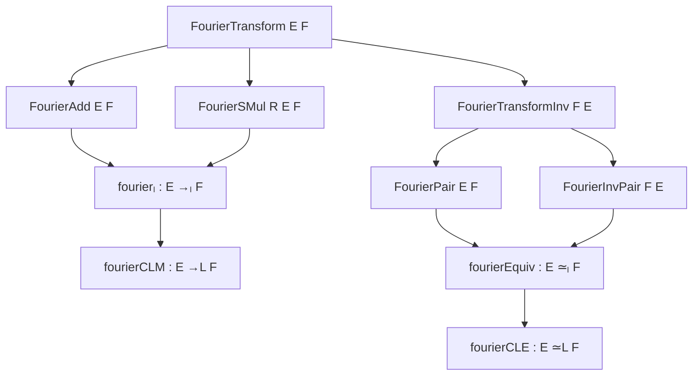

### Technical Brief: `Notation.lean` — Fourier Transform Type Classes in Lean 4

---

#### **1. Key Definitions & Theorems**

| Name | Type | Purpose |
|------|------|---------|
| `FourierTransform E F` | `Type u → Type v → Type*` | Type class for the *Fourier transform* notation `𝓕 : E → F`. |
| `FourierTransformInv E F` | `Type u → Type v → Type*` | Type class for the *inverse Fourier transform* notation `𝓕⁻ : E → F`. |
| `FourierAdd E F` | `[Add E] [Add F] [FourierTransform E F] → Prop` | Ensures `𝓕` preserves addition: `𝓕(f + g) = 𝓕 f + 𝓕 g`. |
| `FourierSMul R E F` | `[SMul R E] [SMul R F] [FourierTransform E F] → Prop` | Ensures `𝓕` preserves scalar multiplication: `𝓕(r • f) = r • 𝓕 f`. |
| `ContinuousFourier E F` | `[TopologicalSpace E] [TopologicalSpace F] [FourierTransform E F] → Prop` | Ensures `𝓕` is continuous. |
| `FourierInvAdd E F` | `[Add E] [Add F] [FourierTransformInv E F] → Prop` | Ensures `𝓕⁻` preserves addition. |
| `FourierInvSMul R E F` | `[SMul R E] [SMul R F] [FourierTransformInv E F] → Prop` | Ensures `𝓕⁻` preserves scalar multiplication. |
| `ContinuousFourierInv E F` | `[TopologicalSpace E] [TopologicalSpace F] [FourierTransformInv E F] → Prop` | Ensures `𝓕⁻` is continuous. |
| `FourierModule R E F` *(deprecated)* | `structure` | Deprecated alias for `FourierAdd` + `FourierSMul`. |
| `FourierInvModule R E F` *(deprecated)* | `structure` | Deprecated alias for `FourierInvAdd` + `FourierInvSMul`. |
| `FourierPair E F` | `[FourierTransform E F] [FourierTransformInv F E] → Prop` | Encodes left-inverse law: `𝓕⁻ ∘ 𝓕 = id`. |
| `FourierInvPair E F` | `[FourierTransform F E] [FourierTransformInv E F] → Prop` | Encodes right-inverse law: `𝓕 ∘ 𝓕⁻ = id`. |
| `fourierₗ R E F` | `E →ₗ[R] F` | Fourier transform as a linear map (requires `FourierAdd` + `FourierSMul`). |
| `fourierCLM R E F` | `E →L[R] F` | Fourier transform as a *continuous* linear map (adds `ContinuousFourier`). |
| `fourierInvₗ R E F` | `E →ₗ[R] F` | Inverse Fourier transform as a linear map. |
| `fourierInvCLM R E F` | `E →L[R] F` | Inverse Fourier transform as a continuous linear map. |
| `fourierEquiv R E F` | `E ≃ₗ[R] F` | Fourier transform as a *linear equivalence* (requires `FourierPair` + `FourierInvPair`). |
| `fourierCLE R E F` | `E ≃L[R] F` | Fourier transform as a *continuous linear equivalence*. |

**Theorems (simplified):**
- `fourier_zero`, `fourier_neg`, `fourier_sum`: `𝓕` preserves 0, negation, and finite sums.
- `fourierInv_zero`, `fourierInv_neg`, `fourierInv_sum`: Same for `𝓕⁻`.
- `fourierEquiv_apply`, `fourierEquiv_symm_apply`: `fourierEquiv` acts as `𝓕`, inverse as `𝓕⁻`.
- `fourierCLE_apply`, `fourierCLE_symm_apply`: Same for continuous linear equivalence.

---

#### **2. Naming Conventions**

- **Prefixes:**
  - `fourier` / `fourierInv`: Core transform/inverse.
  - `fourierₗ`, `fourierCLM`, `fourierInvₗ`, `fourierInvCLM`: Linear / continuous-linear variants.
  - `fourierEquiv`, `fourierCLE`: Equivalence / continuous-linear equivalence variants.
- **Suffixes:**
  - `_add`, `_smul`: Additivity / homogeneity properties.
  - `_pair`, `_inv_pair`: Inversion laws.
  - `_clm`, `_equiv`: Continuous-linear map / equivalence.
- **Notation:**
  - `𝓕` ↔ `fourier`
  - `𝓕⁻` ↔ `fourierInv`
  - Scoped under `FourierTransform` namespace.

---

#### **3. Tactic Stack**

- **`simp`**: Used for `fourier_add`, `fourier_smul`, etc., via `attribute [simp]`.
- **`fun_prop`**: For continuity goals (`continuous_fourier`, `continuous_fourierInv`).
- **`rfl`**: In `@[simp]` lemmas for definitions like `fourierₗ_apply`.
- **`map_zero`, `map_neg`, `map_sum`**: From `AddMonoidHom` to derive properties of `𝓕`/`𝓕⁻`.
- **`AddMonoidHom.mk'`**: Used to construct additive monoid homomorphisms from `fourier_add`.

No heavy automation (e.g., `aesop`, `ring`, `linarith`) appears—proofs rely on algebraic structure and `simp`.

---

#### **4. Proof Logic**

- **Structure-driven**: Proofs follow from type-class assumptions (e.g., `FourierAdd` ⇒ `𝓕` is additive ⇒ `𝓕 0 = 0`).
- **Standard pattern**:
  1. Use `fourier_add` to get additivity.
  2. Construct `AddMonoidHom.mk' 𝓕 fourier_add`.
  3. Apply generic lemmas (`map_zero`, `map_neg`, `map_sum`) from `AddMonoidHom`.
- **Equivalence proofs** (`fourierEquiv`, `fourierCLE`):
  - Use `fourierInv_fourier_eq` and `fourier_fourierInv_eq` to verify left/right inverses.
  - Continuity added via `continuous_fourier` / `continuous_fourierInv`.

---

#### **5. Imports & Dependencies**

| Import | Purpose |
|--------|---------|
| `Mathlib.Algebra.Module.Equiv.Defs` | Linear equivalences (`≃ₗ`) and definitions. |
| `Mathlib.Algebra.BigOperators.Group.Finset.Defs` | Finite sums (`∑ i ∈ s, _`) and `map_sum`. |
| `Mathlib.Topology.Algebra.Module.Equiv` | Continuous linear equivalences (`≃L`) and continuity. |

**Core dependencies**: Module theory, additive group theory, topology, big operators.

---

#### **6. Mermaid Diagrams**

##### **Dependency Graph (Module Scope)**



##### **Overview of File Structure**

```mermaid
flowchart LR
  subgraph Notation
    FT[FourierTransform]
    FTI[FourierTransformInv]
    Notation[notation: 𝓕, 𝓕⁻]
  end

  subgraph Linearity
    Add[FourierAdd]
    SMul[FourierSMul]
    InvAdd[FourierInvAdd]
    InvSMul[FourierInvSMul]
  end

  subgraph Topology
    Cont[ContinuousFourier]
    ContInv[ContinuousFourierInv]
  end

  subgraph Equivalence
    Pair[FourierPair]
    InvPair[FourierInvPair]
  end

  subgraph Constructions
    L[fourierₗ]
    CLM[fourierCLM]
    LEquiv[fourierEquiv]
    CLE[fourierCLE]
  end

  FT --> Add
  FT --> SMul
  FTI --> InvAdd
  FTI --> InvSMul
  FT --> Cont
  FTI --> ContInv
  Add & SMul --> L
  L --> CLM
  Cont --> CLM
  Pair & InvPair --> LEquiv
  LEquiv --> CLE
```

---

#### **7. Summary**

This file establishes a **modular, extensible type-class hierarchy** for the Fourier transform in Lean, separating:
- **Notation** (`𝓕`, `𝓕⁻`)
- **Algebraic structure** (additivity, homogeneity)
- **Topological structure** (continuity)
- **Inversion properties** (`𝓕⁻ ∘ 𝓕 = id`, etc.)

It enables reuse across contexts (e.g., integrable functions, tempered distributions) by deferring concrete semantics to type-class instances. The design avoids coupling notation with algebraic structure, improving inference reliability.

--- 

*End of Technical Brief.*
