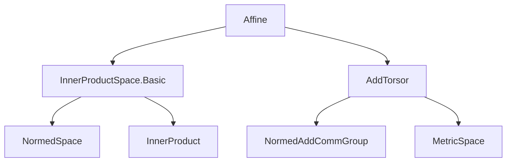
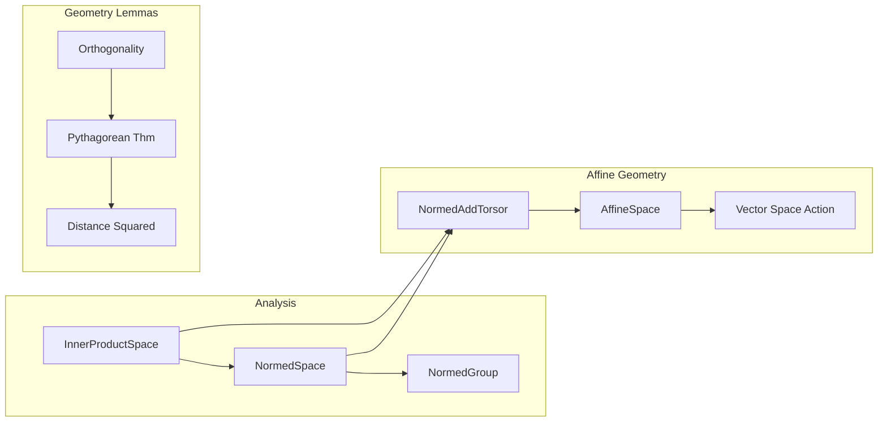

### Technical Brief: `Affine.lean`

---

#### **1. Key Definitions & Theorems**

| Name | Type / Signature | Purpose |
|------|------------------|---------|
| `inner_vsub_left_eq_zero_symm` | `⟪a -ᵥ b, v⟫ = 0 ↔ ⟪b -ᵥ a, v⟫ = 0` | Symmetry of orthogonality in first argument of inner product w.r.t. `vsub`. |
| `inner_vsub_right_eq_zero_symm` | `⟪v, a -ᵥ b⟫ = 0 ↔ ⟪v, b -ᵥ a⟫ = 0` | Symmetry of orthogonality in second argument of inner product w.r.t. `vsub`. |
| `inner_vsub_vsub_left_eq_dist_sq_left_iff` | `⟪a -ᵥ b, a -ᵥ c⟫ = dist a b² ↔ ⟪a -ᵥ b, b -ᵥ c⟫ = 0` | Relates inner product of two `vsub`s sharing left point to orthogonality condition; left argument of inner product is fixed. |
| `inner_vsub_vsub_left_eq_dist_sq_right_iff` | `⟪a -ᵥ b, a -ᵥ c⟫ = dist a c² ↔ ⟪c -ᵥ b, a -ᵥ c⟫ = 0` | Same as above but with right argument fixed; uses `real_inner_comm`. |
| `inner_vsub_vsub_right_eq_dist_sq_left_iff` | `⟪a -ᵥ c, b -ᵥ c⟫ = dist a c² ↔ ⟪a -ᵥ c, b -ᵥ a⟫ = 0` | Orthogonality condition when right argument of both `vsub`s is fixed. |
| `inner_vsub_vsub_right_eq_dist_sq_right_iff` | `⟪a -ᵥ c, b -ᵥ c⟫ = dist b c² ↔ ⟪a -ᵥ b, b -ᵥ c⟫ = 0` | Analogous to previous, with right argument fixed in inner product. |
| `dist_sq_lineMap_lineMap_of_inner_eq_zero` | `dist (lineMap a b t₁) (lineMap a c t₂)² = t₁²·dist a b² + t₂²·dist a c²` | Squared distance between two points on lines from common origin `a`, assuming `b-a ⊥ c-a`. |
| `dist_sq_lineMap_of_inner_eq_zero` | `dist p (lineMap a b t)² = dist p a² + t²·dist a b²` | Squared distance from point `p` to a point on line `a→b`, assuming `p-a ⊥ b-a`. |
| `dist_sq_of_inner_eq_zero` | `dist p b² = dist p a² + dist a b²` | **Pythagorean theorem** in affine setting: orthogonality of `p-a` and `b-a` implies squared distances satisfy Pythagoras. |

---

#### **2. Naming Conventions**

- **Prefixes**:
  - `inner_vsub_...`: Indicates inner product involving vector differences (`vsub`).
  - `dist_sq_...`: Refers to squared distances.
- **Structure**:
  - `left`/`right`: Indicates which argument of `vsub` is shared or preserved.
    - E.g., `left_eq_dist_sq_left` means: first `vsub` argument (`a -ᵥ b`) is shared, and the equality is with `dist a b²`.
  - `inner_eq_zero_symm`: Symmetry of orthogonality under reversing `vsub`.
- **Suffixes**:
  - `_iff`: The theorem is an if-and-only-if statement.
  - `_of_inner_eq_zero`: Assumes orthogonality (`⟪..., ...⟫ = 0`) as hypothesis.

---

#### **3. Tactic Stack**

- `rw`: Used extensively to rewrite using definitions (`dist_eq_norm_vsub`, `vsub_sub_vsub_cancel_left/right`, etc.).
- `simp only [...]`: Simplifies using specific lemmas, often after `rw`.
- `simpa using ...`: Simplifies goal using a given hypothesis.
- `have h := ...; rwa [...] at h`: Derives intermediate result and rewrites it into desired form.
- `ring`, `aesop`: Not present — proofs are mostly algebraic rewrites and simplifications.

---

#### **4. Proof Logic**

- **Pattern**: Most proofs follow a structured rewrite chain:
  1. Expand `dist` as `norm_vsub`.
  2. Apply known inner-product identities (`inner_neg_left/right`, `inner_smul_left/right`, `real_inner_comm`).
  3. Use cancellation lemmas for `vsub` (`vsub_sub_vsub_cancel_left/right`).
  4. Apply symmetry of orthogonality (`inner_vsub_*_eq_zero_symm`).
  5. Simplify using `simp only` with target expressions.

- **Induction**: Not used.
- **Cases**: Not used.
- **Core reasoning**: Algebraic manipulation of inner products and norms, leveraging torsor and inner product space structure.

---

#### **5. Imports**

- `Mathlib.Analysis.InnerProductSpace.Basic`: Core inner product space theory.
- `Mathlib.Analysis.Normed.Group.AddTorsor`: Theory of torsors over normed additive groups — essential for `vsub` and `lineMap`.

---

#### **6. Domain-Specific Theory Overview**

This file formalizes **normed affine spaces over real inner product spaces**, focusing on geometric relationships between points and vectors via the `vsub` operation (`P → P → V`) and inner products.

Key concepts:
- **Affine points** (`P`) and **tangent vectors** (`V`).
- **Orthogonality** (`⟪v, w⟫ = 0`) as central geometric condition.
- **Pythagorean theorem** and **distance decomposition** along orthogonal directions.
- **Line maps** (`AffineMap.lineMap`) used to parametrize affine lines.

---

#### **7. Mermaid Diagrams**

##### **Dependency Graph (Module-Level)**

##### **Overview of File Structure**

##### **Theoretical Context**

--- 

Let me know if you'd like a formal dependency graph for `AffineMap.lineMap`, or a proof sketch for any specific theorem.
