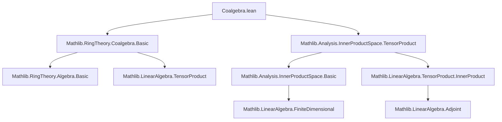
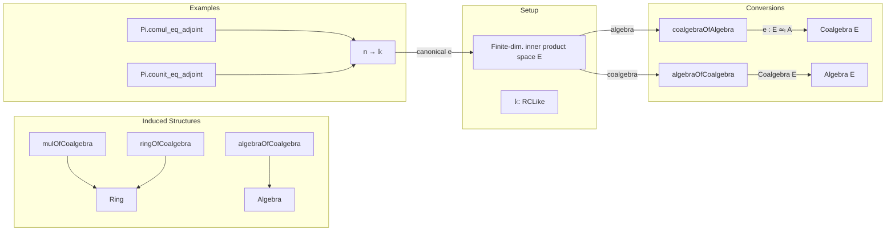

**Technical Brief: Coalgebra.lean**

---

### 1. KEY DEFINITIONS & THEOREMS

| Name | Type / Signature | Purpose |
|------|------------------|---------|
| `coalgebraOfAlgebra` | `E ≃ₗ[𝕜] A → Coalgebra 𝕜 E` | Constructs a coalgebra structure on a finite-dimensional inner product space `E` from an algebra structure on `E` (via linear equivalence `e`), using adjoints of multiplication and algebra map. |
| `mulOfCoalgebra` | `Mul E` | Defines multiplication on `E` from a coalgebra structure: $x * y = \mathrm{adjoint}(\Delta)(x \otimes y)$. |
| `ringOfCoalgebra` | `Ring E` | Lifts `mulOfCoalgebra` to a ring structure, with unit $1 = \mathrm{adjoint}(\varepsilon)(1)$. |
| `algebraOfCoalgebra` | `Algebra 𝕜 E` | Promotes `ringOfCoalgebra` to an algebra structure over `𝕜`, with `algebraMap = adjoint(counit)`. |
| `Pi.comul_eq_adjoint` | `comul = ...` | Identifies comultiplication on `n → 𝕜` (Euclidean space) as the adjoint of multiplication under the canonical equivalence `equiv n 𝕜`. |
| `Pi.counit_eq_adjoint` | `counit = ...` | Identifies counit on `n → 𝕜` as the adjoint of the algebra map under `equiv n 𝕜`. |

---

### 2. NAMING CONVENTIONS

- **Prefixes**:
  - `coalgebraOfAlgebra`, `algebraOfCoalgebra`: indicate *conversion* between algebra/coalgebra structures.
  - `mulOfCoalgebra`, `ringOfCoalgebra`: indicate *induced* algebraic structure from coalgebra.
- **Suffixes**:
  - `_def`: definition lemmas (e.g., `AlgebraOfCoalgebra.mul_def`).
  - `_eq_adjoint`: theorem states equality with an adjoint construction.
- **Module-level**:
  - `adjoint`, `comul`, `counit`, `mul'`, `algebraMap`, `innerₛₗ`: standard coalgebra/inner product notation.
- **Linear maps**:
  - `map`, `lTensor`, `rTensor`, `toLinearMap`, `symm.toLinearMap`: tensor and linear map operations.

---

### 3. TACTIC STACK

Frequent tactics used:

| Tactic | Usage |
|--------|-------|
| `ext` | Extensionality for functions/maps. |
| `simp` / `simp_rw` | Simplification using definitions, adjoint properties, tensor identities. |
| `congr 1` | Congruence to reduce goal to equality of arguments. |
| `rw` / `apply` | Rewriting using adjoint/tensor/coalgebra axioms. |
| `exact` / `rfl` | Trivial proofs (e.g., definitional equalities). |
| `dsimp` | Definitional simplification (especially for `OfNat.ofNat`). |
| `ring` (implicit via `simp` + ring axioms) | For ring-theoretic simplifications (e.g., distributivity, associativity). |

---

### 4. PROOF LOGIC

**General proof strategy**:

- **Adjoint-based constructions**: All constructions rely on finite-dimensionality to identify linear maps with their adjoints via the inner product.
- **Tensor calculus**: Proofs heavily use identities like:
  - $ \mathrm{adjoint}(f \circ g) = \mathrm{adjoint}(g) \circ \mathrm{adjoint}(f) $
  - $ \mathrm{adjoint}(f \otimes g) = \mathrm{adjoint}(f) \otimes \mathrm{adjoint}(g) $
  - $ \langle x \otimes y, \Delta(z) \rangle = \langle x \otimes y, \mathrm{adjoint}(\mu)(z) \rangle = \langle \mu(x \otimes y), z \rangle $
- **Structure verification**:
  - **Coassociativity** (`coassoc`) and **counit laws** (`rTensor_counit_comp_comul`, `lTensor_counit_comp_comul`) are proven by rewriting via adjoint properties and tensor associativity/units.
  - **Ring/algebra laws** (`mul_assoc`, `one_mul`, etc.) are proven by unfolding definitions and applying coalgebra axioms (`coassoc`, `rTensor_counit_comp_comul`, `lTensor_counit_comp_comul`) under adjoints.

**Typical flow**:
1. Unfold definitions (`mul_def`, `algebraMap`, etc.).
2. Rewrite using tensor adjoint identities (`adjoint_comp`, `adjoint_rTensor`, etc.).
3. Apply coalgebra axioms (e.g., `coassoc_symm`, `rTensor_counit_comp_comul`).
4. Simplify using linear equivalence properties (`toLinearEquiv_*`, `symm_symm`).
5. Conclude via `simp` or `rfl`.

---

### 5. IMPORTS

| Import | Role |
|--------|------|
| `Mathlib.Analysis.InnerProductSpace.TensorProduct` | Tensor product of inner product spaces, `⊗ₜ`, `map`, `lTensor`, `rTensor`, adjoints. |
| `Mathlib.RingTheory.Coalgebra.Basic` | Basic coalgebra theory: `Coalgebra`, `comul`, `counit`, `mul'`, `Algebra.linearMap`, etc. |

---

### 6. DEPENDENCY & THEORY OVERVIEW

#### Mermaid Diagram: Theory Dependencies

#### Mermaid Diagram: File Overview

---

### 7. DOMAIN & APPLICATIONS

- **Domain**: Finite-dimensional inner product spaces over `RCLike 𝕜` (e.g., `ℝ`, `ℂ`), with algebra/coalgebra structures.
- **Key application**: Non-commutative graph theory, where a C*-algebra with a faithful positive functional yields an inner product, and one wants the coalgebra structure to be the *adjoint* of the algebra structure.
- **Relevance**: Enables dualization of algebraic constructions (e.g., comultiplication as adjoint of multiplication) in a Hilbert-space setting.

---

### 8. NOTES

- **Redefinability**: Both `coalgebraOfAlgebra` and `algebraOfCoalgebra` are marked `noncomputable abbrev`, and use `[reducible non-instances]` to avoid instance search loops.
- **Notational conventions**:
  - `innerₛₗ 𝕜 v` denotes the linear functional $w \mapsto \langle v, w \rangle$.
  - `mul' 𝕜 A` is the multiplication map $A \otimes A \to A$.
  - `equiv n 𝕜` is the canonical equivalence `n → 𝕜 ≃ₗ[𝕜] 𝕜ⁿ`.

--- 

Let me know if you'd like a formalized summary in Lean or a diagram export (e.g., SVG/PNG).
