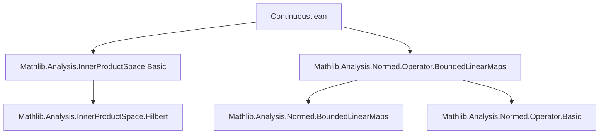
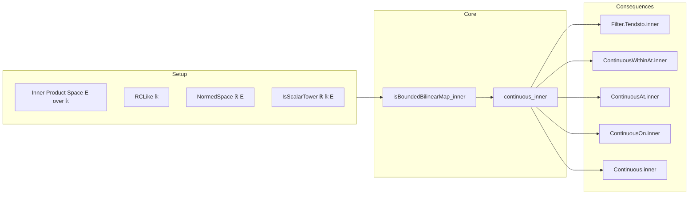
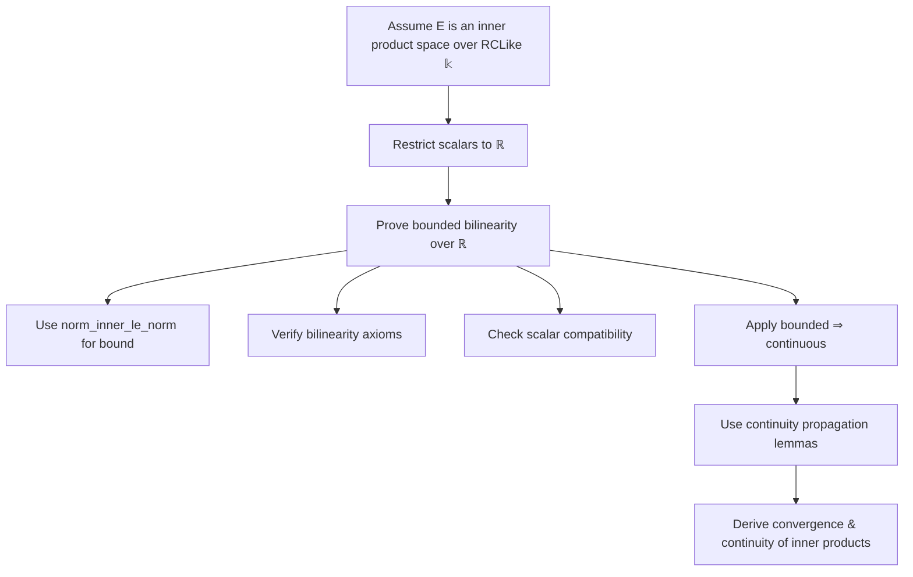

### Technical Brief: `Continuous.lean` — Continuity of the Inner Product in Inner Product Spaces

---

#### **1. Key Definitions & Theorems**

| Name | Type / Signature | Purpose |
|------|------------------|---------|
| `isBoundedBilinearMap_inner` | `IsBoundedBilinearMap ℝ fun p : E × E => ⟪p.1, p.2⟫` | Shows that the inner product, viewed as a real-bilinear map, is bounded (hence continuous over ℝ). Requires `NormedSpace ℝ E` and `IsScalarTower ℝ 𝕜 E`. |
| `continuous_inner` | `Continuous fun p : E × E => ⟪p.1, p.2⟫` | Concludes continuity of the inner product as a map $E \times E \to 𝕜$ (topologized via the underlying real structure). Derived from `isBoundedBilinearMap_inner.continuous`. |
| `Filter.Tendsto.inner` | `Tendsto f l (𝓝 x) → Tendsto g l (𝓝 y) → Tendsto (fun t ↦ ⟪f t, g t⟫) l (𝓝 ⟪x, y⟫)` | Propagates convergence through the inner product: if $f(t) \to x$ and $g(t) \to y$, then $\langle f(t), g(t) \rangle \to \langle x, y \rangle$. |
| `ContinuousWithinAt.inner`, `ContinuousAt.inner`, `ContinuousOn.inner`, `Continuous.inner` | Various continuity properties of $t \mapsto \langle f(t), g(t) \rangle$ | Propagate continuity of $f, g$ to their inner product under local/global continuity notions. Marked with `@[fun_prop]` and `@[continuity]` for automation. |

---

#### **2. Naming Conventions**

- **Prefixes**:
  - `isBoundedBilinearMap_`: Indicates a bounded bilinear map structure.
  - `continuous_`: Indicates a continuity result.
  - `Filter.Tendsto.inner`, `ContinuousAt.inner`, etc.: Pattern `_[property].inner` for lifting properties through inner product.

- **Suffixes**:
  - `_left`, `_right`: Used in proofs for left/right bilinearity (e.g., `inner_add_left`, `inner_smul_real_right`).

- **Notation**:
  - `⟪x, y⟫` is defined as `inner 𝕜 x y`.

---

#### **3. Tactic Stack**

Frequently used tactics in proofs:

| Tactic | Usage |
|--------|-------|
| `simp only [...]` | Simplifies using algebraic identities (e.g., `algebraMap_smul`, `inner_smul_real_left`). |
| `rw [...]` | Rewrites using norm inequality (`norm_inner_le_norm`). |
| `exact ...` | Finalizes boundedness proof via `norm_inner_le_norm`. |
| `fun_prop` | Automation for functoriality of continuity properties (used in `@[fun_prop]` lemmas). |
| `continuous_iff_continuousAt.2` | Converts global continuity to pointwise continuity. |
| `letI : ... := ...` | Introduces instances via restriction of scalars (`rclikeToReal`, `RestrictScalars.isScalarTower`). |

---

#### **4. Proof Logic**

- **Main proof strategy**:
  1. **Boundedness ⇒ Continuity over ℝ**: Prove that the inner product is a bounded bilinear map over the real numbers (via `isBoundedBilinearMap_inner`), using:
     - Bilinearity (`inner_add_left`, `inner_add_right`)
     - Compatibility with scalar multiplication (`inner_smul_real_left`, etc.)
     - Cauchy–Schwarz inequality (`norm_inner_le_norm`) for boundedness.
  2. **Restriction of scalars**: Use `InnerProductSpace.rclikeToReal` to view $E$ as a real normed space, and `RestrictScalars.isScalarTower` to ensure compatibility.
  3. **Lift to general continuity**: Apply general topology lemmas (`continuous_iff_continuousAt`, `tendsto.comp`, etc.) to derive continuity, convergence, and local continuity properties.

- **Inductive/structural pattern**: Not induction-based; relies on algebraic properties of inner products and general topology of normed spaces.

---

#### **5. Imports & Dependencies**

| Import | Role |
|--------|------|
| `Mathlib.Analysis.InnerProductSpace.Basic` | Core definitions: `inner`, `InnerProductSpace`, `norm`, `RCLike`. |
| `Mathlib.Analysis.Normed.Operator.BoundedLinearMaps` | `IsBoundedBilinearMap`, continuity of bilinear maps. |
| `RCLike`, `Real`, `Filter`, `Topology`, `ComplexConjugate`, `Finsupp`, `LinearMap` | Supporting structures: scalar restriction, filter convergence, topology, linear algebra. |

---

#### **6. Mermaid Diagrams**

##### **Dependency Graph (Module-Level)**

##### **Theoretical Flow Overview**

##### **Proof Structure (High-Level)**

---

#### **7. Summary**

This module formalizes the foundational result that the inner product in a (real or complex) inner product space is continuous. It leverages bounded bilinearity over the reals (via restriction of scalars) and standard topology of normed spaces. The lemmas are structured for reuse in analysis (e.g., proving continuity of quadratic forms, adjoints, or operator topologies). The use of `fun_prop` and `continuity` attributes enables automation in proof search for continuity goals.

--- 

Let me know if you'd like a formalization-level dependency graph (e.g., Lean `import` DAG) or a comparison with related files (e.g., `BoundedBilinearMap.lean`, `Adjoint.lean`).
