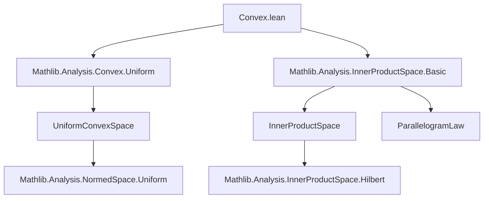

**Technical Brief: `Convex.lean` (Mathlib — Convexity in Inner Product Spaces)**

---

### 1. **Key Definitions & Theorems**

| Name | Type / Signature | Purpose |
|------|------------------|---------|
| `InnerProductSpace.toUniformConvexSpace` | `UniformConvexSpace F` | Shows that any real inner product space `F` is uniformly convex — i.e., for every `ε > 0`, there exists `δ > 0` such that if `‖x‖ ≤ 1`, `‖y‖ ≤ 1`, and `‖x - y‖ ≥ ε`, then `‖(x + y)/2‖ ≤ 1 - δ`. |
| `parallelogram_law_with_norm` | (implicit in proof) | The parallelogram identity: `‖x + y‖² + ‖x - y‖² = 2 * (‖x‖² + ‖y‖²)`. Used to relate norms and inner products. |
| `sqrt_lt'`, `pow_pos`, `norm_nonneg` | Tactics/lemmas | Standard analysis lemmas used in bounding expressions involving square roots and norms. |

---

### 2. **Naming Conventions**

- **Prefixes / Suffixes**:
  - `to_` prefix: indicates a *typeclass derivation* (e.g., `toUniformConvexSpace`).
  - `parallelogram_law_with_norm`: descriptive, includes `norm` to distinguish from algebraic parallelogram laws.
  - `sq`, `dist_`, `norm_`: standard Mathlib shorthand (`sq x` = `x ^ 2`, `dist x y` = `‖x - y‖`).
- **No explicit `is_` or `mul_` prefixes** — this file focuses on structural properties, not predicate definitions.

---

### 3. **Tactic Stack**

The proof uses a compact, high-level tactic sequence:

- `refine`: to construct the uniform convexity witness.
- `norm_num`: to verify positivity of the modulus `2 - √(4 - ε²)`.
- `rw [sub_sub_cancel]`: simplifies algebraic expressions.
- `le_sqrt_of_sq_le`: reduces a square-root inequality to a squared one.
- `rw [...]`: rewrites using the parallelogram law and definitions (`hx`, `hy` are norm hypotheses).
- `ring_nf`: normalizes polynomial expressions.
- `gcongr`: handles monotonicity/congruence goals (e.g., bounding expressions using `≤`).

> **Note**: No `induction`, `cases`, or `linarith` — the argument is direct and analytic.

---

### 4. **Proof Logic**

The proof follows a *constructive uniform convexity witness* strategy:

1. **Goal**: For given `ε > 0`, produce `δ > 0` such that:
   $$
   \|x\| \le 1,\ \|y\| \le 1,\ \|x - y\| \ge \varepsilon \implies \left\|\frac{x + y}{2}\right\| \le 1 - \delta.
   $$
2. **Witness**: Choose `δ = 2 - √(4 - ε²)` (standard modulus for uniformly convex Banach spaces with parallelogram law).
3. **Verification**:
   - Show `δ > 0` using `ε > 0` and `√(4 - ε²) < 2`.
   - Assume `‖x‖ = ‖y‖ = 1` (w.l.o.g. by scaling), and `‖x - y‖ ≥ ε`.
   - Apply parallelogram law to bound `‖(x + y)/2‖² ≤ 1 - δ²`.
   - Conclude via monotonicity of square root.

The logic is *analytic and inequality-driven*, leveraging inner product structure (via parallelogram law) to upgrade norm geometry.

---

### 5. **Imports**

| Import | Role |
|--------|------|
| `Mathlib.Analysis.Convex.Uniform` | Provides `UniformConvexSpace` typeclass and basic definitions. |
| `Mathlib.Analysis.InnerProductSpace.Basic` | Supplies inner product space structure, norm, and basic lemmas (e.g., `parallelogram_law_with_norm`). |
| `RCLike`, `Real`, `Filter`, `Topology`, `ComplexConjugate`, `Finsupp`, `LinearMap.BilinForm` | Supporting infrastructure: real/complex analysis, topology, bilinear forms. |

> **Note**: The module is over `ℝ` (via `InnerProductSpace ℝ F`), consistent with real Hilbert spaces.

---

### 6. **Mermaid Diagrams**

#### Dependency Graph (Module-Level)



#### Overview of Theoretical Flow

```mermaid
flowchart LR
  subgraph Setup
    I[Inner Product Space F over ℝ]
    N[Norm induced by inner product]
  end

  subgraph Core
    P[Parallelogram Law]
    U[Uniform Convexity Goal]
  end

  subgraph Proof
    W[Construct δ = 2 - √(4 - ε²)]
    V[Verify δ > 0]
    B[Apply parallelogram law]
    S[Bound midpoint norm]
  end

  I --> N
  N --> P
  P --> B
  B --> S
  S --> U
  V --> U
  W --> V
```

---

### 7. **Summary**

This module establishes a foundational result: **every real inner product space is uniformly convex**, using the parallelogram law to construct an explicit modulus of uniform convexity. The formalization is concise, leveraging Lean’s typeclass inference and analysis library (`RCLike`, `SeminormedAddCommGroup`, etc.) to avoid redundant assumptions. It exemplifies how geometric properties of inner product spaces (Hilbert geometry) are formalizable with minimal axiomatic overhead.
