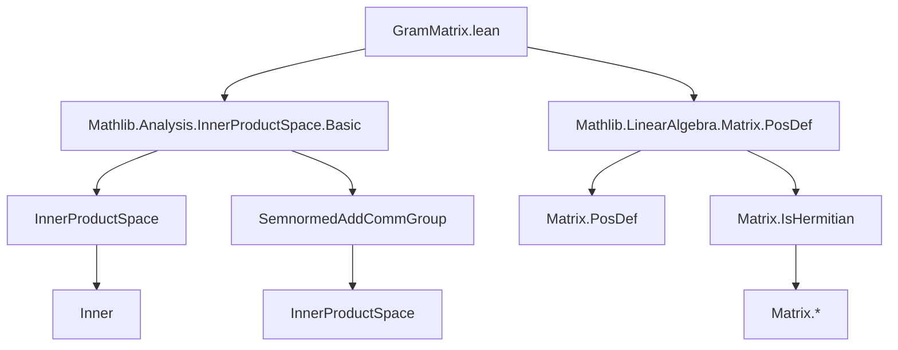
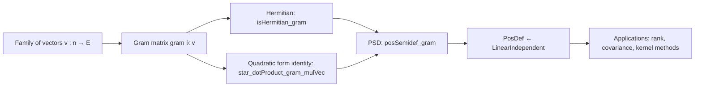
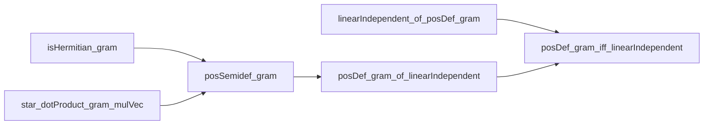

**Technical Brief: `GramMatrix.lean`**

---

### 1. **Key Definitions & Theorems**

| Name | Type / Signature | Purpose |
|------|------------------|---------|
| `gram` | `gram (𝕜 : Type*) [Inner 𝕜 E] (v : n → E) : Matrix n n 𝕜` | Constructs the Gram matrix from a family of vectors `v : n → E` over an inner product space `E` over `𝕜`. Entry `(i, j)` is `⟪v i, v j⟫_𝕜`. |
| `gram_apply` | `(gram 𝕜 v) i j = ⟪v i, v j⟫_𝕜` | Simplification lemma: confirms the definition of `gram`. |
| `isHermitian_gram` | `(gram 𝕜 v).IsHermitian` | Gram matrices are Hermitian (i.e., self-adjoint). |
| `star_dotProduct_gram_mulVec` | `star x ⬝ᵥ (gram 𝕜 v) *ᵥ y = ⟪∑ i, x i • v i, ∑ i, y i • v i⟫_𝕜` | Key identity linking quadratic forms of Gram matrices to inner products of linear combinations of `v`. |
| `posSemidef_gram` | `PosSemidef (gram 𝕜 v)` | Gram matrices are positive semidefinite (PSD). |
| `linearIndependent_of_posDef_gram` | `PosDef (gram 𝕜 v) → LinearIndependent 𝕜 v` | Positive definiteness implies linear independence. |
| `posDef_gram_of_linearIndependent` | `LinearIndependent 𝕜 v → PosDef (gram 𝕜 v)` | In normed inner product spaces, linear independence implies positive definiteness. |
| `posDef_gram_iff_linearIndependent` | `PosDef (gram 𝕜 v) ↔ LinearIndependent 𝕜 v` | Equivalence between positive definiteness and linear independence (in normed inner product spaces). |

---

### 2. **Naming Conventions**

- **Prefixes**:
  - `gram_`: for definitions/lemmas about Gram matrices.
  - `isHermitian_`, `posSemidef_`, `posDef_`: for properties of matrices (Hermitian, PSD, PD).
  - `star_`: for conjugate-linear operations (`star` = complex conjugation / involution).
- **Suffixes**:
  - `_apply`: for simplification lemmas about function application.
  - `_gram`: to denote Gram-specific variants.
  - `_gram_mulVec`: for identities involving matrix-vector multiplication with Gram matrices.
- **Pattern**: `gram_…`, `isHermitian_…`, `posDef_…`, `star_…`, `linearIndependent_of_…`.

---

### 3. **Tactic Stack**

Frequently used tactics in proofs:

| Tactic | Role |
|--------|------|
| `ext` | Extensionality for matrices/functions. |
| `simp` / `simp_rw` | Simplification using `@[simp]` lemmas (`gram_apply`, `inner_zero_left`, etc.). |
| `rw` | Rewriting using equalities (e.g., `star_dotProduct_gram_mulVec`, definitions). |
| `refine` / `exact` | Structured proof construction. |
| `trans` | Chaining intermediate equalities. |
| `have` / `intro` / `cases` | Local assumptions and case analysis. |
| `lt_of_ne'` | From nonnegativity and nonzero, deduce positivity. |
| `mt` / `ne` | Modus tollens and contradiction-based reasoning (e.g., `inner_self_eq_zero.ne`). |
| `Finset`-based simplifications (`sum_inner`, `inner_sum`, `inner_smul_left/right`) | For manipulating sums over finite types. |

---

### 4. **Proof Logic**

- **Structure**:
  - **Step 1**: Show Gram matrix is Hermitian (`isHermitian_gram`) using `inner_conj_symm`.
  - **Step 2**: Prove key quadratic form identity (`star_dotProduct_gram_mulVec`) to connect matrix expressions with inner products.
  - **Step 3**: Use the identity to show PSD: for any `x`, `x* G x = ‖∑ x i • v i‖² ≥ 0`.
  - **Step 4**: For normed inner product spaces:
    - Use `posSemidef_gram` + `inner_self_eq_zero.ne` + linear independence to get strict positivity (`posDef_gram_of_linearIndependent`).
    - Conversely, use `PosDef` ⇒ `x* G x > 0` for nonzero `x` ⇒ `∑ x i • v i ≠ 0` ⇒ linear independence.

- **Induction/Case Analysis**:
  - Not used directly; relies on finite type reasoning (`Fintype.ofFinite n`) and `Fintype.linearIndependent_iff`.
  - `gram_single` uses `decidable_eq` and case analysis on equality of indices.

---

### 5. **Imports & Dependencies**

| Import | Purpose |
|--------|---------|
| `Mathlib.Analysis.InnerProductSpace.Basic` | Core definitions: `InnerProductSpace`, `Inner`, `⟪_, _⟫`, `smul`, `sum`, etc. |
| `Mathlib.LinearAlgebra.Matrix.PosDef` | Definitions: `PosSemidef`, `PosDef`, `IsHermitian`, `dotProduct`, `mulVec`, `submatrix`. |
| `RCLike` | Ensures `𝕜` is `ℝ` or `ℂ` (with conjugation, order, etc.). Required for `star`, `re`, `im`, `nonneg`, etc. |
| `ComplexOrder`, `ComplexConjugate`, `InnerProductSpace` scopes | For `star`, `conj`, `re`, `im`, and inner product notations. |

---

### 6. **Mermaid Diagrams**

#### **Dependency Graph (Module-Level)**

#### **Overview of Theory Flow**

#### **Logical Dependencies (Proof Structure)**

---

### 7. **Domain-Specific AI Agent Notes**

- **Key abstractions**: Gram matrices, inner products, linear independence, positive (semi)definiteness.
- **Critical lemmas for automation**: `gram_apply`, `star_dotProduct_gram_mulVec`, `posDef_gram_iff_linearIndependent`.
- **Common proof patterns**:
  - Reduce matrix properties to inner product identities.
  - Use finite type reasoning (`Fintype.ofFinite`) to apply `Fintype.linearIndependent_iff`.
  - Leverage `inner_self_eq_zero.ne` to convert nonzero norms to nonzero vectors.
- **Suggested tactic automation**: `simp_all [gram_apply, star_dotProduct_gram_mulVec]` + `aesop` for structure.

--- 

Let me know if you'd like a formalized summary in Lean or a theory graph for integration into a larger knowledge base.
