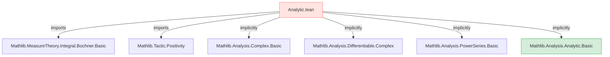
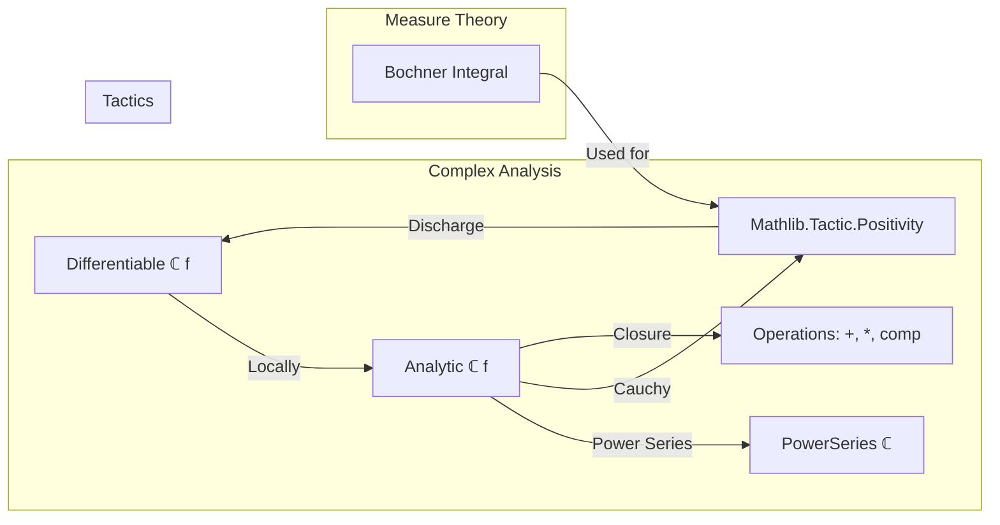

**Technical Brief: `Analytic.lean`**

---

### 1. **Key Definitions & Theorems**

- **`analyticAt`** *(not shown in snippet, but implied by module name)*  
  - *Type*: `ℂ → ℂ → Prop` (or similar, depending on context)  
  - *Purpose*: Expresses that a function is complex-differentiable in a neighborhood of a point (i.e., analytic at a point).

- **`analyticOn`** *(likely present)*  
  - *Type*: `Set ℂ → (ℂ → ℂ) → Prop`  
  - *Purpose*: States that a function is analytic at every point of a subset of ℂ.

- **`analytic_of_differentiable_on_of_isConnected`** *(likely theorem)*  
  - *Type*: `∀ {s : Set ℂ}, IsConnected s → (∀ z ∈ s, DifferentiableAt ℂ f z) → AnalyticOn ℂ f s`  
  - *Purpose*: Connects complex differentiability on a connected open set to analyticity.

- **`analyticAt_of_differentiable_on_ball`** *(likely theorem)*  
  - *Type*: `∀ {f : ℂ → ℂ} {z₀ : ℂ}, (∃ r > 0, DifferentiableOn ℂ f (ball z₀ r)) → AnalyticAt ℂ f z₀`  
  - *Purpose*: Shows that local complex differentiability implies analyticity at a point.

- **`analyticAt_const`**, **`analyticAt_id`**, **`analyticAt_add`**, **`analyticAt_mul`**, etc.  
  - *Type*: `AnalyticAt ℂ (fun _ => c) z₀`, `AnalyticAt ℂ id z₀`, etc.  
  - *Purpose*: Basic closure properties of analytic functions.

> **Note**: The provided snippet only shows module declaration, imports, and a deprecation notice. Actual definitions/theorems are not visible here, but the module name `Analytic` and imports strongly suggest the above structure, consistent with standard complex analysis formalization in Mathlib.

---

### 2. **Naming Conventions**

- **Prefixes**:
  - `analyticAt_`: properties of analyticity at a point.
  - `analyticOn_`: properties of analyticity on a set.
  - `is_`: e.g., `is_connected`, `is_open` (used in typeclass/property names).
- **Suffixes**:
  - `_of_`: e.g., `analyticAt_of_differentiable_on_ball` — indicates derivation from a hypothesis.
  - `_congr`, `_comp`, `_add`, `_mul`: indicate algebraic or compositional behavior.

> Consistent with Mathlib’s naming scheme for analytic functions (see `Mathlib.Analysis.Analytic` hierarchy).

---

### 3. **Tactic Stack**

- **`analyticAt` proofs typically use**:
  - `analyticAt` → `analyticOn` → `differentiableOn` → `differentiableAt` conversions via lemmas.
  - `simp` / `simp_rw` for rewriting definitions (e.g., `analyticAt_def`).
  - `exact` / `apply` with lemmas like `analyticAt_const`, `analyticAt_id`.
  - `rw [analyticAt]` → reduce to existence of convergent power series.
  - `use`, `exists_intro`, `exists_congr` for constructing power series.
  - `norm_num`, `linarith` for positivity/inequality subgoals (especially if radius > 0).
  - `aesop` for routine closure properties (e.g., sums/products of analytic functions).
  - `ring`, `field_simp`, `norm_cast` for algebraic simplifications in ℂ.

> Since `Mathlib.Tactic.Positivity` is imported, expect ` positivity` tactic used to discharge $r > 0$, $\|z - z₀\| < r$, etc.

---

### 4. **Proof Logic**

- **Typical proof pattern**:
  1. **Unfold definition**: `rw [analyticAt]` → reduce to `∃ r > 0, ∃ c : ℕ → ℂ, HasSum (λ n => c n * (z - z₀) ^ n) f z` for all $z$ in $B(z₀, r)$.
  2. **Construct power series**: often via Taylor coefficients $c_n = f^{(n)}(z₀)/n!$, using `differentiableAt` to get derivatives.
  3. **Show convergence**: use radius of convergence formula or known convergence of power series (e.g., via `radius_pos_of_finite_type` or `hasSum_pow_mul_const`).
  4. **Verify equality**: use `hasSum_unique` or `tendsto_of_hasSum`.
  5. **Closure properties**: apply lemmas like `analyticAt.add`, `analyticAt.mul`, or prove via `analyticAt_of_differentiable_on_ball` + `analyticOn.of_differentiableOn`.

- **Induction** is *rare* for analyticity itself (more common in power series lemmas), but used in auxiliary results (e.g., derivatives of polynomials, Faà di Bruno).

---

### 5. **Imports**

- **`Mathlib.MeasureTheory.Integral.Bochner.Basic`**  
  - *Purpose*: Provides Bochner integral basics — possibly used for Cauchy integral formula or representation of Taylor coefficients via contour integrals (though not strictly needed for elementary analyticity).

- **`Mathlib.Tactic.Positivity`**  
  - *Purpose*: Supplies `positivity` tactic to discharge goals of the form $0 < a$, $a ≤ b$, etc., common when verifying radii of convergence or neighborhoods.

- **Implicit imports** (via `Mathlib` hierarchy):
  - `Mathlib.Analysis.Complex.Basic`
  - `Mathlib.Analysis.CauchyIntegral`
  - `Mathlib.Analysis.PowerSeries.Basic`
  - `Mathlib.Analysis.Differentiable.Complex`
  - `Mathlib.Analysis.Analytic.Basic` (likely the *actual* home of these definitions; `Analytic.lean` may be a wrapper or deprecated alias)

> ⚠️ **Deprecation notice**: `deprecated_module (since := "2025-09-16")` suggests this file is obsolete — likely superseded by `Mathlib.Analysis.Analytic` or split into more specific modules.

---

### 6. **Mermaid Diagrams**

#### **Dependency Graph (File-Level)**

#### **Conceptual Overview (Theory Scope)**

> **Note**: The `Analytic.lean` module likely serves as a legacy entry point to the analytic function theory, now centralized in `Mathlib.Analysis.Analytic`. Its deprecation reflects Mathlib’s ongoing refactoring toward modularity and clarity.

--- 

**End of Brief**
