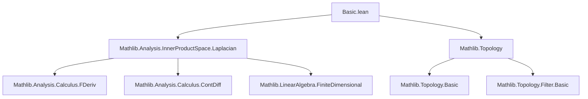
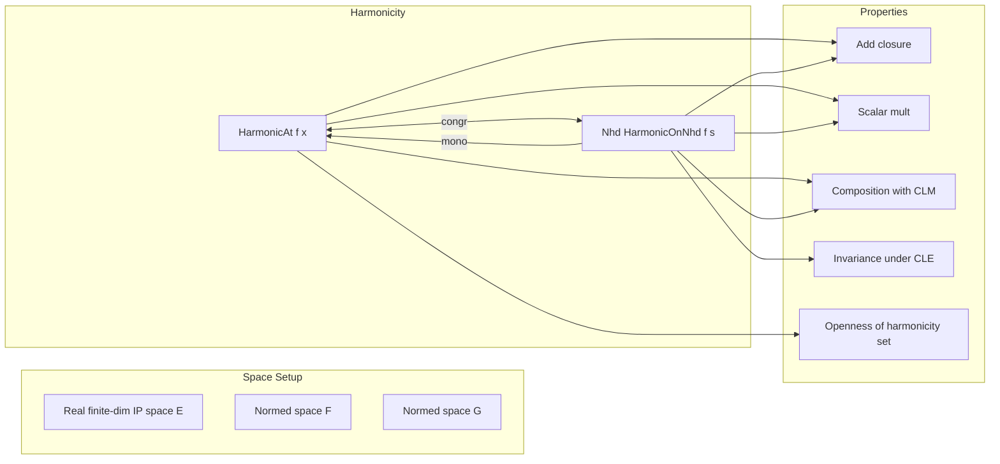

**Technical Brief: Basic.lean — Harmonic Functions in Lean 4**

---

### 1. **Key Definitions & Theorems**

| Name | Type / Signature | Purpose |
|------|------------------|---------|
| `HarmonicAt` | `f : E → F → x : E → Prop` | `f` is harmonic at `x` iff `f` is $C^2$ at `x` and its Laplacian vanishes in a neighborhood of `x`. |
| `HarmonicOnNhd` | `f : E → F → s : Set E → Prop` | `f` is harmonic in a neighborhood of `s` iff it is harmonic at every point of `s`. |
| `harmonicAt_congr_nhds` | `f₁ =ᶠ[𝓝 x] f₂ → HarmonicAt f₁ x ↔ HarmonicAt f₂ x` | Harmonicity at a point depends only on the germ at that point. |
| `HarmonicAt.eventually` | `HarmonicAt f x → ∀ᶠ y in 𝓝 x, HarmonicAt f y` | Harmonicity is stable under small perturbations of the base point. |
| `isOpen_setOf_harmonicAt` | `IsOpen { x | HarmonicAt f x }` | The set of points where `f` is harmonic is open — harmonicity is an open property. |
| `HarmonicOnNhd.mono` | `t ⊆ s → HarmonicOnNhd f s → HarmonicOnNhd f t` | Monotonicity of harmonicity on subsets. |
| `HarmonicAt.add` | `HarmonicAt f₁ x → HarmonicAt f₂ x → HarmonicAt (f₁ + f₂) x` | Closure under addition. |
| `HarmonicOnNhd.add` | `HarmonicOnNhd f₁ s → HarmonicOnNhd f₂ s → HarmonicOnNhd (f₁ + f₂) s` | Closure under addition on neighborhoods. |
| `HarmonicAt.const_smul` | `HarmonicAt f x → HarmonicAt (c • f) x` | Closure under scalar multiplication. |
| `HarmonicOnNhd.const_smul` | `HarmonicOnNhd f s → HarmonicOnNhd (c • f) s` | Closure under scalar multiplication on neighborhoods. |
| `HarmonicAt.comp_CLM` | `HarmonicAt f x → (l : F →L[ℝ] G) → HarmonicAt (l ∘ f) x` | Harmonicity preserved under composition with continuous linear maps. |
| `HarmonicOnNhd.comp_CLM` | `HarmonicOnNhd f s → (l : F →L[ℝ] G) → HarmonicOnNhd (l ∘ f) s` | Same for neighborhoods. |
| `harmonicAt_comp_CLE_iff` | `l : F ≃L[ℝ] G → HarmonicAt (l ∘ f) x ↔ HarmonicAt f x` | Harmonicity is invariant under continuous linear equivalences. |
| `harmonicOnNhd_comp_CLE_iff` | `l : F ≃L[ℝ] G → HarmonicOnNhd (l ∘ f) s ↔ HarmonicOnNhd f s` | Same for neighborhoods. |

---

### 2. **Naming Conventions**

- **Prefixes**:
  - `harmonicAt_`, `harmonicOnNhd_`: predicate-specific naming.
  - `is_` is *not* used (unlike many other Lean libraries); instead, `HarmonicAt`/`HarmonicOnNhd` are used directly.
- **Suffixes**:
  - `_at` for pointwise properties (`HarmonicAt`).
  - `_onNhd` for neighborhood-wide properties (`HarmonicOnNhd`).
  - `_congr_nhds`, `_eventually`, `_mono`: standard categorical/stability suffixes.
  - `_add`, `_const_smul`, `_comp_CLM`, `_comp_CLE_iff`: structural property suffixes.

---

### 3. **Tactic Stack**

Frequently used tactics in proofs:

| Tactic | Role |
|--------|------|
| `constructor` | Split conjunctions (e.g., `HarmonicAt` is a conjunction). |
| `filter_upwards` | Prove statements about filters (especially `∀ᶠ` in neighborhoods). |
| `simp_all` | Simplify using all hypotheses and definitions. |
| `congr_of_eventuallyEq` | Use eventual equality to transfer differentiability/harmonicity. |
| `symm` | Flip `=ᶠ` or `↔` for symmetry. |
| `eventually_nhds` | Use that a property holds eventually at a point iff it holds on some neighborhood. |
| `laplacian_congr_nhds`, `laplacian_add_nhds`, `laplacian_smul_nhds`, `laplacian_CLM_comp_left_nhds` | Lemmas from `Laplacian` module used to manipulate Laplacians under congruence, sum, scalar mult, and composition. |
| `contDiffAt.congr_of_eventuallyEq`, `ContDiffAt.eventually`, `ContDiffAt.const_smul`, `ContDiffAt.add`, `ContDiffAt.continuousLinearMap_comp` | Properties of `ContDiffAt` used to handle smoothness. |

---

### 4. **Proof Logic**

- **Structure**: Proofs follow a standard pattern:
  1. **Decompose** the definition (`HarmonicAt` is a conjunction → `constructor`).
  2. **Handle smoothness** (`ContDiffAt`) using known closure properties (e.g., `add`, `const_smul`, `continuousLinearMap_comp`).
  3. **Handle Laplacian condition** (`Δ f =ᶠ[𝓝 x] 0`) using:
     - `filter_upwards` to combine eventual equalities,
     - lemmas like `laplacian_congr_nhds`, `laplacian_add_nhds`, etc.
  4. **Simplify** with `simp_all`.

- **Common proof patterns**:
  - *Congruence*: Use `h.symm` or `h` to switch between `f₁` and `f₂`.
  - *Eventual stability*: Use `h.1.eventually`, `h.2.eventually_nhds`, then `filter_upwards`.
  - *Equivalence via inverse maps*: For `harmonicAt_comp_CLE_iff`, apply both directions using `l` and `l.symm`.

---

### 5. **Imports**

- `Mathlib.Analysis.InnerProductSpace.Laplacian`: Provides:
  - Laplacian operator `Δ`
  - Differentiability lemmas (`ContDiffAt`, `laplacian_add_nhds`, etc.)
  - Compatibility lemmas for linear maps (`laplacian_CLM_comp_left_nhds`)

- `Topology`: Provides:
  - Neighborhood filters (`𝓝 x`)
  - Topological notions (`IsOpen`, `eventually`, `congr_of_eventuallyEq`)

- `InnerProductSpace`: Module namespace for geometric/analytic structure over `E`.

---

### 6. **Mermaid Diagrams**

#### **Dependency Graph (File-Level)**

#### **Conceptual Overview (Theory Module)**

---

### 7. **Domain-Specific AI Agent Guidance**

- **Key entities**: `HarmonicAt`, `HarmonicOnNhd`, `Δ`, `ContDiffAt`, `𝓝`, `→L[ℝ]`, `≃L[ℝ]`.
- **Common goals**: Prove harmonicity of combinations (sums, scalar multiples), transfer via linear maps, or show openness/stability.
- **Typical proof steps**:
  1. Unfold `HarmonicAt` → split into `ContDiffAt` + `Δ f =ᶠ[𝓝 x] 0`.
  2. Use `filter_upwards` + Laplacian lemmas.
  3. For equivalences, apply both directions with `l` and `l.symm`.
- **Avoid**: Manual `laplacian` computation — rely on `Laplacian` module lemmas.

--- 

Let me know if you'd like a formalized *library roadmap* or *proof automation suggestions* for harmonic function reasoning in Lean.
