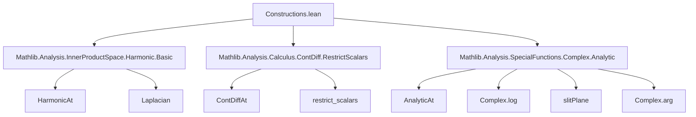

**Technical Brief: `Constructions.lean` — Construction of Harmonic Functions**

---

### 1. **Key Definitions & Theorems**

| Name | Type / Signature | Purpose |
|------|------------------|---------|
| `HarmonicAt` | `f : ℂ → F → Prop` | States that `f` is harmonic at a point `x ∈ ℂ`, i.e., satisfies Laplace’s equation in a neighborhood. |
| `ContDiffAt.harmonicAt` | `ContDiffAt ℂ 2 f x → HarmonicAt f x` | Shows that *twice* continuously complex-differentiable functions on ℂ are harmonic. |
| `AnalyticAt.harmonicAt` | `AnalyticAt ℂ f x → HarmonicAt f x` | Extends the above to analytic functions (using `ContDiffAt.harmonicAt` + analytic ⇒ `C^∞`). |
| `AnalyticAt.harmonicAt_re` | `AnalyticAt ℂ f x → HarmonicAt (f.re) x` | Real part of a complex-analytic function is harmonic. |
| `AnalyticAt.harmonicAt_im` | `AnalyticAt ℂ f x → HarmonicAt (f.im) x` | Imaginary part of a complex-analytic function is harmonic. |
| `AnalyticAt.harmonicAt_conj` | `AnalyticAt ℂ f x → HarmonicAt (conj ∘ f) x` | Complex conjugate of a complex-analytic function is harmonic. |
| `analyticAt_harmonicAt_log_normSq` | `AnalyticAt ℂ g z ∧ g z ≠ 0 ∧ g z ∈ slitPlane → HarmonicAt (Real.log ∘ ‖g‖²) z` | Helper lemma: `log ∘ ‖g‖²` is harmonic near points where `g` is non-zero and lands in the slit plane. |
| `AnalyticAt.harmonicAt_log_norm` | `AnalyticAt ℂ f z ∧ f z ≠ 0 → HarmonicAt (Real.log ∘ ‖f‖) z` | Main result: `log ‖f‖` is harmonic wherever `f` is analytic and non-vanishing. |

---

### 2. **Naming Conventions**

- **Prefixes**:
  - `harmonicAt_`: for theorems about harmonicity at a point.
  - `analyticAt_`: for results depending on analyticity at a point.
  - `contDiffAt_`: for results relying on `ContDiffAt`.
- **Suffixes**:
  - `_re`, `_im`, `_conj`: indicate real part, imaginary part, or conjugate.
  - `_log_norm`, `_log_normSq`: indicate use of `log ∘ ‖·‖` or `log ∘ ‖·‖²`.
- **CLM / CLE**: `CLM` = `ContinuousLinearMap`, `CLE` = `ContinuousLinearEquiv`. Used in composition lemmas like `comp_CLM`, `comp_CLE_iff`.

---

### 3. **Tactic Stack**

Frequent tactics used in proofs:

| Tactic | Role |
|--------|------|
| `simp` / `simp only` | Simplify expressions involving `comp`, `normSq`, `conj`, `log`, `re`, `im`. |
| `rw` | Rewrite using definitions or lemmas (e.g., `norm_def`, `normSq_eq_conj_mul_self`). |
| `filter_upwards` | Handle almost-everywhere equalities in filters (e.g., `𝓝 z`). |
| `aesop` | Automated reasoning for simple goals, especially in `eventuallyEq` contexts. |
| `linarith` | Linear arithmetic over reals (e.g., positivity of `normSq`). |
| `congr` / `congr 1` | Prove equality of composite functions by congruence. |
| `exact`, `apply`, `refine` | Standard proof construction. |
| `have`, `by_cases` | Case analysis (e.g., membership in `slitPlane`). |
| `mem_nhds_iff` / `preimage_mem_nhds` | Manipulate neighborhoods via continuity. |

---

### 4. **Proof Logic**

- **General Strategy**:
  1. **Reduction to known harmonic functions** via composition with continuous linear maps/equivalences (`comp_CLM`, `comp_CLE_iff`).
  2. **Use of complex structure**: exploit `I² = -1`, `normSq = conj · * ·`, and properties of `log` on `slitPlane`.
  3. **Local analysis**: work in neighborhoods (`𝓝 z`) and use `eventuallyEq` to replace functions with equivalent ones.
  4. **Case split on `slitPlane` membership** to handle branch cuts of `log`.
  5. **Symmetrization**: for `log ‖f‖`, relate to `log ∘ normSq ∘ f`, then use identity:
     $$
     \log \|f(z)\| = \tfrac12 \log(\|f(z)\|^2) = \tfrac12 \Re(\log(f(z)) + \log(\overline{f(z)}))
     $$
     when `f(z)` avoids the branch cut.

- **Typical Flow** (e.g., `harmonicAt_log_norm`):
  - Reduce `log ‖f‖` to `(1/2) • log ∘ normSq ∘ f`.
  - If `f(z) ∈ slitPlane`, apply `analyticAt_harmonicAt_log_normSq`.
  - Else, use symmetry: `normSq ∘ f = normSq ∘ (-f)`, and `-f(z) ∈ slitPlane`.

---

### 5. **Imports & Dependencies**

| Import | Purpose |
|--------|---------|
| `Mathlib.Analysis.InnerProductSpace.Harmonic.Basic` | Defines `HarmonicAt`, Laplacian, basic properties. |
| `Mathlib.Analysis.Calculus.ContDiff.RestrictScalars` | Enables restriction of scalars ℂ → ℝ for `ContDiff`, needed to relate complex and real differentiability. |
| `Mathlib.Analysis.SpecialFunctions.Complex.Analytic` | Provides `AnalyticAt`, `log`, `clog`, `slitPlane`, and their analyticity properties. |

---

### 6. **Mermaid Diagrams**

#### **Dependency Graph (Module-Level)**



#### **Overview of Theoretical Flow**

```mermaid
flowchart LR
  subgraph "Differentiability"
    A1[ContDiffAt ℂ 2 f x] -->|ContDiffAt.harmonicAt| A2[HarmonicAt f x]
    B1[AnalyticAt ℂ f x] -->|analytic ⇒ C^∞| A1
    B1 -->|AnalyticAt.harmonicAt| A2
  end

  subgraph "Real/Imag/Conj"
    A2 -->|comp_CLM reCLM| A3[HarmonicAt (f.re)]
    A2 -->|comp_CLM imCLM| A4[HarmonicAt (f.im)]
    A2 -->|comp_CLE conjCLE| A5[HarmonicAt (conj ∘ f)]
  end

  subgraph "log ∘ norm"
    B1 -->|f z ≠ 0| C1[log ‖f‖ harmonic?]
    C1 -->|case split on slitPlane| C2[analyticAt_harmonicAt_log_normSq]
    C2 -->|identity: log ∘ normSq = Re(log + log ∘ conj)| C3[sum of harmonic functions]
    C3 -->|comp_CLM reCLM| C4[HarmonicAt (log ‖f‖)]
  end
```

---

### 7. **Mathematical Summary**

- **Core principle**: Complex analyticity ⇒ harmonicity, via identification of the Laplacian with $4 \partial \bar\partial$ and complex differentiability.
- **Key trick**: Use of the *slit plane* to define a holomorphic branch of `log`, and symmetry (`f` vs `-f`) to cover all non-zero points.
- **Result**: A rich class of harmonic functions arises from complex analysis: real/imag parts, conjugates, and `log ‖f‖` for non-vanishing `f`.

--- 

Let me know if you'd like a formalized dependency graph (e.g., for `leanproject`), or a proof sketch in natural language for a specific theorem.
