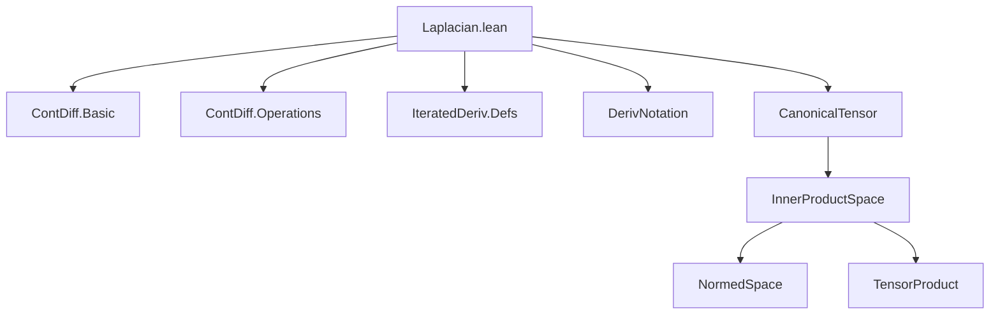

**Technical Brief: Laplacian.lean**

---

### 1. KEY DEFINITIONS & THEOREMS

| Name | Type / Signature | Purpose |
|------|------------------|---------|
| `bilinearIteratedFDerivWithinTwo` | `E → E →ₗ[𝕜] E →ₗ[𝕜] F` | Converts the second `fderivWithin` into a bilinear map in the second argument. |
| `bilinearIteratedFDerivTwo` | `E → E →ₗ[𝕜] E →ₗ[𝕜] F` | Same as above, but for the global `fderiv`. |
| `tensorIteratedFDerivWithinTwo` | `E → E ⊗[𝕜] E →ₗ[𝕜] F` | Lifts the bilinear second derivative to a linear map on the tensor product. |
| `tensorIteratedFDerivTwo` | `E → E ⊗[𝕜] E →ₗ[𝕜] F` | Global version of the above. |
| `laplacianWithin` | `E → F` | Definition of the Laplacian of `f` on a set `s`, via evaluation of `tensorIteratedFDerivWithinTwo` at the canonical covariant tensor. |
| `Δ[s] f` | Notation for `laplacianWithin f s` | Standard notation for the Laplacian relative to a set `s`. |
| `instLaplacian` | Instance `Laplacian (E → F) (E → F)` | Provides the global Laplacian operator `Δ`. |
| `laplacianWithin_eq_iteratedFDerivWithin_orthonormalBasis` | `Δ[s] f e = ∑ i, iteratedFDerivWithin ℝ 2 f s e ![v i, v i]` | Computes the Laplacian using any orthonormal basis `v`. |
| `laplacian_eq_iteratedFDeriv_orthonormalBasis` | `Δ f = fun x ↦ ∑ i, iteratedFDeriv ℝ 2 f x ![v i, v i]` | Global version of the above. |
| `laplacianWithin_eq_iteratedDerivWithin_real` | `(Δ[s] f) e = iteratedDerivWithin 2 f s e` | For `f : ℝ → F`, Laplacian coincides with second derivative. |
| `laplacian_eq_iteratedDeriv_real` | `Δ f e = iteratedDeriv 2 f e` | Global version of the above. |
| `laplacianWithin_smul`, `laplacian_smul` | `Δ[s] (v • f) = v • Δ[s] f`, etc. | Scalar compatibility of Laplacian on `ContDiff` functions. |
| `laplacianWithin_add`, `laplacian_add` | `Δ[s] (f₁ + f₂) = Δ[s] f₁ + Δ[s] f₂`, etc. | Additivity of Laplacian on `ContDiff` functions. |
| `laplacianWithin_CLM_comp_left`, `laplacian_CLM_comp_left` | `Δ[s] (l ∘ f) = l ∘ Δ[s] f`, etc. | Commutativity of `Δ` with left-composition by continuous linear maps. |

---

### 2. NAMING CONVENTIONS

- **Prefixes**:
  - `bilinearIteratedFDeriv*`: bilinear reformulation of second derivative.
  - `tensorIteratedFDeriv*`: tensor-lifted version of second derivative.
  - `laplacianWithin*`: set-relative Laplacian.
  - `laplacian*` (no `Within`): global Laplacian.
  - `iteratedFDerivWithin*`, `iteratedFDeriv*`: standard iterated derivative API.

- **Suffixes**:
  - `_within`: relative to a set `s`.
  - `_nhds`, `_nhdsWithin`: neighborhood-based congruence or continuity statements.
  - `_orthonormalBasis`, `_stdOrthonormalBasis`: basis-specific formulas.
  - `_real`, `_complexPlane`: special cases for `ℝ` or `ℂ`.

- **Notation**:
  - `Δ[s] f` for `laplacianWithin f s`.
  - `Δ f` for global Laplacian.

---

### 3. TACTIC STACK

- `simp`: heavily used for rewriting definitions, especially with `canonicalCovariantTensor_eq_sum`, `tensorIteratedFDerivTwo_eq_iteratedFDeriv`, etc.
- `rw`: for applying lemmas about tensor lifts, bilinear forms, and `iteratedFDeriv`.
- `congr`: in `laplacian_eq_iteratedDeriv_real`, to extend equality pointwise.
- `filter_upwards`: for proving neighborhood-based congruence lemmas (`=ᶠ` statements).
- `fin_cases`: for case analysis on finite index types (e.g., `Fin 1`).
- `ext`: for extensionality proofs (e.g., proving two functions equal by evaluating at all points).
- `apply`, `nth_rw`: for structured rewriting and applying lemmas with specific arguments.

---

### 4. PROOF LOGIC

- **Structure**: Proofs follow a standard pattern:
  1. **Unfold definitions** (`laplacianWithin`, `tensorIteratedFDerivWithinTwo`, etc.).
  2. **Rewrite using basis expansions** (e.g., `canonicalCovariantTensor_eq_sum`).
  3. **Apply known lemmas** about `iteratedFDeriv`/`iteratedFDerivWithin` (e.g., additivity, scalar multiplication, chain rule).
  4. **Simplify sums** using `Finset.sum_add_distrib`, `Finset.smul_sum`, etc.
  5. For congruence lemmas: use `filter_upwards` with `EventuallyEq` lemmas for `iteratedFDeriv`.

- **Induction**: Not used directly; proofs rely on algebraic properties and basis expansions.
- **Case analysis**: Limited to finite index types (e.g., `Fin 1` in real case).
- **Neighborhood reasoning**: Uses filter-based arguments (`=ᶠ[𝓝 x]`, `𝓝[s] x`) for local properties.

---

### 5. IMPORTS

| Module | Purpose |
|--------|---------|
| `Mathlib.Analysis.Calculus.ContDiff.Basic` | Continuously differentiable functions (`ContDiffAt`, `ContDiffWithinAt`). |
| `Mathlib.Analysis.Calculus.ContDiff.Operations` | Algebraic operations on `ContDiff` functions. |
| `Mathlib.Analysis.Calculus.IteratedDeriv.Defs` | Definitions and basic API for `iteratedDeriv`, `iteratedFDeriv`. |
| `Mathlib.Analysis.Distribution.DerivNotation` | Notation for derivatives in distributional context (used for `iteratedDerivWithin`). |
| `Mathlib.Analysis.InnerProductSpace.CanonicalTensor` | Construction and properties of `canonicalCovariantTensor`, key for Laplacian definition. |

---

### 6. DEPENDENCY & THEORY OVERVIEW

#### Mermaid Diagram: Module Dependencies



#### Mermaid Diagram: Theory Flow

```mermaid
graph LR
  A[Real finite-dim inner product space E] --> B[Canonical covariant tensor ∈ E ⊗ E]
  B --> C[Second derivative: E → E ⊗ E → F]
  C --> D[Laplacian: E → F via trace over tensor]
  D --> E[Orthonormal basis formula: Δf = Σᵢ D²f(vᵢ, vᵢ)]
  E --> F[Linearity & compatibility with ContDiff]
  F --> G[Commutativity with linear maps, real/imag parts]
```

---

### 7. DOMAIN & SCOPE

- **Mathematical domain**: Real finite-dimensional inner product spaces, functions `E → F` where `F` is a normed space over `𝕜` (typically `ℝ` or `ℂ`).
- **Primary theory**: Differential calculus on inner product spaces, with emphasis on:
  - Second derivatives as multilinear/tensor maps.
  - Laplacian as a trace operation over the canonical tensor.
  - Computational formulas in orthonormal bases.
  - Algebraic and analytic properties (linearity, continuity, congruence).
- **Applications**: PDEs on manifolds (via local charts), complex analysis (`ℂ ≅ ℝ²`), spectral theory.

---

### 8. KEY OBSERVATIONS

- The definition is **basis-independent** but **computationally accessible** via orthonormal bases.
- The use of `tensorIteratedFDerivTwo` and `canonicalCovariantTensor` reflects a coordinate-free, geometric approach.
- The `ContDiffAt ℝ 2` hypothesis is minimal for `Δ` to be defined pointwise.
- The `Laplacian` typeclass instance allows uniform notation and future generalization.

--- 

*End of Technical Brief.*
