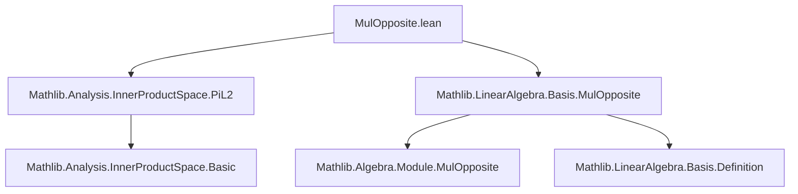
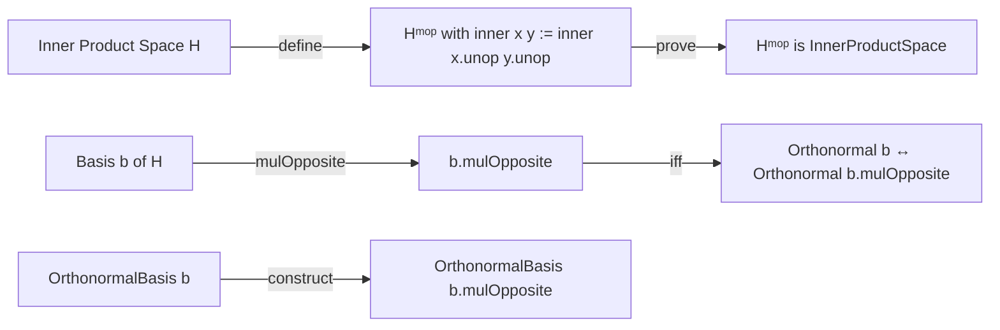

**Technical Brief: `MulOpposite.lean`**

---

### 1. **Key Definitions & Theorems**

| Name | Type / Signature | Purpose |
|------|------------------|---------|
| `Inner.𝕜 Hᵐᵒᵖ` | `instance [Inner 𝕜 H] : Inner 𝕜 Hᵐᵒᵖ` | Defines the inner product on the multiplicative opposite module `Hᵐᵒᵖ` by pulling back via `unop`. |
| `inner_unop` | `[Inner 𝕜 H] (x y : Hᵐᵒᵖ) : inner 𝕜 x.unop y.unop = inner 𝕜 x y` | Simplifies inner product on `Hᵐᵒᵖ` to inner product on `H` after applying `unop`. |
| `inner_op` | `[Inner 𝕜 H] (x y : H) : inner 𝕜 (op x) (op y) = inner 𝕜 x y` | Shows inner product is preserved under `op`. |
| `InnerProductSpace.𝕜 Hᵐᵒᵖ` | `instance [RCLike 𝕜] [SeminormedAddCommGroup H] [InnerProductSpace 𝕜 H] : InnerProductSpace 𝕜 Hᵐᵒᵖ` | Lifts the inner product space structure to `Hᵐᵒᵖ`. |
| `norm_sq_eq_re_inner` (field in instance) | `x : Hᵐᵒᵖ ↦ (inner_self_eq_norm_sq x.unop).symm` | Verifies the norm-squared equals real part of inner product on `Hᵐᵒᵖ`. |
| `conj_inner_symm`, `add_left`, `smul_left` | Inherited from `H` via `unop` | Prove inner product axioms on `Hᵐᵒᵖ`. |
| `mulOpposite_is_orthonormal_iff` | `(b : Module.Basis ι 𝕜 H) : Orthonormal 𝕜 b.mulOpposite ↔ Orthonormal 𝕜 b` | Equivalence of orthonormality for a basis and its multiplicative opposite. |
| `OrthonormalBasis.mulOpposite` | `(b : OrthonormalBasis ι 𝕜 H) → OrthonormalBasis ι 𝕜 Hᵐᵒᵖ` | Constructs an orthonormal basis on `Hᵐᵒᵖ` from one on `H`. |
| `toBasis_mulOpposite` | `(b : OrthonormalBasis ι 𝕜 H) : b.mulOpposite.toBasis = b.toBasis.mulOpposite` | Confirms the underlying basis of `b.mulOpposite` is `b.toBasis.mulOpposite`. |

---

### 2. **Naming Conventions**

- **Prefixes**:
  - `mulOpposite_`: for lemmas/defs about the multiplicative opposite construction.
  - `inner_`: for inner product–related lemmas.
  - `toBasis_`: for conversions from orthonormal bases to bases.

- **Suffixes**:
  - `_iff`: for biconditional characterizations (e.g., `mulOpposite_is_orthonormal_iff`).
  - `_op`, `_unop`: for maps involving `op`/`unop`.

- **Module-level naming**:
  - `op`, `unop`: standard for multiplicative opposite (as in `MulOpposite` typeclass).

---

### 3. **Tactic Stack**

- `rfl`: used repeatedly for definitional equalities (`inner_unop`, `inner_op`, `toBasis_mulOpposite`).
- `simp_rw` (implicit via `@[simp]`): for simplification using definitional lemmas.
- `symm`: used in `norm_sq_eq_re_inner` to flip equality.
- No heavy automation (e.g., `aesop`, `linarith`, `ring`) is needed—proofs are mostly definitional or inherited.

---

### 4. **Proof Logic**

- **Structure**:  
  1. Define inner product on `Hᵐᵒᵖ` via `unop`.  
  2. Prove basic simplification lemmas (`inner_unop`, `inner_op`) by `rfl`.  
  3. Lift inner product space structure by verifying axioms via `unop` and lifting from `H`.  
  4. For orthonormal bases:  
     - Show orthonormality is preserved under `mulOpposite` (definitional via `rfl`).  
     - Construct `mulOpposite` basis via `toBasis.mulOpposite.toOrthonormalBasis`.  
     - Prove coherence of `toBasis` with construction.

- **Logical flow**:  
  *Definitional → Inherited → Constructive*  
  All proofs rely on the fact that `op`/`unop` are inverse isomorphisms, so properties transfer trivially.

---

### 5. **Imports**

| Import | Role |
|--------|------|
| `Mathlib.Analysis.InnerProductSpace.PiL2` | Provides general inner product space infrastructure (e.g., `Inner`, `InnerProductSpace`). |
| `Mathlib.LinearAlgebra.Basis.MulOpposite` | Defines `mulOpposite` on modules/bases and basic properties (e.g., `mulOpposite` on bases). |

---

### 6. **Mermaid Diagrams**

#### **Dependency Graph (File-Level)**

#### **Overview of Theory Flow**

---

### 7. **Domain-Specific AI Agent Notes**

- **Core domain**: Functional analysis / operator algebras (inner product spaces, orthonormal bases).
- **Key abstraction**: Multiplicative opposite as a *trivial* but useful structural transformation.
- **Pattern**: Transfer of structure along isomorphisms (`op`/`unop`)—ideal for automation via `rfl` + `simp`.
- **Future extensions**: Likely to be used in contexts like:
  - Anti-linear operators (e.g., complex conjugation),
  - Opposite C*-algebras,
  - Tensor products with opposite structures.

--- 

Let me know if you'd like a formalized summary in Lean or a theory graph for the broader `MulOpposite` ecosystem.
