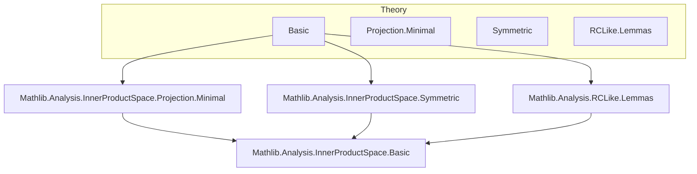

### Technical Brief: `Basic.lean` — Orthogonal Projection in Lean 4

---

#### **1. Key Definitions & Theorems**

| Name | Type / Signature | Purpose |
|------|------------------|---------|
| `HasOrthogonalProjection` | `class HasOrthogonalProjection (K : Submodule 𝕜 E) : Prop` | Asserts that every vector in `E` admits an orthogonal projection onto `K`. |
| `orthogonalProjectionFn` | `E → E` | Unbundled function returning the unique point in `K` satisfying the orthogonality condition. Used only internally. |
| `orthogonalProjection` | `E →L[𝕜] K` | **Bundled continuous linear map** (orthogonal projection onto `K`). |
| `starProjection` | `E →L[𝕜] E` | Orthogonal projection onto `K`, viewed as a map `E → E` (i.e., `subtypeL ∘ orthogonalProjection`). |
| `orthogonalProjectionFn_mem` | `v ∈ E → K.orthogonalProjectionFn v ∈ K` | Ensures the unbundled projection lands in `K`. |
| `orthogonalProjectionFn_inner_eq_zero` | `∀ w ∈ K, ⟪v - K.orthogonalProjectionFn v, w⟫ = 0` | Characterizes the unbundled projection via orthogonality. |
| `eq_orthogonalProjectionFn_of_mem_of_inner_eq_zero` | Uniqueness of projection with orthogonality property. |
| `starProjection_inner_eq_zero` | `∀ w ∈ K, ⟪v - K.starProjection v, w⟫ = 0` | Same as above, for bundled `starProjection`. |
| `sub_starProjection_mem_orthogonal` | `v - K.starProjection v ∈ Kᗮ` | Difference lies in orthogonal complement. |
| `eq_starProjection_of_mem_orthogonal` | Characterization via membership in `Kᗮ`. |
| `starProjection_minimal` | `‖y - U.starProjection y‖ = ⨅ x : U, ‖y - x‖` | Minimizes distance to subspace. |
| `orthogonalProjection_mem_subspace_eq_self` / `starProjection_mem_subspace_eq_self` | `v ∈ K → K.orthogonalProjection v = v` | Idempotent on `K`. |
| `starProjection_eq_self_iff` | `K.starProjection v = v ↔ v ∈ K` | Fixed points = elements of `K`. |
| `isIdempotentElem_starProjection` | `IsIdempotentElem K.starProjection` | `starProjection` is idempotent. |
| `range_starProjection` | `U.starProjection.range = U` | Image is exactly `U`. |
| `orthogonalProjection_eq_zero_iff` | `K.orthogonalProjection v = 0 ↔ v ∈ Kᗮ` | Kernel = orthogonal complement. |
| `ker_orthogonalProjection` / `ker_starProjection` | `ker = Kᗮ` | Explicit kernel description. |
| `norm_orthogonalProjection_apply_le` | `‖K.orthogonalProjection v‖ ≤ ‖v‖` | Non-expansive. |
| `lipschitzWith_orthogonalProjection` / `lipschitzWith_starProjection` | `LipschitzWith 1` | 1-Lipschitz. |
| `norm_orthogonalProjection` (if `K ≠ ⊥`) | `‖K.orthogonalProjection‖ = 1` | Operator norm = 1. |
| `starProjection_singleton` | `(𝕜 ∙ v).starProjection w = (⟪v, w⟫ / ‖v‖²) • v` | Explicit formula for 1D subspace. |
| `starProjection_unit_singleton` | If `‖v‖ = 1`, then `(𝕜 ∙ v).starProjection w = ⟪v, w⟫ • v` | Simplified for unit vectors. |
| `norm_sq_eq_add_norm_sq_projection` | `‖x‖² = ‖S.orthogonalProjection x‖² + ‖Sᗮ.orthogonalProjection x‖²` | Pythagorean theorem. |
| `inner_starProjection_left_eq_right` | `⟪K.starProjection u, v⟫ = ⟪u, K.starProjection v⟫` | Self-adjointness. |
| `starProjection_isSymmetric` / `isSymmetricProjection_starProjection` | `starProjection` is symmetric (and symmetric projection). |
| `isSymmetricProjection_iff_eq_coe_starProjection` | Characterizes symmetric projections as orthogonal projections. |
| `id_eq_sum_starProjection_self_orthogonalComplement` | `id = K.starProjection + Kᗮ.starProjection` | Decomposition of identity. |

---

#### **2. Naming Conventions**

- **Prefixes**:
  - `orthogonalProjection*`: Bundled/unbundled projections *into* `K`.
  - `starProjection*`: Same, but *as endomorphisms* `E → E`.
  - `mem_*`, `inner_*`, `norm_*`, `ker_*`, `range_*`: Standard properties.
  - `eq_*_of_*`: Uniqueness / characterization lemmas.
  - `of_*`: Constructors or implications *from* a condition.

- **Suffixes**:
  - `_Fn`: Unbundled version (internal use only).
  - `_left`, `_right`: For symmetry/adjointness.
  - `_iff`: Biconditional characterizations.
  - `_eq_zero_iff`, `_eq_self_iff`: Fixed-point / kernel characterizations.

- **Notation**:
  - `⟪x, y⟫` = `inner 𝕜 x y`
  - `absR` = `@abs ℝ _ _`
  - `Kᗮ` = orthogonal complement

---

#### **3. Tactic Stack**

| Tactic | Frequency | Role |
|--------|-----------|------|
| `simp` / `simp only` | Very High | Simplify using lemmas, especially `@[simp]` lemmas. |
| `rw` / `rwa` | High | Rewrite using equalities, often with `⟨...⟩` or `Subtype.ext`. |
| `ext` | High | Extensionality for functions/maps (especially `ContinuousLinearMap`). |
| `exact` / `assumption` | Medium | Direct proof steps. |
| `convert` | Medium | Match goals up to definitional equality (e.g., norms). |
| `nlinarith` | Medium | Handle quadratic inequalities (e.g., norm squares). |
| `field_simp`, `match_scalars` | Medium | Field simplifications in scalar expressions. |
| `gcongr` | Low | For norm inequalities (e.g., `‖T x‖ ≤ ‖T‖ * ‖x‖`). |
| `rcases`, `obtain` | Medium | Extract witnesses from `∃` or `∧`. |
| `have`, `suffices` | Medium | Introduce intermediate claims. |
| `linarith` | Low | Linear arithmetic (less common due to quadratic norms). |

---

#### **4. Proof Logic**

- **Structure**:
  1. **Existence**: Use `HasOrthogonalProjection.exists_orthogonal` to get `w ∈ K` with `v - w ∈ Kᗮ`.
  2. **Uniqueness**: Prove via orthogonality: if `v, v' ∈ K` both satisfy `⟪u - v, w⟫ = 0`, then `v = v'`.
  3. **Linearity & Continuity**: Show unbundled map is linear and bounded (via norm inequality), then bundle via `LinearMap.mkContinuous`.
  4. **Idempotence & Symmetry**: Use orthogonality to prove `T² = T` and `⟪T x, y⟫ = ⟪x, T y⟫`.
  5. **Norm Bounds**: Use Pythagorean theorem (`norm_add_sq_eq_norm_sq_add_norm_sq_of_inner_eq_zero`) to derive `‖T x‖ ≤ ‖x‖`, then operator norm ≤ 1.
  6. **Characterizations**: Reduce to uniqueness via `eq_*_of_*` lemmas.

- **Common Patterns**:
  - *Induction* is not used (no inductive types involved).
  - *Cases* on `v ∈ K` or `v ∈ Kᗮ` are frequent.
  - *Subtype reasoning*: Use `Subtype.ext` to prove equality of bundled elements.
  - *Duality*: `K` ↔ `Kᗮ` symmetry exploited (e.g., `orthogonalProjection_orthogonal`, `starProjection_orthogonal`).

---

#### **5. Imports**

| Module | Purpose |
|--------|---------|
| `Mathlib.Analysis.InnerProductSpace.Projection.Minimal` | Minimal distance characterization, existence of projections in complete subspaces. |
| `Mathlib.Analysis.InnerProductSpace.Symmetric` | Symmetric operators, adjoints, and symmetric projections. |
| `Mathlib.Analysis.RCLike.Lemmas` | Real/complex analysis lemmas (e.g., `re`, `norm_sq`, `inner` properties). |

---

#### **6. Mermaid Diagrams**

##### **Dependency Graph (Top-Level)**



##### **Overview of `Basic.lean`**

```mermaid
flowchart TD
  A[Submodule K] --> B[HasOrthogonalProjection K]
  B --> C[orthogonalProjectionFn : E → E]
  C --> D[orthogonalProjection : E →L[𝕜] K]
  D --> E[starProjection : E →L[𝕜] E]

  B --> F[orthogonalProjectionFn_mem]
  B --> G[orthogonalProjectionFn_inner_eq_zero]
  G --> H[eq_orthogonalProjectionFn_of_mem_of_inner_eq_zero]

  D --> I[norm_orthogonalProjection_apply_le]
  D --> J[lipschitzWith_orthogonalProjection]
  D --> K[norm_orthogonalProjection]

  E --> L[starProjection_inner_eq_zero]
  E --> M[sub_starProjection_mem_orthogonal]
  E --> N[starProjection_minimal]

  D --> O[ker_orthogonalProjection = Kᗮ]
  E --> P[range_starProjection = K]

  E --> Q[isIdempotentElem]
  E --> R[isSymmetricProjection]

  Q --> S[isSymmetricProjection_iff_eq_coe_starProjection]
  R --> S

  D --> T[norm_sq_eq_add_norm_sq_projection]
  T --> U[Pythagorean theorem]

  style A fill:#f9f,stroke:#333
  style B fill:#bbf,stroke:#333
  style D fill:#9cf,stroke:#333
  style E fill:#9cf,stroke:#333
```

---

#### **7. Theory Scope**

- **Core Setting**: Complete inner product space `E` over `𝕜 ∈ {ℝ, ℂ}` (via `RCLike`).
- **Objects**: Submodules `K ≤ E`, especially *complete* ones (e.g., closed subspaces).
- **Main Results**:
  - Existence/uniqueness of orthogonal projection.
  - `orthogonalProjection` and `starProjection` as continuous linear maps.
  - Metric properties: non-expansiveness, 1-Lipschitz, minimal distance.
  - Algebraic properties: idempotence, symmetry, kernel/range.
  - Decomposition: `E = K ⊕ Kᗮ`, `id = proj_K + proj_{Kᗮ}`.
  - Explicit formulas for 1D subspaces.

- **Applications**:
  - Lax–Milgram theorem (cited in references).
  - Hilbert space geometry (e.g., projection theorems).
  - Operator theory (symmetric projections ↔ orthogonal projections).

--- 

This file forms the foundational API for orthogonal projections in `Mathlib`, enabling higher-level geometry and analysis in Hilbert spaces.
