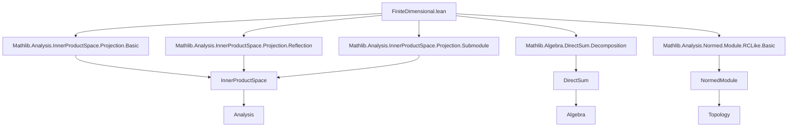
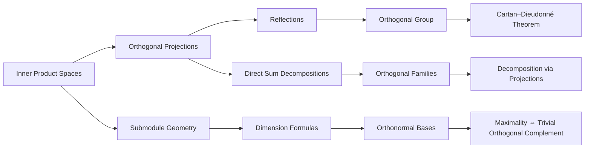

### Technical Brief: `FiniteDimensional.lean`

---

#### **1. Key Definitions & Theorems**

| Name | Type / Signature | Purpose |
|------|------------------|---------|
| `det_reflection` | `K.reflection.toLinearMap.det = (-1) ^ finrank 𝕜 Kᗮ` | Computes determinant of reflection over subspace `K` in terms of codimension. |
| `linearEquiv_det_reflection` | `K.reflection.det = (-1) ^ finrank 𝕜 Kᗮ` | Same as above, but for `LinearEquiv.det` (units action). |
| `finrank_add_inf_finrank_orthogonal` | `finrank K₁ + finrank (K₁ᗮ ⊓ K₂) = finrank K₂` (under `K₁ ≤ K₂`) | Dimension formula for subspace and orthogonal complement intersected with larger subspace. |
| `finrank_add_finrank_orthogonal` | `finrank K + finrank Kᗮ = finrank E` (when `E` finite-dim) | Fundamental dimension identity: dim(subspace) + dim(orthogonal complement) = dim(space). |
| `finrank_orthogonal_span_singleton` | `finrank (𝕜 ∙ v)ᗮ = n` (if `finrank E = n+1`, `v ≠ 0`) | Orthogonal complement of a line has codimension 1. |
| `LinearIsometryEquiv.reflections_generate_dim_aux` | `∃ l, l.length ≤ n ∧ φ = ∏_{v ∈ l} reflection (ℝ ∙ v)ᗮ` | Factorization of isometry into reflections, bounded by dimension of moving subspace. |
| `LinearIsometryEquiv.reflections_generate_dim` | `∃ l, l.length ≤ finrank F ∧ φ = ∏_{v ∈ l} reflection (ℝ ∙ v)ᗮ` | Special case of Cartan–Dieudonné: every orthogonal transformation is product of ≤ dim reflections. |
| `LinearIsometryEquiv.reflections_generate` | `Subgroup.closure (range reflection) = ⊤` | Orthogonal group is generated by reflections (Cartan–Dieudonné theorem). |
| `OrthogonalFamily.isInternal_iff_of_isComplete` | `DirectSum.IsInternal V ↔ (iSup V)ᗮ = ⊥` (under completeness) | Internal direct sum decomposition iff orthogonal complement of span is trivial. |
| `OrthogonalFamily.sum_projection_of_mem_iSup` | `∑ i, (V i).starProjection x = x` (if `x ∈ iSup V`) | Decomposition of vector via orthogonal projections onto orthogonal family. |
| `OrthogonalFamily.projection_directSum_coeAddHom` | `(V i).orthogonalProjection (coeAddMonoidHom x) = x i` | Projection onto component of direct sum equals coefficient. |
| `OrthogonalFamily.decomposition` | `DirectSum.Decomposition V` | Constructs decomposition of space into orthogonal direct sum via projections. |
| `maximal_orthonormal_iff_orthogonalComplement_eq_bot` | `maximal orthonormal ↔ span vᗮ = ⊥` | Maximal orthonormal set iff its span has trivial orthogonal complement. |
| `maximal_orthonormal_iff_basis_of_finiteDimensional` | `maximal orthonormal ↔ basis` (finite-dim case) | In finite dimensions, maximal orthonormal sets are exactly orthonormal bases. |

---

#### **2. Naming Conventions**

- **Prefixes**:
  - `det_`, `linearEquiv_det_`: determinant-related.
  - `finrank_`: finite-dimensional dimension formulas.
  - `orthogonal_`, `reflection_`, `projection_`: geometric constructions.
  - `maximal_orthonormal_`: orthonormal set maximality.
- **Suffixes**:
  - `_eq_self`, `_eq_bot`, `_eq_zero`: equality to canonical subobjects.
  - `_of_le`, `_of_finiteDimensional`, `_of_hasOrthogonalProjection`: hypotheses in theorem names.
  - `_aux`: auxiliary lemmas used in main proofs (e.g., `reflections_generate_dim_aux`).
- **Notation**:
  - `Kᗮ`: orthogonal complement of submodule `K`.
  - `⟪x, y⟫`: inner product.
  - `absR`: alias for `abs ℝ`.
  - `reflection (ℝ ∙ v)ᗮ`: reflection across hyperplane orthogonal to vector `v`.

---

#### **3. Tactic Stack**

Frequently used tactics in proofs:
- `rw`, `simp`, `simp_rw`: rewriting and simplification (especially with `orthogonalProjection`, `reflection`, `det`, `finrank`).
- `ext`: extensionality for functions/maps.
- `convert`: flexible equality chaining (e.g., in `finrank_add_finrank_orthogonal`).
- `induction ... with | zero | succ`: induction on natural numbers (used in `reflections_generate_dim_aux`).
- `by_cases`, `by_contra`: case splits and contradiction.
- `exact`, `assumption`, `linarith`, `lia`: arithmetic and linear reasoning.
- `erw`: rewrite with definitional equality (used in `decomposition` proof).
- `grind`: custom tactic (likely from Mathlib’s `Grind` module).
- `refine`, `obtain`, `rcases`: structured proof construction.

---

#### **4. Proof Logic**

- **Inductive structure**: Many proofs (e.g., `reflections_generate_dim_aux`) use strong induction on natural numbers (dimension).
- **Case analysis**: Splitting on whether a dimension is zero or positive, or whether a vector lies in a subspace.
- **Dimension counting**: Central technique: using identities like `finrank K + finrank Kᗮ = finrank E` to bound dimensions.
- **Orthogonal decomposition**: Leveraging `orthogonalProjection`, `starProjection`, and `DirectSum` to decompose vectors and maps.
- **Geometric reasoning**: Reflections, fixed subspaces, and moving subspaces (`ker(id - φ)`, `ker(id - φ)ᗮ`) used to control action of isometries.
- **Equivalence chaining**: Proving equivalences (`↔`) by splitting into two directions, often via `contrapose!`, `intro`, `apply`, `symm`.

---

#### **5. Imports**

Core dependencies defining scope:
- `Mathlib.Analysis.InnerProductSpace.Projection.*`: projection theory (basic, reflection, submodule).
- `Mathlib.Algebra.DirectSum.Decomposition`: direct sum decompositions.
- `Mathlib.Analysis.Normed.Module.RCLike.Basic`: RCLike fields (e.g., ℝ, ℂ), normed modules.

---

#### **6. Mermaid Diagrams**

##### **Dependency Graph (Module-Level)**

##### **Overview of Theory Flow**

---

#### **7. Summary**

This module formalizes core finite-dimensional inner product space theory in Lean, with emphasis on:
- **Geometric linear algebra**: orthogonal complements, reflections, projections.
- **Structure theory of the orthogonal group**: generation by reflections (Cartan–Dieudonné).
- **Decomposition theory**: orthogonal families, direct sums, orthonormal bases.

It bridges analysis (inner product, normed spaces), algebra (modules, direct sums), and topology (finite-dimensional subspaces are closed), and relies heavily on `RCLike` and `FiniteDimensional` assumptions. The proofs combine dimension counting, induction, and geometric reasoning, with heavy use of `orthogonalProjection` and `reflection` infrastructure.
