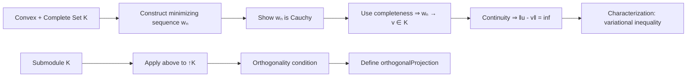

**Technical Brief: Minimal.lean — Existence of Minimizers (Hilbert Projection Theorem)**

---

### 1. KEY DEFINITIONS & THEOREMS

| Name | Type / Signature | Purpose |
|------|------------------|---------|
| `exists_norm_eq_iInf_of_complete_convex` | `{K : Set F} → K.Nonempty → IsComplete K → Convex ℝ K → ∀ u : F, ∃ v ∈ K, ‖u - v‖ = ⨅ w : K, ‖u - w‖` | **Main theorem**: existence of a minimizer (projection) of a point onto a nonempty complete convex subset in a real inner product space. |
| `norm_eq_iInf_iff_real_inner_le_zero` | `{K : Set F} → Convex ℝ K → ∀ {u v : F}, v ∈ K → (‖u - v‖ = ⨅ w : K, ‖u - w‖) ↔ ∀ w ∈ K, ⟪u - v, w - v⟫_ℝ ≤ 0` | **Characterization** of minimizers via variational inequality (first-order condition). |
| `exists_norm_eq_iInf_of_complete_subspace` | `(K : Submodule 𝕜 E) → IsComplete ↑K → ∀ u : E, ∃ v ∈ K, ‖u - v‖ = ⨅ w : ↑K, ‖u - w‖` | Special case of the above for **submodules/subspaces** (linear subspaces). |
| `norm_eq_iInf_iff_real_inner_eq_zero` | `(K : Submodule ℝ F) → ∀ {u v : F}, v ∈ K → (‖u - v‖ = ⨅ w : ↑K, ‖u - w‖) ↔ ∀ w ∈ K, ⟪u - v, w⟫_ℝ = 0` | Characterization for **real submodules**: minimizer iff residual is orthogonal to the subspace. |
| `norm_eq_iInf_iff_inner_eq_zero` | `∀ {u v : E}, v ∈ K → (‖u - v‖ = ⨅ w : K, ‖u - w‖) ↔ ∀ w ∈ K, ⟪u - v, w⟫ = 0` | Generalization to **any `RCLike` field** (e.g., ℂ), using `re` and `im` to recover orthogonality. |

---

### 2. NAMING CONVENTIONS

- **Prefixes**:
  - `exists_...`: asserts existence of a minimizer.
  - `norm_eq_iInf_...`: characterizes minimizers via equality of norm to infimum distance.
- **Suffixes**:
  - `_of_complete_convex`: hypothesis pattern (convex + complete).
  - `_of_complete_subspace`: for linear subspaces.
  - `_real_inner_...`: real-case version (uses `⟪·,·⟫_ℝ`).
  - `_inner_...`: general `RCLike` case (uses `⟪·,·⟫`).
- **Notation**:
  - `⟪x, y⟫` = `inner 𝕜 x y`
  - `absR` = `@abs ℝ _ _`
  - `δ` = `⨅ w : K, ‖u - w‖` (infimum distance)

---

### 3. TACTIC STACK

| Tactic | Frequency | Role |
|--------|-----------|------|
| `rcases` / `rintro` | High | Destruct existential/universal hypotheses and subtypes. |
| `have` / `suffices` | Very high | Introduce intermediate lemmas or goals. |
| `rw` / `simp` / `simp only` | High | Rewrite using definitions, inner product identities, algebraic laws. |
| `calc` | Medium | Chain equalities (e.g., parallelogram law, norm expansions). |
| `ring` / `abel` | Medium | Simplify algebraic expressions (polynomial identities, abelian group rewrites). |
| `gcongr` | Medium | Congruence for inequalities under monotone functions (e.g., `sqrt`, `*`). |
| `linarith` | Medium | Solve linear inequalities (e.g., from variational condition). |
| `fun_prop` / `filter_tactics` | Low | Prove continuity, filter convergence (e.g., `Tendsto`, `Continuous`). |
| `exact` / `apply` | High | Apply lemmas or hypotheses directly. |
| `by_cases` | Medium | Split on decidable propositions (e.g., `q = 0`). |
| `convert` | Medium | Match goals up to definitional equality (e.g., composition of limits). |

---

### 4. PROOF LOGIC

The proof of `exists_norm_eq_iInf_of_complete_convex` follows a **classical analysis strategy**:

1. **Infimum approximation**:
   - Define `δ = ⨅ w : K, ‖u - w‖`.
   - Use definition of infimum to construct a sequence `(w n) ⊆ K` with `‖u - w n‖ < δ + 1/(n+1)`, hence `‖u - w n‖ → δ`.

2. **Cauchy property**:
   - Use the **parallelogram law** to bound `‖wₙ - wₘ‖²` in terms of `‖u - wₙ‖`, `‖u - wₘ‖`, and `δ`.
   - Show `‖wₙ - wₘ‖ → 0` as `n,m → ∞`, using that `‖u - w n‖ → δ`.

3. **Completeness**:
   - Since `K` is complete, `w n → v ∈ K`.

4. **Minimality**:
   - Use continuity of `v ↦ ‖u - v‖` to pass to the limit: `‖u - v‖ = δ`.

The characterization theorems (`norm_eq_iInf_iff_...`) use:
- **Variational inequality** (`≤ 0`) for convex sets (via convex combinations `θ w + (1-θ) v`).
- **Orthogonality** (`= 0`) for subspaces (by testing both `w` and `-w` to get equality).
- For `RCLike` fields, reduce to real case via `restrictScalars`, then lift using `RCLike.ext` (`re`/`im`).

---

### 5. IMPORTS & DEPENDENCIES

| Module | Role |
|--------|------|
| `Mathlib.Analysis.InnerProductSpace.Basic` | Core inner product space theory: `inner`, `norm`, `parallelogram_law`, `inner_smul_right`, `norm_sub_sq`. |
| `Mathlib.Analysis.SpecificLimits.Basic` | Tools for limits: `Tendsto`, `atTop`, `nhds`, `tendsto_one_div_add_atTop_nhds_zero_nat`. |
| `Topology`, `RCLike`, `Real`, `Filter`, `InnerProductSpace` | Open namespaces for `tendsto`, `continuous`, `RCLike`, `re`, `im`, `I`, etc. |

---

### 6. MERMAID DIAGRAMS

#### Dependency Graph (Top-Level)

```mermaid
graph TD
  A[Minimal.lean] --> B[Mathlib.Analysis.InnerProductSpace.Basic]
  A --> C[Mathlib.Analysis.SpecificLimits.Basic]
  A --> D[Mathlib/Analysis/InnerProductSpace/Projection/Basic.lean]  %% future usage
  B --> E[Parallelogram Law]
  B --> F[Inner Product Properties]
  C --> G[Limits & Convergence]
  D --> A
```

#### Overview of Theory Flow



---

### 7. SUMMARY

This file establishes the **Hilbert projection theorem** in full generality for `RCLike` fields (including ℂ), providing both **existence** and **characterization** of minimizers. It is foundational for defining orthogonal projections onto submodules (`Submodule.orthogonalProjection`), and is used in `Projection/Basic.lean`. The proofs combine classical analysis (Cauchy sequences, completeness), convex geometry (variational inequalities), and inner product algebra (parallelogram law, polarization).
