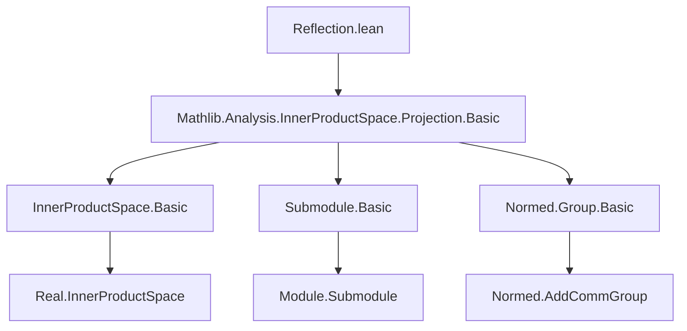

**Technical Brief: `Reflection.lean` Module**

---

### 1. **Key Definitions & Theorems**

| Name | Type / Signature | Purpose |
|------|------------------|---------|
| `reflectionLinearEquiv` | `E ≃ₗ[𝕜] E` | Linear equivalence underlying the reflection; defined as $x \mapsto 2 \cdot K.\text{starProjection}(x) - x$, shown involutive. |
| `reflection` | `E ≃ₗᵢ[𝕜] E` | The *linear isometry equivalence* (i.e., distance-preserving linear automorphism) implementing reflection in a complete subspace $K$. |
| `reflection_apply` | `K.reflection p = 2 • K.starProjection p - p` | Explicit formula for the action of reflection. |
| `reflection_symm`, `reflection_inv` | `K.reflection.symm = K.reflection`, `K.reflection⁻¹ = K.reflection` | Reflection is its own inverse. |
| `reflection_reflection` | `K.reflection (K.reflection p) = p` | Involution property applied pointwise. |
| `reflection_involutive` | `Function.Involutive K.reflection` | Abstract involutivity. |
| `reflection_trans_reflection`, `reflection_mul_reflection` | `K.reflection.trans K.reflection = 1`, `K.reflection * K.reflection = 1` | Group-theoretic formulation of involutivity. |
| `reflection_orthogonal_apply` | `Kᗮ.reflection v = -K.reflection v` | Relation between reflection in $K$ and in its orthogonal complement $K^\perp$. |
| `reflection_singleton_apply` | `reflection (𝕜 ∙ u) v = 2 • (⟪u, v⟫ / ‖u‖²) • u - v` | Explicit formula for reflection in a 1-dimensional subspace (standard Householder reflection). |
| `reflection_eq_self_iff` | `K.reflection x = x ↔ x ∈ K` | Fixed points of reflection are precisely points in $K$. |
| `reflection_mem_subspace_eq_self` | `x ∈ K ⇒ K.reflection x = x` | Immediate corollary of above. |
| `reflection_map_apply`, `reflection_map` | Functoriality under isometric linear equivalences: `reflection (K.map f) = f⁻¹ ∘ reflection K ∘ f`. |
| `reflection_bot` | `reflection ⊥ = neg` | Reflection in the trivial subspace is negation. |
| `reflection_mem_subspace_orthogonalComplement_eq_neg` | `v ∈ Kᗮ ⇒ K.reflection v = -v` | Reflection of a vector orthogonal to $K$ is its negation. |
| `reflection_sub` | `‖v‖ = ‖w‖ ⇒ reflection (ℝ ∙ (v - w))ᗮ v = w` | Key geometric lemma: reflection in the orthogonal complement of $(v - w)$ swaps $v$ and $w$ when norms match. |

---

### 2. **Naming Conventions**

- **Prefixes**:
  - `reflection_`: core reflection properties (`reflection_apply`, `reflection_eq_self_iff`, etc.)
  - `reflection_mem_..._eq_self` / `eq_neg`: behavior on subspaces / orthogonal complements.
  - `reflection_orthogonal`: relation to orthogonal complement.
  - `reflection_singleton`: 1D case.
  - `reflection_map`: behavior under pushforward by isometries.
  - `reflection_bot`: minimal subspace case.

- **Suffixes**:
  - `_apply`: pointwise evaluation.
  - `_iff`: biconditional characterizations.
  - `_eq_self`, `_eq_neg`: fixed-point / sign behavior.

- **Auxiliary**:
  - `reflectionLinearEquiv`: underlying linear equivalence before norm preservation is verified.

---

### 3. **Tactic Stack**

Frequent tactics used in proofs:

| Tactic | Role |
|--------|------|
| `simp` / `simp only` | Simplify using definitions (`reflection_apply`, `starProjection_eq_self_iff`, etc.) |
| `abel` | Simplify linear combinations (e.g., `2 • a - (2 • a - x) = x`) |
| `convert ... using 2` | Match goals up to definitional equality of auxiliary terms |
| `rw` / `rwa` | Rewrite using lemmas (e.g., `starProjection_singleton`, `orthogonalProjection_mem_subspace_orthogonalComplement_eq_zero`) |
| `ext` | Extensionality for functions / linear maps |
| `apply ...` / `exact` | Direct proof steps (e.g., `apply reflection_mem_subspace_eq_self`) |
| `set ...` | Introduce local definitions (e.g., `R := reflection ...`) |
| `have h₁ : ...` / `have h₂ : ...` | Intermediate lemmas in geometric arguments (e.g., `reflection_orthogonalComplement_singleton_eq_neg`) |

---

### 4. **Proof Logic**

- **Structure**: Most proofs follow a *definition → simplification → algebraic manipulation* pattern.
- **Core strategy**:
  1. Unfold `reflection` via `reflection_apply`.
  2. Use properties of `starProjection` (e.g., `starProjection_eq_self_iff`, orthogonality).
  3. Apply linear algebra simplifications (`abel`, `smul_right_injective`, `two_ne_zero`).
  4. For geometric lemmas (`reflection_sub`), introduce auxiliary isometries and combine known facts (e.g., `R(v-w) = -(v-w)`, `R(v+w) = v+w`) to derive target equality.
- **Induction is not used** — all arguments are direct algebraic/geometric.

---

### 5. **Imports**

- `Mathlib.Analysis.InnerProductSpace.Projection.Basic`  
  → Provides `Submodule`, `orthogonalProjection`, `starProjection`, `HasOrthogonalProjection`, and basic inner product space theory.

- Implicit dependencies (via `RCLike`, `InnerProductSpace`, `NormedAddCommGroup`):
  - `Mathlib.Analysis.InnerProductSpace.Basic`
  - `Mathlib.Analysis.Normed.Group.Basic`
  - `Mathlib.Algebra.Module.LinearMap.Basic`
  - `Mathlib.Algebra.Module.Submodule.Basic`
  - `Mathlib.Data.Real.Basic` (for `RCLike`)

---

### 6. **Mermaid Diagrams**

#### **Dependency Graph (Module-Level)**



#### **Overview of Theory Flow**

```mermaid
flowchart LR
  A[Submodule K ⊆ E] -->|orthogonal projection| B[K.HasOrthogonalProjection]
  B --> C[Define starProjection]
  C --> D[reflectionLinearEquiv := 2•starProj - id]
  D -->|prove involutive| E[reflection : E ≃ₗᵢ[𝕜] E]
  E --> F[Properties: involution, fixed points, behavior on K, Kᗮ]
  E --> G[Functoriality under isometries]
  E --> H[Special cases: 1D, ⊥, Kᗮ]
  H --> I[Geometric lemma: reflection_sub]
```

#### **Conceptual Flow of Reflection**

```mermaid
flowchart LR
  x[E] -->|orthogonal proj| w[K]
  x -->|v = x - w| v[Kᗮ]
  v -->|⟪v,w⟫=0| orthogonal decomposition
  reflection --> 2•w - x = w - v
  subgraph "Reflection Geometry"
    direction TB
    w[K] --- "orthogonal" --- v[Kᗮ]
  end
  2•w - x --> "involutive" --> x
```

---

### Summary

This module formalizes **reflection in a complete subspace** of a (real or complex) inner product space, building on orthogonal projection. It establishes the reflection as an involutive linear isometry, analyzes its fixed points and action on orthogonal complements, and proves key geometric lemmas (e.g., `reflection_sub`) used in further developments (e.g., Cartan–Dieudonné theorem, geometry of normed spaces). The formalization is clean, modular, and leverages Lean’s typeclass infrastructure (`RCLike`, `HasOrthogonalProjection`) for generality.
