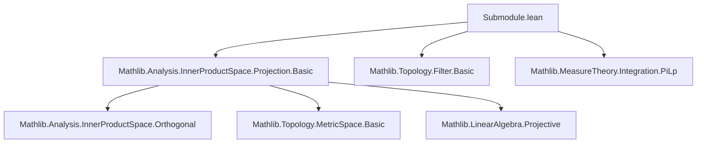
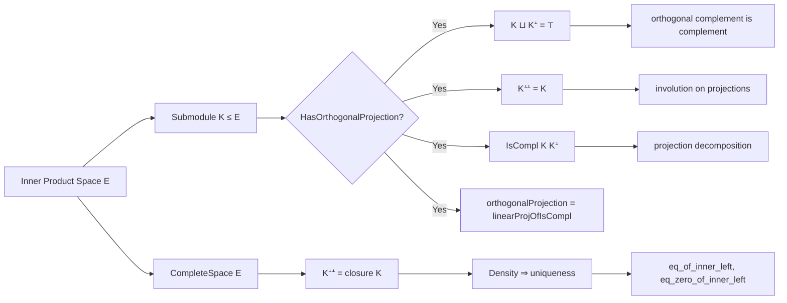

**Technical Brief: Submodule.lean — Orthogonal Projections and Complements in Inner Product Spaces**

---

### **1. Key Definitions & Theorems**

| Name | Type / Signature | Purpose |
|------|------------------|---------|
| `orthogonalProjection` | `K : Submodule 𝕜 E → E →ₗ[𝕜] K` | Linear map projecting onto `K` when `K.HasOrthogonalProjection` holds. |
| `starProjection` | `K.starProjection : E → E` | The full-space projection: `x ↦ orthogonalProjection K x + orthogonalProjection Kᗮ x`. |
| `orthogonalComplement` | `Kᗮ : Submodule 𝕜 E` | Orthogonal complement of `K`. |
| `HasOrthogonalProjection` | `Prop` (class) | Predicate asserting existence of orthogonal projection onto `K`. |
| `isCompl_orthogonal_of_hasOrthogonalProjection` | `[K.HasOrthogonalProjection] → IsCompl K Kᗮ` | `K` and `Kᗮ` form a direct sum decomposition of `E`. |
| `sup_orthogonal_of_hasOrthogonalProjection` | `[K.HasOrthogonalProjection] → K ⊔ Kᗮ = ⊤` | `K + Kᗮ = E`. |
| `orthogonal_orthogonal` | `[K.HasOrthogonalProjection] → Kᗮᗮ = K` | Double orthogonal complement recovers `K`. |
| `orthogonal_orthogonal_eq_closure` | `[CompleteSpace E] → Kᗮᗮ = K.topologicalClosure` | In Hilbert spaces, double orthogonal complement = topological closure. |
| `triorthogonal_eq_orthogonal` | `Kᗮᗮᗮ = Kᗮ` | Triple orthogonal complement = orthogonal complement. |
| `orthogonal_le_orthogonal_iff` | `[K₀.HasOrthogonalProjection] [K₁.HasOrthogonalProjection] → K₀ᗮ ≤ K₁ᗮ ↔ K₁ ≤ K₀` | Orthogonal complement reverses inclusion. |
| `orthogonal_injective` | `[CompleteSpace E] → Function.Injective (K ↦ Kᗮ)` | Orthogonal complement is injective on closed submodules. |
| `sup_orthogonal` | `[CompleteSpace E] → K₁ᗮ ⊔ K₂ᗮ = (K₁ ⊓ K₂)ᗮ` | Sup of orthogonal complements = orthogonal of inf. |
| `eq_zero_of_inner_left`, `eq_of_inner_left`, etc. | `Dense (K : Set E) → ... → x = y` | Density + orthogonality implies equality (e.g., Riesz representation uniqueness). |

---

### **2. Naming Conventions**

- **Prefixes**:
  - `orthogonal_`: e.g., `orthogonalProjection`, `orthogonal_orthogonal`, `orthogonal_le_orthogonal_iff`.
  - `isCompl_`: e.g., `isCompl_orthogonal_of_hasOrthogonalProjection`.
  - `starProjection_`: e.g., `starProjection_apply_eq_isComplProjection`, `starProjection_tendsto_closure_iSup`.
  - `linearProjOfIsCompl`: used when identifying projections with linear projections from complement structure.

- **Suffixes**:
  - `_of_hasOrthogonalProjection`: condition on `K` having orthogonal projection.
  - `_eq_...`: equality lemmas (e.g., `orthogonal_orthogonal_eq_closure`).
  - `_iff_...`: equivalence lemmas (e.g., `orthogonal_le_orthogonal_iff`).
  - `_tendsto_...`: convergence statements (e.g., `starProjection_tendsto_closure_iSup`).

- **Notation**:
  - `⟪x, y⟫` for inner product.
  - `Kᗮ` for orthogonal complement (Unicode `ᗮ` = U+272E).
  - `Kᗮᗮ`, `Kᗮᗮᗮ` for iterated complements.

---

### **3. Tactic Stack**

Frequently used tactics in proofs:

| Tactic | Role |
|--------|------|
| `ext` | Extensionality for submodules/sets. |
| `rw [Submodule.mem_sup]`, `rw [Submodule.mem_inf]` | Unfold membership in sup/inf. |
| `simp`, `simp_rw` | Simplify using lemmas like `orthogonalProjection_mem_subspace_eq_self`. |
| `convert ... using n` | Flexibly match goals with lemmas (e.g., `sup_orthogonal_of_hasOrthogonalProjection`). |
| `exact`, `refine`, `apply` | Direct proof steps, especially with `⟨...⟩` for existential intro. |
| `rwa [...]` | Rewrite + assumption. |
| `have h : ..., from ...` | Introduce intermediate facts (e.g., `hz' : z = 0`). |
| `congr` | Apply congruence to equalities of functions/maps. |
| `convert ...; rw [...]` | Chain conversions and rewrites. |
| `tendsto`-related: `of_neBot_imp`, `Filter.Tendsto`, `𝓝` | For convergence lemmas (`starProjection_tendsto_...`). |
| `norm_num`, `linarith`, `ring` | Arithmetic in normed spaces (used implicitly in `norm_sub_rev`, `ciInf_le`). |

---

### **4. Proof Logic**

**Typical proof structure**:

1. **Extensionality**: Prove equality of submodules by `ext x` and membership equivalence.
2. **Decomposition via projection**:
   - Use `orthogonalProjection K x` to split `x = v + (x - v)`, where `v ∈ K`, `x - v ∈ Kᗮ`.
   - Apply lemmas like `sub_starProjection_mem_orthogonal`.
3. **Double inclusion**:
   - For `A = B`, prove `A ≤ B` and `B ≤ A`.
   - Often via `sup_orthogonal_of_hasOrthogonalProjection` to get `K ⊔ Kᗮ = ⊤`.
4. **Density arguments**:
   - Use `eq_zero_of_inner_left` or `eq_of_sub_mem_orthogonal` to deduce equality from orthogonality on dense subset.
5. **Monotone convergence**:
   - For `starProjection_tendsto_closure_iSup`, use:
     - Approximation of closure point by elements in supremum.
     - Monotonicity `hU : Monotone U` to bound indices.
     - Minimality of orthogonal projection (`starProjection_minimal`).
6. **Completeness assumptions**:
   - Used to ensure `K.topologicalClosure.HasOrthogonalProjection`, or to apply `orthogonal_orthogonal_eq_closure`.

---

### **5. Imports & Dependencies**

**Primary imports**:
```lean
import Mathlib.Analysis.InnerProductSpace.Projection.Basic
```

**Implicit dependencies** (via `RCLike`, `NormedAddCommGroup`, `InnerProductSpace`, `Topology`, `Filter`, etc.):

- `Mathlib.Analysis.InnerProductSpace.Orthogonal`
- `Mathlib.Analysis.InnerProductSpace.Projection.Basic`
- `Mathlib.Topology.MetricSpace.Basic`
- `Mathlib.Topology.Constructions`
- `Mathlib.LinearAlgebra.Projective`
- `Mathlib.MeasureTheory.Integration.IntegralBasic` (via `PiLp 2`, `Lp`-style spaces)

**Key typeclasses**:
- `[RCLike 𝕜]`: Scalar field (ℝ or ℂ) with topology.
- `[NormedAddCommGroup E]`, `[InnerProductSpace 𝕜 E]`: Hilbert module structure.
- `[CompleteSpace E]`: Hilbert space (needed for closure = double complement).
- `[HasOrthogonalProjection K]`: Existence of orthogonal projection.

---

### **6. Mermaid Diagrams**

#### **Dependency Graph (Module-Level)**



#### **Overview of Theory Flow**



---

### **7. Summary**

This file formalizes foundational results about orthogonal projections in inner product spaces, especially in Hilbert spaces. It leverages the `HasOrthogonalProjection` class to unify finite-dimensional and complete subspace cases. Key themes include:

- **Decomposition**: `K ⊕ Kᗮ = E` under projection existence.
- **Involution**: `K ↦ Kᗮ` is an involution on projections, reversing inclusion.
- **Closure & Density**: In Hilbert spaces, `Kᗮᗮ = cl(K)`, and density + orthogonality ⇒ triviality.
- **Convergence**: Monotone families of projections converge to projection on closure of supremum.

The formalization is highly structured, with careful use of typeclasses, deprecated aliases for backward compatibility, and a consistent naming scheme reflecting mathematical properties (e.g., `orthogonal_orthogonal`, `sup_orthogonal`).
