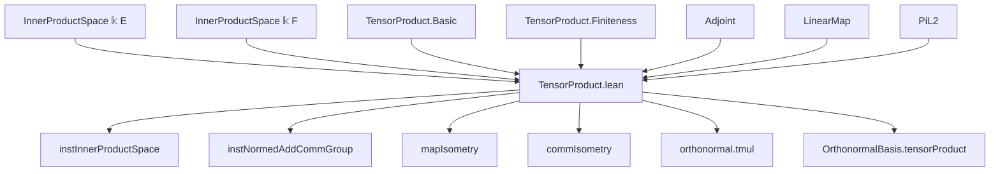
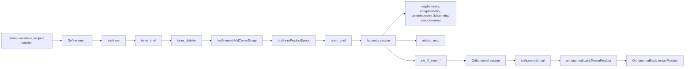

**Technical Brief: TensorProduct.lean — Inner Product Space Structure on Tensor Products**

---

### 1. KEY DEFINITIONS & THEOREMS

| Name | Type / Signature | Purpose |
|------|------------------|---------|
| `inner_` | `E ⊗[𝕜] F →ₗ⋆[𝕜] E ⊗[𝕜] F →ₗ[𝕜] 𝕜` | Bilinear form defining the inner product on pure tensors: `⟪a⊗b, c⊗d⟫ = ⟪a,c⟫ * ⟪b,d⟫`. Constructed via `lift` and `mapBilinear`. |
| `instInner` | `Inner 𝕜 (E ⊗[𝕜] F)` | Instance of an inner product (as a `Inner` structure) on the tensor product. |
| `inner_tmul` | `inner (x⊗y) (x'⊗y') = inner x x' * inner y y'` | Simplification lemma for inner product on pure tensors. |
| `inner_definite` | `inner x x = 0 → x = 0` | Proves positive-definiteness of the inner product using finite submodule reduction and orthonormal bases. |
| `re_inner_self_nonneg` | `0 ≤ re (inner x x)` | Shows real part of inner product with itself is nonnegative. |
| `instNormedAddCommGroup` | `NormedAddCommGroup (E ⊗[𝕜] F)` | Normed additive group structure induced by the inner product norm. |
| `instInnerProductSpace` | `InnerProductSpace 𝕜 (E ⊗[𝕜] F)` | Full inner product space structure on tensor product. |
| `norm_tmul` | `‖x⊗y‖ = ‖x‖ * ‖y‖` | Norm of pure tensor equals product of norms. |
| `mapIsometry` | `(E →ₗᵢ G) → (F →ₗᵢ H) → (E⊗F →ₗᵢ G⊗H)` | Linear isometry version of `TensorProduct.map`. |
| `congrIsometry` | `(E ≃ₗᵢ G) → (F ≃ₗᵢ H) → (E⊗F ≃ₗᵢ G⊗H)` | Linear isometry equivalence version of `TensorProduct.congr`. |
| `commIsometry` | `E⊗F ≃ₗᵢ F⊗E` | Swap isomorphism as a linear isometry equivalence. |
| `lidIsometry` | `𝕜⊗E ≃ₗᵢ E` | Left unitor isomorphism as a linear isometry equivalence. |
| `assocIsometry` | `E⊗F⊗G ≃ₗᵢ E⊗(F⊗G)` | Associator isomorphism as a linear isometry equivalence. |
| `orthonormal.tmul` | `Orthonormal b₁ → Orthonormal b₂ → Orthonormal (b₁ ⊗ b₂)` | Tensor product of orthonormal families is orthonormal. |
| `OrthonormalBasis.tensorProduct` | `OrthonormalBasis ι₁ E → OrthonormalBasis ι₂ F → OrthonormalBasis (ι₁×ι₂) (E⊗F)` | Tensor product of orthonormal bases yields orthonormal basis on tensor product. |

---

### 2. NAMING CONVENTIONS

- **Prefixes**:
  - `inner_`: private helper for inner product definition.
  - `mapIsometry`, `congrIsometry`, `commIsometry`, `lidIsometry`, `assocIsometry`: isometric versions of existing tensor constructions.
  - `mapInclIsometry`: isometric version of inclusion map.
  - `lTensor`, `rTensor`: left/right tensoring with identity.
- **Suffixes**:
  - `_isometry`: indicates a linear isometry (not just linear map).
  - `_equiv` / `_isometry`: for equivalences (`≃ₗᵢ`).
  - `_tmul`: for properties of pure tensors (`⊗ₜ`).
  - `_threefold`, `_threefold'`: for 3-fold tensor products (left- vs right-associated).
- **Other**:
  - `ext_iff_inner_*`: extensionality lemmas via inner products against pure tensors.
  - `repr_tmul_apply`: coordinate formulas for orthonormal basis representation.

---

### 3. TACTIC STACK

- **Core tactics**:
  - `induction_on`: heavy use for tensor product induction (on pure tensors, sums, scalar multiples).
  - `simp` / `simp_all`: extensive simplification using `inner_tmul`, `map_sum`, `inner_add_*`, etc.
  - `rw`, `conv_lhs`: rewriting and conversion mode for structural manipulations.
  - `ext`, `ext'`: extensionality for linear maps and continuous linear maps.
  - `grw`: for rewriting in `dist`, `nndist`, `edist` contexts.
  - `have`, `obtain`: for intermediate constructions (e.g., finite submodules, orthonormal bases).
  - `convert`, `apply`, `exact`: for constructing proofs of equalities and instances.

- **Key automation**:
  - `aesop` not used (explicit manual reasoning).
  - `ring`, `linarith`, `norm_num` not prominent — algebraic simplifications are mostly `simp`-driven.

---

### 4. PROOF LOGIC

**General proof strategy**:

1. **Define bilinear form** `inner_` on pure tensors via universal property of tensor product (`lift`, `mapBilinear`).
2. **Verify inner product axioms**:
   - Symmetry/conjugate symmetry: via `induction_on` and `simp`.
   - Linearity: inherited from `innerₛₗ`.
   - Positive-definiteness: reduce to finite-dimensional case using `exists_finite_submodule_of_setFinite`, then apply `inner_self` with orthonormal bases (`stdOrthonormalBasis`).
3. **Inductive proofs** dominate:
   - Prove properties on pure tensors, then extend by linearity and continuity.
   - E.g., `inner_map_map`, `inner_comm_comm`, `inner_lid_lid`, `inner_assoc_assoc`.
4. **Finite-dimensional reduction**:
   - For positive-definiteness and nonnegativity, use that any tensor lies in tensor product of finite submodules.
   - Then use orthonormal bases of those submodules (guaranteed by `stdOrthonormalBasis`).
5. **Isometry constructions**:
   - Use `isometryOfInner` to upgrade linear maps to linear isometries once inner-product preservation is shown.
   - For equivalences, use `isometryOfInner` + `LinearEquiv` structure.

---

### 5. IMPORTS

| Module | Purpose |
|--------|---------|
| `Mathlib.Analysis.InnerProductSpace.Adjoint` | Adjoint operators, inner product calculus. |
| `Mathlib.Analysis.InnerProductSpace.LinearMap` | Linear maps between inner product spaces, isometries. |
| `Mathlib.Analysis.InnerProductSpace.PiL2` | ℓ² spaces, finite products. |
| `Mathlib.LinearAlgebra.TensorProduct.Basic` | Basic tensor product definitions (`⊗ₜ`, `map`, `comm`, `assoc`, `lid`). |
| `Mathlib.LinearAlgebra.TensorProduct.Finiteness` | Finite-dimensional properties, finite submodules. |
| `Mathlib.RingTheory.TensorProduct.Finite` | Finite generation/torsion-free properties. |

**Core dependencies**: `RCLike`, `NormedAddCommGroup`, `InnerProductSpace`, `Submodule`, `OrthonormalBasis`, `Basis`, `FiniteDimensional`.

---

### 6. MERMAID DIAGRAMS

#### Dependency Graph (High-Level)

#### Overview of File Structure

---

### 7. THEORY CONTEXT

This file sits at the intersection of:

- **Functional analysis**: inner product spaces, normed structures, isometries.
- **Linear algebra**: tensor products, bases, orthonormality.
- **Category theory**: structural isomorphisms (`comm`, `assoc`, `lid`) lifted to isometric equivalences.

It serves as a foundational step toward:
- Tensor products of Hilbert spaces.
- Continuous linear maps on tensor products.
- Infinite tensor products (future work: see TODO).
- Quantum information theory (e.g., orthonormal bases on composite systems).

The development mirrors standard mathematical practice: define inner product on pure tensors, extend bilinearly, verify axioms, then lift algebraic isomorphisms to isometric ones.

--- 

*End of Technical Brief.*
