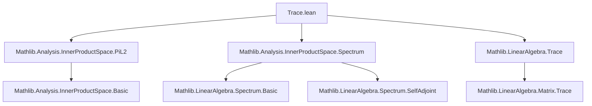
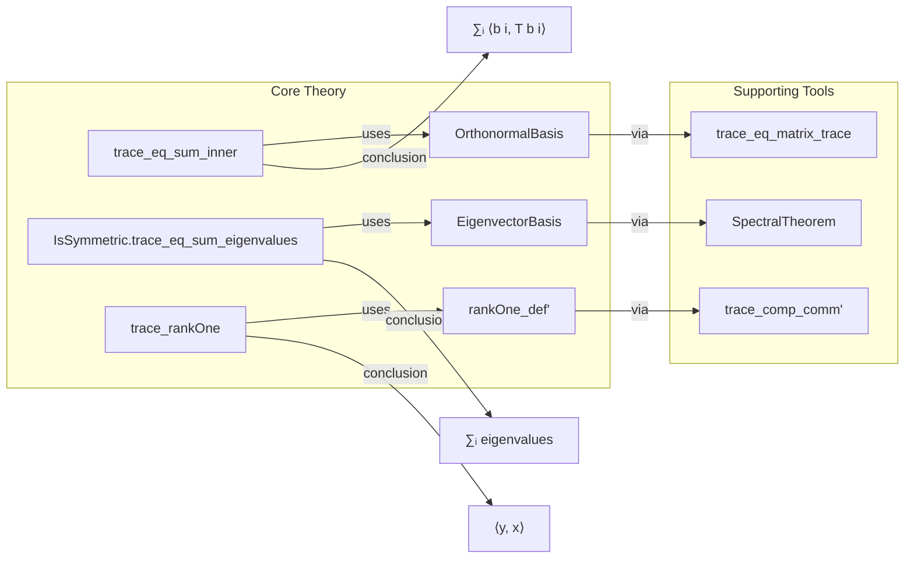

**Technical Brief: `Trace.lean` (Lean 4 Formalization)**  
*Domain: Functional Analysis / Linear Algebra in Inner Product Spaces*  
*Author: Iván Renison (2025)*  
*License: Apache 2.0*

---

### 1. KEY DEFINITIONS & THEOREMS

| Name | Type / Signature | Purpose |
|------|------------------|---------|
| `trace_eq_sum_inner` | `T.trace 𝕜 E = ∑ i, ⟪b i, T (b i)⟫_𝕜` | Expresses trace of a linear operator $T$ as sum of diagonal entries w.r.t. any orthonormal basis $b$. |
| `IsSymmetric.trace_eq_sum_eigenvalues` | `T.trace 𝕜 E = ∑ i, hT.eigenvalues hn i` | For symmetric $T$, trace equals sum of its (real) eigenvalues (counted with multiplicity). |
| `IsSymmetric.re_trace_eq_sum_eigenvalues` | `RCLike.re (T.trace 𝕜 E) = ∑ i, hT.eigenvalues hn i` | Same as above but explicitly for the real part (useful when trace may be complex a priori). |
| `InnerProductSpace.trace_rankOne` | `(rankOne 𝕜 x y).trace 𝕜 E = inner 𝕜 y x` | Trace of a rank-one operator $v \mapsto \langle v, x \rangle y$ equals $\langle y, x \rangle$. |

*Notation*:  
- $T.trace\ \mathbb{k}\ E$ is the trace of $T : E \to E$ over field $\mathbb{k}$.  
- $\langle -, - \rangle_\mathbb{k}$ is the inner product.  
- `OrthonormalBasis ι 𝕜 E` indexes an orthonormal basis by finite type $\iota$.  
- `rankOne 𝕜 x y` is the rank-one operator $v \mapsto \langle v, x \rangle y$.

---

### 2. NAMING CONVENTIONS

- **Prefixes**:
  - `trace_`: for trace-related lemmas (`trace_eq_sum_inner`, `trace_rankOne`).
  - `IsSymmetric.`: for properties of symmetric operators (`trace_eq_sum_eigenvalues`, `re_trace_eq_sum_eigenvalues`).
- **Suffixes**:
  - `_eq_sum_...`: indicates equality with a sum over basis/eigenvalues.
  - `_eq_one`, `_norm_eq_one`: used in orthonormality contexts (e.g., `b.norm_eq_one`).
- **Variable naming**:
  - `T`: linear operator.
  - `b`: orthonormal basis.
  - `x, y`: vectors for rank-one operators.
  - `hn`: hypothesis that $\dim E = n$.

---

### 3. TACTIC STACK

| Tactic | Frequency | Role |
|--------|-----------|------|
| `rw` | High | Rewriting definitions: trace, matrix trace, inner product, orthonormal basis properties. |
| `simp` | Medium | Simplifying using `norm_eq_one`, `apply_eigenvectorBasis`, `inner_smul_real_right`, etc. |
| `apply` / `intro` | Medium | Structuring proofs (e.g., `apply Fintype.sum_congr`, `intro i`). |
| `exact` | Low | Finalizing proofs (e.g., `exact RCLike.ofReal_re_ax _`). |
| `classical` | Low | Used once to enable classical choice (e.g., existence of orthonormal basis). |
| `simp_rw` (via `rw` + `simp`) | Implicit | Combined simplifying rewrites (e.g., `b.repr_apply_apply`). |

---

### 4. PROOF LOGIC

**General proof strategy**:
1. **Reduce to matrix representation** (e.g., via `trace_eq_matrix_trace`).
2. **Use orthonormal basis properties** (e.g., `b.coe_toBasis`, `b.repr_apply_apply`) to simplify diagonal entries.
3. **For symmetric operators**, invoke spectral theorem:
   - Construct eigenvector basis `hT.eigenvectorBasis`.
   - Use `apply_eigenvectorBasis` to replace $T(b_i)$ with $\lambda_i b_i$.
   - Simplify inner products using `inner_smul_real_right`, `inner_self_eq_norm_sq_to_K`, and `b.norm_eq_one`.
4. **For rank-one operators**, reduce to known formula via `rankOne_def'`, `trace_comp_comm'`, and singleton basis simplification.

**Typical flow**:
> *Induction-free*; relies on structural properties (basis expansion, spectral theorem for symmetric operators), and algebraic simplifications.

---

### 5. IMPORTS & DEPENDENCIES

| Module | Role |
|--------|------|
| `Mathlib.Analysis.InnerProductSpace.PiL2` | Provides $\ell^2$-type constructions, orthonormal bases, and basic inner product space theory. |
| `Mathlib.Analysis.InnerProductSpace.Spectrum` | Spectral theory for symmetric operators: eigenvalues, eigenvector bases, `IsSymmetric` typeclass. |
| `Mathlib.LinearAlgebra.Trace` | General trace theory for linear maps and matrices. |

*Core ambient assumptions*:
- `𝕜` is a `RCLike` field (i.e., $\mathbb{R}$ or $\mathbb{C}$).
- $E$ is a finite-dimensional normed additive commutative group and inner product space over $\mathbb{k}$.
- $\iota$ is a finite type indexing orthonormal bases.

---

### 6. MERMAID DIAGRAMS

#### Dependency Graph (Module-Level)

#### Overview of File Structure

---

### 7. SUMMARY

This module formalizes foundational trace identities in finite-dimensional inner product spaces over $\mathbb{R}$ or $\mathbb{C}$. It bridges linear algebra (trace, eigenvalues) and functional analysis (inner products, orthonormal bases), with emphasis on symmetric operators and rank-one perturbations. The proofs are constructive in nature (using orthonormal/eigenvector bases) and lean heavily on `Mathlib`’s spectral theory and matrix trace infrastructure.

Let me know if you'd like a formalized version of this brief in Lean doc-string format or a proof sketch in natural deduction style.
