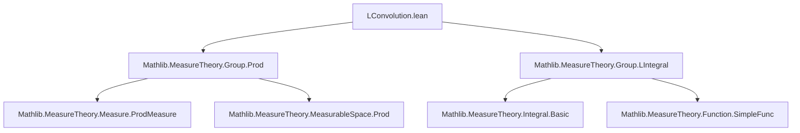

**Technical Brief: `LConvolution.lean`**

---

### 1. **Key Definitions & Theorems**

| Name | Type / Signature | Purpose |
|------|------------------|---------|
| `mlconvolution` | `G → ℝ≥0∞ → G → ℝ≥0∞ → Measure G → G → ℝ≥0∞` | Defines multiplicative convolution: $(f ⋆ₘₗ[μ] g)(x) = \int^-_y f(y) \cdot g(y^{-1} * x) \, dμ(y)$ |
| `lconvolution` | (implicit via `to_additive`) | Additive convolution: $(f ⋆ₗ[μ] g)(x) = \int^-_y f(y) \cdot g(-y + x) \, dμ(y)$ |
| `mlconvolution_def` | `∀ f g μ x, (f ⋆ₘₗ[μ] g) x = ∫⁻ y, f y * g (y⁻¹ * x) ∂μ` | Justifies definition by reflexivity; used for rewriting |
| `zero_mlconvolution` | `0 ⋆ₘₗ[μ] f = 0` | Convolution with zero function yields zero |
| `mlconvolution_zero` | `f ⋆ₘₗ[μ] 0 = 0` | Same as above, reversed argument |
| `measurable_mlconvolution` | `Measurable f → Measurable g → Measurable (f ⋆ₘₗ[μ] g)` | Ensures closure under measurability (requires `MeasurableMul₂`, `MeasurableInv`, `SFinite μ`) |
| `aemeasurable_mlconvolution` | `AEMeasurable f μ → AEMeasurable g μ → AEMeasurable (f ⋆ₘₗ[μ] g) μ` | Same for almost-everywhere measurability |
| `mlconvolution_assoc₀` | `AEMeasurable f → AEMeasurable g → AEMeasurable k → f ⋆ₘₗ[μ] g ⋆ₘₗ[μ] k = (f ⋆ₘₗ[μ] g) ⋆ₘₗ[μ] k` | Associativity for a.e. measurable functions |
| `mlconvolution_assoc` | `Measurable f → Measurable g → Measurable k → ...` | Full associativity for measurable functions |
| `mlconvolution_comm` | `[CommGroup G] → [IsMulLeftInvariant μ] → [IsInvInvariant μ] → f ⋆ₘₗ[μ] g = g ⋆ₘₗ[μ] f` | Commutativity in commutative groups with invariant measures |

> **Note**: `lconvolution` is defined via `to_additive` attribute, inheriting all properties from `mlconvolution` under additive notation.

---

### 2. **Naming Conventions**

- **Prefixes**:
  - `mlconvolution_`: Multiplicative convolution (e.g., `mlconvolution_def`, `mlconvolution_assoc`)
  - `zero_`, `zero_...`: Zero-function behavior
- **Suffixes**:
  - `_def`: Definition lemmas (often `rfl`)
  - `_assoc`, `_comm`: Algebraic properties
  - `_measurable`, `_aemeasurable`: Regularity properties
- **Notation**:
  - `⋆ₘₗ[μ]`: Multiplicative convolution w.r.t. `μ`
  - `⋆ₘₗ`: Multiplicative convolution w.r.t. `volume`
  - `⋆ₗ[μ]`, `⋆ₗ`: Additive analogues (via `to_additive`)

---

### 3. **Tactic Stack**

| Tactic | Frequency | Role |
|--------|-----------|------|
| `simp` | High | Simplify definitions, especially using `mlconvolution_def`, `zero_mlconvolution`, etc. |
| `ext` | High | Extensionality to prove function equality |
| `rw` | Medium | Rewrite using lemmas like `lintegral_mul_left_eq_self`, `lintegral_inv_eq_self`, `mul_comm`, `mul_assoc` |
| `conv` | Medium | Structural rewriting in integrals (e.g., factoring constants out of integrals) |
| `fun_prop` | Medium | Propagate measurability / a.e. measurability goals |
| `simp only [...]` | Medium | Precise simplification to avoid unfolding too much |
| `simpa` | Low | Final simplification after `rw` steps |

---

### 4. **Proof Logic**

- **Structure**: Most proofs follow a standard pattern:
  1. **Extensionality**: `ext x` to reduce to pointwise equality.
  2. **Unfold**: `simp only [mlconvolution_def]` to expose integral expression.
  3. **Rewrite integrals**: Use integral identities (e.g., `lintegral_mul_left_eq_self`, `lintegral_inv_eq_self`, `lintegral_lintegral_swap`) to rearrange terms.
  4. **Algebraic simplification**: Use `mul_comm`, `mul_assoc`, `mul_left_inv`, etc., depending on group structure.
  5. **Measurability checks**: `fun_prop` ensures integrability/measurability prerequisites hold.

- **Induction**: Not used — proofs rely on measure-theoretic identities and algebraic properties.

- **Key Lemma Usage**:
  - `lintegral_lintegral_swap`: Fubini-type swap for iterated integrals (used in associativity).
  - `lintegral_inv_eq_self`: For change-of-variables in commutative case.
  - `lintegral_mul_left_eq_self`, `lintegral_mul_const''`: Pulling constants out of integrals.

---

### 5. **Imports**

| Import | Purpose |
|--------|---------|
| `Mathlib.MeasureTheory.Group.Prod` | Product measures, measurable space structure on product groups |
| `Mathlib.MeasureTheory.Group.LIntegral` | Lebesgue integral (`∫⁻`) on groups, properties like `lintegral_mul_left_eq_self`, `lintegral_inv_eq_self`, `lintegral_lintegral_swap` |

> These imports indicate the file lives in the *measure theory on topological groups* ecosystem, specifically for handling convolution in the context of left-invariant measures.

---

### 6. **Mermaid Diagrams**

#### **Dependency Graph (File-Level)**



#### **Conceptual Overview (Module Scope)**

```mermaid
flowchart LR
  subgraph "Group Setup"
    G1[Group G] --> G2[MeasurableMul₂ G]
    G1 --> G3[MeasurableInv G]
    G2 --> G4[Measurable multiplication]
    G3 --> G5[Measurable inversion]
  end

  subgraph "Measure Assumptions"
    M1[Measure μ] --> M2[IsMulLeftInvariant μ]
    M1 --> M3[SFinite μ]
    M2 --> M4[Left-invariance]
    M3 --> M5[σ-finiteness]
  end

  subgraph "Function Space"
    F1[G → ℝ≥0∞] --> F2[Measurable f]
    F1 --> F3[AEMeasurable f]
  end

  subgraph "Convolution Operator"
    C1[mlconvolution f g μ] --> C2[Associativity]
    C1 --> C3[Commutativity (CommGroup)]
    C1 --> C4[Measurability]
    C1 --> C5[Zero behavior]
  end

  G1 --> C1
  M1 --> C1
  F1 --> C1
```

#### **Theory Context (Broader Landscape)**

This file sits between:
- **Foundational group/measure theory** (`Mathlib.MeasureTheory.Group.*`)
- **Convolution of measures** (`MeasureTheory.Convolution`), where `μ ∗ ν` is defined via pushforwards.
- **Applications**: Likely used to prove that if `μ = π.withDensity f`, `ν = π.withDensity g`, and `π` is left-invariant, then `μ ∗ ν = π.withDensity (f ⋆ₘₗ[π] g)` — a key link between measure convolution and function convolution.

---

### 7. **Design Notes**

- **Why `y⁻¹ * x` instead of `x * y⁻¹`?**  
  To align with left-invariant measures: the kernel `y ↦ g(y⁻¹ * x)` is the left-translation of `g` by `x`, which interacts correctly with left-invariance.

- **Why not use `MeasureTheory.convolution`?**  
  That definition uses `g(x - y)` (additive) or `g(x * y⁻¹)` (multiplicative), which flips the density order in the measure-theoretic convolution. This file’s definition ensures compatibility with `withDensity`.

- **Use of `ℝ≥0∞`**:  
  Ensures integrals always exist (possibly as `∞`), avoiding domain issues. Later extensions may restrict to integrable functions (`ℝ` or `ℂ`).

---

**End of Brief**
