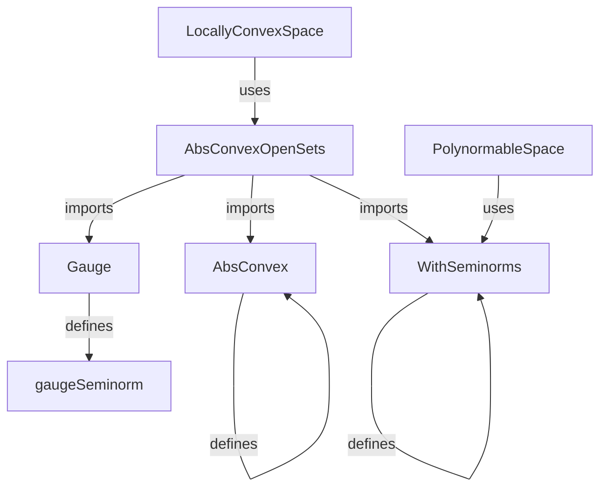
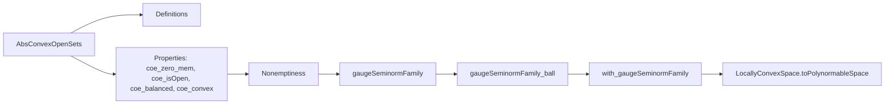

**Technical Brief: `AbsConvexOpen.lean`**

---

### 1. **Key Definitions & Theorems**

| Name | Type / Signature | Purpose |
|------|------------------|---------|
| `AbsConvexOpenSets` | `{ s : Set E // (0 : E) ∈ s ∧ IsOpen s ∧ AbsConvex 𝕜 s }` | Type of subsets of `E` that are absolutely convex, open, and contain 0. |
| `gaugeSeminormFamily` | `SeminormFamily 𝕜 E (AbsConvexOpenSets 𝕜 E)` | Family of seminorms indexed by absolutely convex open neighborhoods of 0, defined via gauges. |
| `gaugeSeminormFamily_ball` | `(gaugeSeminormFamily 𝕜 E s).ball 0 1 = (s : Set E)` | Relates the unit ball of the gauge seminorm to the original set `s`. |
| `with_gaugeSeminormFamily` | `WithSeminorms (gaugeSeminormFamily 𝕜 E)` | Main theorem: the topology of a locally convex space is induced by the gauge seminorm family. |
| `LocallyConvexSpace.toPolynormableSpace` | `PolynormableSpace 𝕜 E` | Corollary: every locally convex space over `ℝ` or `ℂ` is polynormable. |

---

### 2. **Naming Conventions**

- **Prefixes**:
  - `coe_`: projections from subtype (e.g., `coe_zero_mem`, `coe_isOpen`, `coe_balanced`).
  - `gaugeSeminormFamily_`: properties of the seminorm family (e.g., `gaugeSeminormFamily_ball`).
- **Suffixes**:
  - `_ball`: unit ball of a seminorm.
  - `_mem_nhds`, `_isOpen`, `_balanced`, `_convex`: membership/openness/balancedness/convexity facts.
- **Type suffixes**:
  - `AbsConvexOpenSets`: subtype of sets with 4 properties (contains 0, open, balanced, convex).

---

### 3. **Tactic Stack**

Frequent tactics used in proofs:
- `rw`, `simp_rw`, `dsimp`: rewriting and simplification.
- `exact`, `refine`, `convert`: constructing proofs via unification.
- `rw [Seminorm.ball_zero_eq]`, `rw [gaugeSeminorm_toFun]`: leveraging library lemmas.
- `iInter₂`, `biInter_finset`, `mem_iInter₂.mpr`: handling intersections over finite sets/indexed families.
- `convex_of_nonneg_surjective_algebraMap`, `balanced_iInter₂`, `isOpen_biInter_finset`: structural properties of seminorm balls.
- `aesop` is *not* used here — proofs are mostly manual and rely on `simp`-based automation.

---

### 4. **Proof Logic**

The core proof of `with_gaugeSeminormFamily` follows this structure:

1. **Goal**: Show topology = topology induced by `gaugeSeminormFamily`.
2. Use `SeminormFamily.withSeminorms_of_hasBasis`, reducing to basis comparison.
3. Two directions:
   - **From `AbsConvexOpenSets` to seminorm basis**:
     - For `s : AbsConvexOpenSets`, use `gaugeSeminormFamily_ball` to show `s` is a unit ball of one seminorm ⇒ `s` is a basic neighborhood.
   - **From seminorm basis to `AbsConvexOpenSets`**:
     - A basic neighborhood is an intersection of balls `⋂ i ∈ S, {x | p_i(x) < r}`.
     - Show this intersection is open, balanced, convex, and contains 0 ⇒ it's in `AbsConvexOpenSets`.
     - Key step: use `gaugeSeminormFamily_ball` again to rewrite each ball as `s_i`, then use closure properties of `AbsConvexOpenSets`.

Induction or case analysis is *not* used — the argument is structural and relies on properties of seminorms and absolutely convex sets.

---

### 5. **Imports**

Primary dependencies (define scope and theory):
- `Mathlib.Analysis.LocallyConvex.AbsConvex`: absolutely convex sets and their properties.
- `Mathlib.Analysis.LocallyConvex.WithSeminorms`: topology induced by seminorm families.
- `Mathlib.Analysis.Convex.Gauge`: gauge function and its relation to convex, balanced, absorbent sets.

Also uses:
- `NormedField`, `NNReal`, `Pointwise`, `Topology`, `Set`
- `RCLike`, `Module`, `ContinuousSMul`, `LocallyConvexSpace`, `PolynormableSpace`

---

### 6. **Mermaid Diagrams**

#### **Dependency Graph (Module-Level)**

#### **Overview of File Structure**

---

### 7. **Summary**

This file formalizes the classical result that in a locally convex space over `ℝ` or `ℂ`, the topology is completely determined by the family of gauges of absolutely convex open neighborhoods of zero. It constructs the seminorm family explicitly and proves it induces the original topology, yielding polynormability as a corollary. The formalization is highly structural, leveraging subtype reasoning, seminorm calculus, and topological closure properties.
