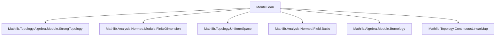
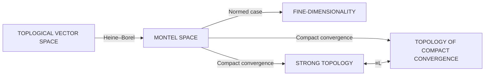
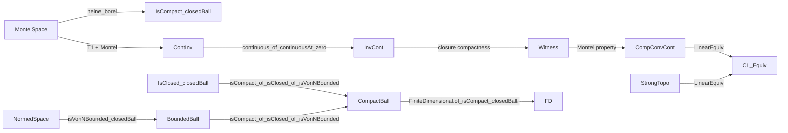

**Technical Brief: `Montel.lean` (Lean 4 Formalization)**  
*Domain: Functional Analysis — Topological Vector Spaces*

---

### 1. **Key Definitions & Theorems**

| Name | Type / Signature | Purpose |
|------|------------------|---------|
| `MontelSpace` | `class MontelSpace (𝕜 E) [SeminormedRing 𝕜] [Zero E] [SMul 𝕜 E] [TopologicalSpace E] : Prop` | Defines a *Montel space* as a topological vector space where every closed and von Neumann bounded set is compact (Heine–Borel property). |
| `MontelSpace.heine_borel` | `∀ s : Set E, IsClosed s → IsVonNBounded 𝕜 s → IsCompact s` | Axiom of the class: closed + von Neumann bounded ⇒ compact. |
| `MontelSpace.isCompact_of_isClosed_of_isVonNBounded` | `{s : Set E} → IsClosed s → IsVonNBounded 𝕜 s → IsCompact s` | Instantiation of the Heine–Borel property for a given Montel space. |
| `MontelSpace.finiteDimensional_of_normedSpace` | `FiniteDimensional 𝕜 E` | **Main theorem**: A normed Montel space over a nontrivially normed field is finite-dimensional. |
| `LinearEquiv.toCompactConvergenceCLM` | `(E →SL[σ] F) ≃ₗ[𝕜₂] E →SL_c[σ] F` | *Technical intermediate* linear equivalence (type synonym copy), used to build the continuous version. |
| `ContinuousLinearEquiv.toCompactConvergenceCLM` | `(E →SL[σ] F) ≃L[𝕜₂] E →SL_c[σ] F` | **Main theorem**: If `E` is a Montel space (and T₁), then the strong operator topology and the topology of compact convergence on `E →SL[σ] F` coincide, realized as a continuous linear equivalence. |
| `ContinuousLinearEquiv.toCompactConvergenceCLM_apply` / `symm_apply` | `f x = f x` | Simplification lemmas confirming the equivalence acts as identity on underlying functions. |

---

### 2. **Naming Conventions**

- **Prefixes**:
  - `is_`: predicate-style (e.g., `isClosed`, `isVonNBounded`, `isCompact`).
  - `to_`: constructions turning one structure into another (e.g., `toCompactConvergenceCLM`).
  - `heine_borel`: named after the defining property.
- **Suffixes**:
  - `_CLM`: *Continuous Linear Map* (e.g., `→SL[σ] F`, `→SL_c[σ] F`).
  - `_c`: subscript for *compact convergence* variants (e.g., `→SL_c[σ] F`).
- **Module/namespace style**:
  - `MontelSpace.finiteDimensional_of_normedSpace`: descriptive, modular.
  - `ContinuousLinearEquiv.toCompactConvergenceCLM`: full path, explicit.

---

### 3. **Tactic Stack**

| Tactic | Frequency | Role |
|--------|-----------|------|
| `simp only [...]` | High | Simplify definitions (e.g., `AddHom.toFun_eq_coe`, `LinearMap.coe_toAddHom`). |
| `intro`, `apply`, `exact` | High | Basic proof structure. |
| `rw [...]` | Medium | Rewrite using lemmas (e.g., `ContinuousAt`, `tendsto_iff`). |
| `have`, `use`, `exact` | Medium | Local assumptions and witness construction. |
| `mono` | Medium | Monotonicity for uniform convergence topologies. |
| `apply continuous_of_continuousAt_zero` | Low | Key for proving continuity of inverse. |
| `closure` reasoning | Low | Used in `continuous_invFun` proof (e.g., `isClosed_closure`, `subset_closure`). |

No heavy automation (`aesop`, `ring`, `norm_cast`) — proofs are mostly *manual* and rely on topological/functional-analytic lemmas.

---

### 4. **Proof Logic**

- **Structure**:
  1. **Definition**: Introduce `MontelSpace` via Heine–Borel property.
  2. **Normed case**:
     - Use `FiniteDimensional.of_isCompact_closedBall₀`.
     - Show closed unit ball is von Neumann bounded (via `NormedSpace.isVonNBounded_closedBall`).
     - Apply `isCompact_of_isClosed_of_isVonNBounded`.
  3. **Compact convergence vs. strong topology**:
     - Define linear equivalence first (`LinearEquiv.toCompactConvergenceCLM`).
     - Prove continuity of forward map: use monotonicity of topology and total boundedness ⇒ von Neumann bounded.
     - Prove continuity of inverse:
       - Reduce to continuity at 0.
       - Use neighborhood basis characterization (via `tendsto_iff`).
       - Construct witness using closure of a set `a` (compact because Montel).
       - Apply `MontelSpace.isCompact_of_isClosed_of_isVonNBounded` to `closure a`.

- **Key logical flow**:
  > *Induction-free*; relies on *topological properties* (compactness, boundedness, closure), *uniform space* machinery, and *continuous linear map* calculus.

---

### 5. **Imports & Dependencies**

| Import | Purpose |
|--------|---------|
| `Mathlib.Topology.Algebra.Module.StrongTopology` | Defines strong topology on dual/continuous linear maps. |
| `Mathlib.Analysis.Normed.Module.FiniteDimension` | Tools for finite-dimensionality criteria (e.g., compactness of closed balls). |
| `Filter`, `Topology`, `Set`, `ContinuousLinearMap`, `Bornology` | Core infrastructure for uniform convergence, bounded sets, filters, topologies. |
| `CompactConvergenceCLM` (open) | Provides `→SL_c[σ] F`, topology of compact convergence on continuous linear maps. |

**Core theory dependencies**:  
- Topological vector spaces (`TVS`),  
- Uniform spaces & bornologies,  
- Normed spaces over nontrivially normed fields,  
- Compact convergence topologies.

---

### 6. **Mermaid Diagrams**

#### **Dependency Graph (Module-Level)**

#### **Conceptual Overview (Theory Flow)**

#### **Proof Dependency Tree (Main Theorem)**

---

### 7. **Notes & Observations**

- **Nonstandard definition**: The formalization *does not assume barrelledness*, unlike classical treatments (cf. Trèves). This aligns with the comment in the docstring.
- **Use of `T1Space`**: Required for `continuous_invFun` proof (e.g., closure behavior, separation).
- **Type synonyms**: `→SL[σ] F` vs `→SL_c[σ] F` — same underlying type, different topologies; equivalence shows topologies coincide.
- **Simp lemmas**: `apply`/`symm_apply` confirm the equivalence is *identity on points*, i.e., no hidden coercion.

--- 

*End of Technical Brief.*
