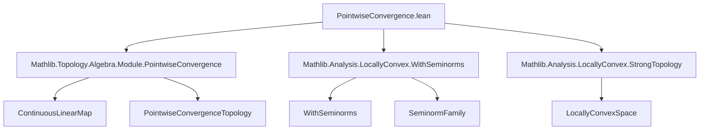
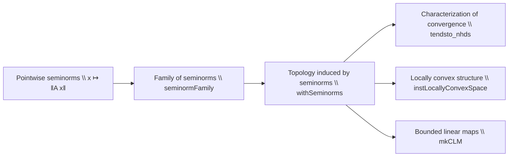

**Technical Brief: `PointwiseConvergence.lean`**

---

### 1. **Key Definitions & Theorems**

| Name | Type / Signature | Purpose |
|------|------------------|---------|
| `seminorm (x : E)` | `Seminorm 𝕜₂ (E →SLₚₜ[σ] F)` | Defines the seminorm $A \mapsto \|A x\|$ for fixed $x \in E$. |
| `seminormFamily` | `SeminormFamily 𝕜₂ (E →SLₚₜ[σ] F) E` | The family of all `seminorm x` indexed by $x : E$. |
| `inducingFn` | `(E →SLₚₜ[σ] F) →ₗ[𝕜₂] (E → F)` | The canonical linear inclusion of continuous linear maps with pointwise topology into all functions. |
| `isInducing_inducingFn` | `Topology.IsInducing (inducingFn …)` | Shows `inducingFn` induces the topology on `E →SLₚₜ[σ] F`. |
| `withSeminorms` | `WithSeminorms (seminormFamily …)` | Proves the topology is induced by `seminormFamily`. |
| `instLocallyConvexSpace` | `LocallyConvexSpace R (E →SLₚₜ[σ] F)` | Shows the space is locally convex (in the topological sense). |
| `tendsto_nhds` | `Tendsto u f (𝓝 y₀) ↔ ∀ x ε > 0, ∀ᶠ k in f, ‖u k x - y₀ x‖ < ε` | Characterizes convergence in the pointwise topology via seminorms. |
| `tendsto_nhds_atTop` | Analogous to above for `atTop` filters. | Gives sequential characterization of convergence. |
| `mkCLM` | `(E →SLₚₜ[σ] F) →L[𝕜₂] D →SLₚₜ[τ] G` | Constructs a bounded linear map between spaces of continuous linear maps under a boundedness condition. |

---

### 2. **Naming Conventions**

- **Prefixes**:
  - `seminorm`: family of seminorms.
  - `inducingFn`: function that induces a topology.
  - `mkCLM`: “make Continuous Linear Map”.
- **Suffixes**:
  - `Family`: indicates a family (indexed collection) of structures.
  - `CLM`: stands for *Continuous Linear Map*.
  - `isInducing`, `withSeminorms`: predicate-style names for properties.
- **Notation**:
  - `→SLₚₜ[σ]`: notation for *continuous linear maps with pointwise convergence topology* and scalar restriction `σ`.
  - `→L[𝕜₂]`: bounded (i.e., continuous) linear maps.
  - `→SL[σ]`: continuous linear maps without topology specified.

---

### 3. **Tactic Stack**

Frequently used tactics in proofs:

- `simp` / `simp only`: simplification using definitions (especially for seminorm axioms).
- `rw`: rewriting using equalities/characterizations (e.g., `← Seminorm.finset_sup_smul`).
- `apply`: especially in `mkCLM.cont`, to apply continuity criteria.
- `obtain` / `cases`: destruct existential hypotheses (e.g., `hbound f`).
- `exact`, `refine`: for completing proofs with known lemmas.
- `withSeminorms.tendsto_nhds`: leveraging imported lemmas from `WithSeminorms`.
- `Set.Finite.union`, `Set.finite_empty`: for locally convex structure proofs.

---

### 4. **Proof Logic**

- **Structure**:
  1. **Define seminorms** pointwise: verify seminorm axioms via norm properties.
  2. **Show topology is induced** by these seminorms:
     - Use `inducingFn` to embed into product space `E → F`.
     - Use `withSeminorms_pi` for product topology.
     - Transport via equivalence `E ≃ Σ _ : E, Fin 1`.
  3. **Characterize convergence** using `tendsto_nhds` from `WithSeminorms`.
  4. **Construct bounded linear maps** using uniform convergence CLM and boundedness condition.
  5. **Prove local convexity**:
     - Use `UniformConvergenceCLM.locallyConvexSpace`.
     - Show directedness of finite subsets via `directedOn_of_sup_mem`.

- **Common pattern**: reduce to known structures (product spaces, uniform convergence), then use transport via equivalences or embeddings.

---

### 5. **Imports**

| Import | Role |
|--------|------|
| `Mathlib.Topology.Algebra.Module.PointwiseConvergence` | Core definitions of pointwise convergence topology on modules. |
| `Mathlib.Analysis.LocallyConvex.WithSeminorms` | Theory of locally convex spaces via seminorm families. |
| `Mathlib.Analysis.LocallyConvex.StrongTopology` | Strong topology on duals; used for context/compatibility. |

---

### 6. **Mermaid Diagrams**

#### **Dependency Graph (Module-Level)**

#### **Overview of Theory Flow**

---

### 7. **Summary**

This file formalizes that the space of continuous linear maps $E \toSLₚₜ[σ] F$ equipped with the **topology of pointwise convergence** is:
- **Locally convex**, induced by the seminorm family $A \mapsto \|A x\|$ for $x \in E$,
- **Metrizable** in the sense of `WithSeminorms`,
- Supports **convergence characterizations** (via filters and nets),
- Allows construction of **bounded linear operators** between such spaces under boundedness conditions.

It serves as a foundational module for duality theory and weak-* topologies in functional analysis within Lean.
