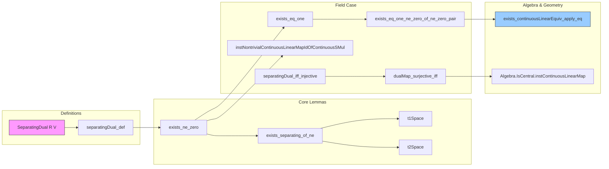

**Technical Brief: `SeparatingDual.lean`**

---

### 1. KEY DEFINITIONS & THEOREMS

| Name | Type / Signature | Purpose |
|------|------------------|---------|
| `separatingDual_def` | `SeparatingDual R V ↔ ∀ x : V, x ≠ 0 → ∃ f : StrongDual R V, f x ≠ 0` | Equivalence defining the `SeparatingDual` typeclass: continuous linear functionals separate points. |
| `exists_ne_zero'` | `∀ x : V, x ≠ 0 → ∃ f : StrongDual R V, f x ≠ 0` | Core witness for `SeparatingDual`: any nonzero vector is detected by some continuous linear functional. |
| `exists_ne_zero` | `x ≠ 0 → ∃ f, f x ≠ 0` | Simplified version of `exists_ne_zero'`, usable under `SeparatingDual R V`. |
| `exists_separating_of_ne` | `x ≠ y → ∃ f, f x ≠ f y` | Separation of *points* (not just vectors from 0) using continuous linear functionals. |
| `t1Space` | `T1Space R → T1Space V` | If base ring is T1, then the module is T1, using separating dual. |
| `t2Space` | `T2Space R → T2Space V` | If base ring is Hausdorff, then the module is Hausdorff. |
| `separatingDual_iff_injective` | `SeparatingDual R V ↔ Function.Injective (ContinuousLinearMap.coeLM R V R).flip` | Characterization via injectivity of the canonical map $V \to \mathrm{Hom}_R(V,R)$. |
| `dualMap_surjective_iff` | `Surjective (f.dualMap ∘ toLinearMap) ↔ Injective f` | Extension of linear functionals from finite-dimensional subspaces (Hahn–Banach-type). |
| `instNontrivialContinuousLinearMapIdOfContinuousSMul` | `Nontrivial V → Nontrivial W → ContinuousSMul R W → SeparatingDual R V → Nontrivial (V →L[R] W)` | Existence of nontrivial continuous linear operators between nontrivial spaces under separating dual. |
| `exists_eq_one` | `x ≠ 0 → ∃ f, f x = 1` | Normalization: any nonzero vector can be mapped to 1. |
| `exists_eq_one_ne_zero_of_ne_zero_pair` | `x ≠ 0 ∧ y ≠ 0 → ∃ f, f x = 1 ∧ f y ≠ 0` | Simultaneous normalization and separation for two nonzero vectors. |
| `Algebra.IsCentral.instContinuousLinearMap` | `Algebra.IsCentral S R → Algebra.IsCentral S (V →L[R] V)` | Triviality of the center of continuous linear endomorphisms under central algebra structure. |
| `exists_continuousLinearEquiv_apply_eq` | `x ≠ 0 ∧ y ≠ 0 → ∃ A : V ≃L[R] V, A x = y` | Transitivity of the group of continuous linear equivalences on nonzero vectors. |

---

### 2. NAMING CONVENTIONS

- **Prefixes**:
  - `exists_...`: Existence statements (e.g., `exists_ne_zero`, `exists_eq_one`).
  - `separatingDual_...`: Properties tied to the `SeparatingDual` class (e.g., `separatingDual_iff_injective`).
  - `inst...`: Instance declarations (e.g., `instNontrivialContinuousLinearMapIdOfContinuousSMul`).
  - `..._space`: Topological separation properties (`t1Space`, `t2Space`).

- **Suffixes**:
  - `'_` (e.g., `exists_ne_zero'`): Internal/auxiliary version of a lemma.
  - `..._of_...`: Conditional version (e.g., `exists_eq_one_ne_zero_of_ne_zero_pair`).
  - `..._iff_...`: Equivalence characterizations.

- **Functional style**:
  - `...Map`: Dual/map constructions (`dualMap_surjective_iff`).
  - `...SMul`: SMul-related conditions (`ContinuousSMul`, `SMulCommClass`, `IsScalarTower`).

---

### 3. TACTIC STACK

Frequently used tactics in proofs:

| Tactic | Role |
|--------|------|
| `rcases` / `obtain` | Extract witnesses from existential quantifiers (e.g., from `exists_ne_zero`). |
| `simp` / `simp only` | Simplify goals using definitions (`map_zero`, `smul_eq_mul`, etc.). |
| `rw` / `apply` | Rewrite using equivalences or lemmas (e.g., `inv_mul_cancel₀`, `mul_inv_cancel₀`). |
| `abel` | Solve linear algebraic identities in additive groups/modules. |
| `fun_prop` | Prove continuity of constructions in topological modules. |
| `aesop` | Automated reasoning for algebraic facts (e.g., in `Algebra.IsCentral`). |
| `push_neg` | Push negations inward for logical equivalences. |
| `congrm` / `congr` | Reduce goals by congruence (e.g., in `separatingDual_iff_injective`). |
| `nontriviality` | Introduce existence of distinct elements in nontrivial types. |

---

### 4. PROOF LOGIC

- **General structure**:
  1. **Assume `SeparatingDual R V`** (via `variable` or instance).
  2. **Apply `exists_ne_zero'`** to get a functional detecting a nonzero vector.
  3. **Normalize** using scalar multiplication (`inv_mul_cancel₀`) to get functionals mapping to 1.
  4. **Combine functionals** (e.g., `u + v`) to satisfy multiple constraints.
  5. **Construct operators** (e.g., `z ↦ z + G z • (y - x)`) and verify:
     - Linearity (`map_add'`, `map_smul'`)
     - Invertibility (`left_inv`, `right_inv`)
     - Continuity (`fun_prop`)
  6. **Use algebraic properties** (e.g., `Subalgebra.mem_center_iff`) for structural results (e.g., centrality).

- **Inductive/constructive flavor**:
  - Proofs are mostly *constructive* (explicit formulas for inverses, operators).
  - No heavy transfinite induction; relies on Hahn–Banach (via `geometric_hahn_banach_point_point`) for existence of separating functionals.

---

### 5. IMPORTS & SCOPE

| Import | Role |
|--------|------|
| `Mathlib.Algebra.Central.Basic` | Central algebras, center of algebras. |
| `Mathlib.Analysis.LocallyConvex.Separation` | Geometric Hahn–Banach (separating convex sets/points). |
| `Mathlib.Analysis.LocallyConvex.WithSeminorms` | Locally convex spaces via seminorms. |
| `Mathlib.LinearAlgebra.Dual.Lemmas` | Dual spaces, dual maps, finite-dimensional duality. |

**Scope**:  
The file develops the theory of *topological modules with separating dual*, focusing on:
- Separation axioms (`T1`, `T2`)
- Existence of nonzero functionals and operators
- Transitive group actions of `V ≃L[R] V` on `V \ {0}`
- Centrality of endomorphism algebras

It bridges functional analysis (Hahn–Banach) and algebra (module theory, centrality), especially over `ℝ`, `ℂ`, or general topological fields.

---

### 6. MERMAID DIAGRAMS

#### Dependency Graph (High-Level)

```mermaid
graph TD
  A[Topological Ring R] --> B[Topological Module V]
  B --> C[SeparatingDual R V]
  C --> D[Continuous Linear Functionals Separate Points]
  D --> E[T1/T2 Separation of V]
  D --> F[Nontriviality of V →L[R] W]
  D --> G[Transitive Action of V ≃L[R] V]
  D --> H[Trivial Center of End(V)]
  I[Locally Convex Space] -->|geometric Hahn-Banach| D
  J[Normed Space over RCLike] -->|analytic Hahn-Banach| D
```

#### Overview of File Structure



---

**Summary**:  
`SeparatingDual.lean` formalizes a foundational property of topological vector spaces — *separability by continuous linear functionals* — and derives a suite of structural consequences: topological separation, nontriviality of operator spaces, transitive group actions, and centrality of endomorphism algebras. It leverages Hahn–Banach theorems (geometric and analytic) as black-box existence principles, then proceeds with explicit constructions and algebraic reasoning.
