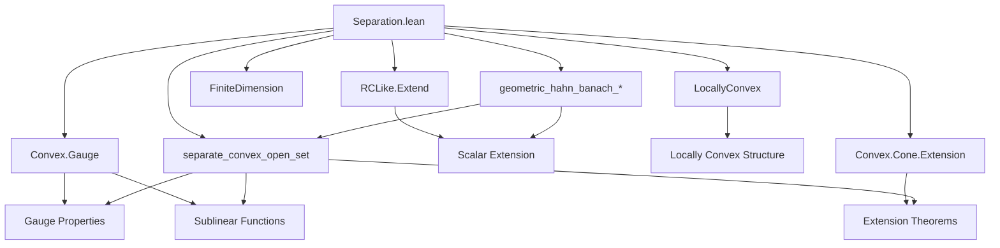
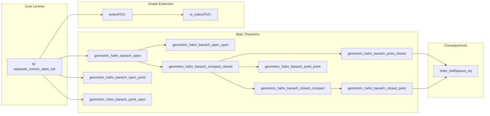

### Technical Brief: Separation.lean

---

#### **1. Key Definitions & Theorems**

| Name | Type / Signature | Purpose |
|------|------------------|---------|
| `separate_convex_open_set` | `∀ {s : Set E}, 0 ∈ s → Convex ℝ s → IsOpen s → x₀ ∉ s → ∃ f : StrongDual ℝ E, f x₀ = 1 ∧ ∀ x ∈ s, f x < 1` | Core separation lemma: separates a point from an open convex neighborhood of 0. |
| `geometric_hahn_banach_open` | `Convex ℝ s → IsOpen s → Convex ℝ t → Disjoint s t → ∃ f, u, (∀ a ∈ s, f a < u) ∧ ∀ b ∈ t, u ≤ f b` | Weak separation of two disjoint convex sets, one open. |
| `geometric_hahn_banach_open_point` | `Convex ℝ s → IsOpen s → x ∉ s → ∃ f, ∀ a ∈ s, f a < f x` | Weak separation of point and open convex set. |
| `geometric_hahn_banach_point_open` | `Convex ℝ t → IsOpen t → x ∉ t → ∃ f, ∀ b ∈ t, f x < f b` | Weak separation of open convex set and point (dual version). |
| `geometric_hahn_banach_open_open` | `Convex ℝ s → IsOpen s → Convex ℝ t → IsOpen t → Disjoint s t → ∃ f, u, (∀ a ∈ s, f a < u) ∧ ∀ b ∈ t, u < f b` | Semistrict separation: strict inequality on both sides for disjoint open convex sets. |
| `geometric_hahn_banach_compact_closed` | `Convex ℝ s → IsCompact s → Convex ℝ t → IsClosed t → Disjoint s t → ∃ f, u, v, (∀ a ∈ s, f a < u) ∧ u < v ∧ ∀ b ∈ t, v < f b` | Strict separation of compact and closed convex sets. |
| `geometric_hahn_banach_closed_compact` | Symmetric version of above (closed, then compact). |
| `geometric_hahn_banach_point_closed` | `Convex ℝ t → IsClosed t → x ∉ t → ∃ f, u, f x < u ∧ ∀ b ∈ t, u < f b` | Strict separation of point and closed convex set. |
| `geometric_hahn_banach_closed_point` | `Convex ℝ s → IsClosed s → x ∉ s → ∃ f, u, (∀ a ∈ s, f a < u) ∧ u < f x` | Strict separation of closed convex set and point. |
| `geometric_hahn_banach_point_point` | `x ≠ y → ∃ f, f x < f y` | Separation of two distinct points (uses T₁). |
| `iInter_halfSpaces_eq` | `Convex ℝ s → IsClosed s → ⋂ l, {x | ∃ y ∈ s, l x ≤ l y} = s` | Closed convex sets are intersections of supporting half-spaces. |
| `extendTo𝕜'ₗ` | `StrongDual ℝ E →ₗ[ℝ] StrongDual 𝕜 E` | Extension of real dual functionals to complex/other RCLike scalars. |
| `re_extendTo𝕜'ₗ` | `re ((extendTo𝕜'ₗ g) x) = g x` | Real part recovers original functional. |

---

#### **2. Naming Conventions**

- **Prefixes**:
  - `geometric_hahn_banach_*`: All main separation theorems.
  - `separate_convex_*`: Core lemmas for separating a point from a convex set.
  - `iInter_halfSpaces_eq`: Intersection-theoretic consequence.

- **Suffixes**:
  - `_open`, `_point`, `_closed`, `_compact`: Indicate topological properties of the sets involved.
  - `_open_open`, `_compact_closed`, `_point_point`: Combined cases.
  - `_point_closed` vs `_closed_point`: Order matters (point first vs. set first).
  - `_point_closed` vs `_closed_point`: Asymmetric variants.

- **Other**:
  - `re_` prefix: For scalar-field extensions (e.g., `re_extendTo𝕜'ₗ`).
  - `extendTo𝕜'ₗ`: Extension of real-linear functionals to complex/other RCLike modules.

---

#### **3. Tactic Stack**

Frequently used tactics:
- `aesop`: For automated reasoning about linear algebra and topology.
- `simp_rw`, `simp`: Simplification with rewrite rules (especially for `vadd`, `sub`, `mem_singleton`, etc.).
- `linarith`: Linear arithmetic over inequalities.
- `ring`: Polynomial simplification over reals.
- `exact`, `refine`, `obtain`, `cases'`: Proof construction.
- `rw [← interior_Iic]`, `rw [← interior_Ici]`: Topological interior tricks.
- `intro`, `intro h`, `by_contra`: Standard proof structure.
- `fun_prop`: For proving continuity of functionals (in `RCLike` section).
- `ext`: Extensionality for functions/sets.

---

#### **4. Proof Logic**

- **Induction/Case Analysis**:
  - Many proofs split on emptiness of sets (`eq_empty_or_nonempty`), especially for edge cases.
  - Use of `disj.zero_notMem_sub_set`, `vadd_mem_vadd_set_iff`, etc., to translate disjointness.

- **Core Strategy**:
  1. Reduce to `separate_convex_open_set` via translation and set operations (`s - t`, `x₀ +ᵥ (s - t)`).
  2. Construct a linear map via `LinearPMap.mkSpanSingleton`, then extend using sublinear dominated extension (`gauge` as sublinear).
  3. Use continuity of extension via `continuous_of_nonzero_on_open`.
  4. Derive inequalities from properties of gauge function (`gauge_lt_one_of_mem_of_isOpen`, `gauge_nonneg`, etc.).
  5. For strict separation (compact/closed), use extremal value theorem (`isMaxOn`) to tighten bounds.

- **Scalar Extension**:
  - For `RCLike`, lift real results using `extendTo𝕜'ₗ` and `re_extendTo𝕜'ₗ`.
  - Use `IsScalarTower.continuousSMul` to ensure compatibility of topologies.

---

#### **5. Imports**

| Module | Purpose |
|--------|---------|
| `Mathlib.Analysis.Convex.Cone.Extension` | Convex cone extension lemmas (used in `gauge`-based extension). |
| `Mathlib.Analysis.Convex.Gauge` | Gauge function properties (sublinear, positive homogeneity, etc.). |
| `Mathlib.Analysis.RCLike.Extend` | Extension of linear maps over RCLike scalars. |
| `Mathlib.Topology.Algebra.Module.FiniteDimension` | Finite-dimensional module topology (not directly used, but may be relevant for context). |
| `Mathlib.Topology.Algebra.Module.LocallyConvex` | Locally convex spaces (used in `geometric_hahn_banach_compact_closed`). |

---

#### **8. Mermaid Diagrams**

##### **Dependency Graph (High-Level)**

##### **Overview of File Structure**

---

#### **6. Theory Context**

- **Goal**: Provide geometric forms of the Hahn–Banach theorem in topological real vector spaces.
- **Scope**: Separation of convex sets under various topological assumptions (open, compact, closed, singleton).
- **Generalization**: Extend results to `RCLike` scalars (e.g., ℂ) via real part extraction.
- **Applications**:
  - Support functionals for convex sets.
  - Duality theory (e.g., `iInter_halfSpaces_eq`).
  - Separation in locally convex spaces (used in functional analysis).

---

#### **7. TODO & Open Issues**

- **Eidelheit’s theorem**: Not yet formalized (mentioned in TODO).
- **Interior-closure inclusion**: `Convex ℝ s → interior (closure s) ⊆ s` is open.

---

This file is a cornerstone in convex analysis in Lean, formalizing foundational separation results with careful attention to topological and algebraic structure.
