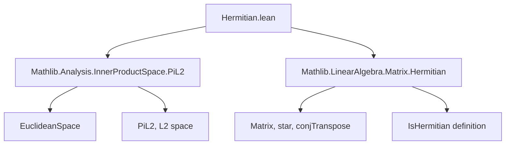

**Technical Brief: `Hermitian.lean`**

---

### 1. **Key Definitions & Theorems**

| Name | Type / Signature | Purpose |
|------|------------------|---------|
| `IsHermitian` | `A.IsHermitian` (defined elsewhere, assumed as predicate on `Matrix n n 𝕜`) | Predicate stating that $A^\* = A$, i.e., the conjugate transpose equals the matrix itself. |
| `IsHermitian.coe_re_apply_self` | `h : A.IsHermitian → i : n → (re (A i i) : 𝕜) = A i i` | Shows diagonal entries of a Hermitian matrix are real (viewed in `𝕜 = ℝ` or `ℂ`). |
| `IsHermitian.coe_re_diag` | `h : A.IsHermitian → (fun i => (re (A.diag i) : 𝕜)) = A.diag` | Extension of above to the full diagonal vector. |
| `isHermitian_iff_isSymmetric` | `IsHermitian A ↔ A.toEuclideanLin.IsSymmetric` | Core equivalence: a matrix is Hermitian iff its induced linear map on the Euclidean space is symmetric (i.e., self-adjoint). |
| `IsHermitian.im_star_dotProduct_mulVec_self` | `hA : A.IsHermitian → x : n → 𝕜 → RCLike.im (star x ⬝ᵥ A *ᵥ x) = 0` | For Hermitian $A$, the imaginary part of $x^\* A x$ vanishes — a standard property of quadratic forms over Hermitian matrices. |

---

### 2. **Naming Conventions**

- **Predicate prefix**: `IsHermitian.` — standard Lean pattern for typeclass-like predicates.
- **Diagonal-related lemmas**: `coe_re_apply_self`, `coe_re_diag` — emphasize coercion (`coe`) and real part (`re`) of diagonal entries.
- **Equivalence lemmas**: `isHermitian_iff_isSymmetric` — uses `iff` naming pattern for biconditionals.
- **Inner-product style expressions**: `star x ⬝ᵥ A *ᵥ x` — uses `star` for conjugate transpose of vector, `⬝ᵥ` for dot product, `*ᵥ` for matrix-vector multiplication.

---

### 3. **Tactic Stack**

- `rw` — rewriting using equalities (e.g., `← conj_eq_iff_re`, `h.eq`)
- `ext` — extensionality for matrices/vectors (e.g., `ext i j`)
- `simp only [...]` — simplification with explicit lemmas, avoiding over-simplification
- `simpa [...] using ...` — simplifies goal using a given proof term
- `classical` — used to enable classical reasoning (e.g., for existence of real/imag parts)
- `funext` — functional extensionality for proving equality of functions

No heavy automation (e.g., `aesop`, `linarith`) — proofs are mostly direct and structural.

---

### 4. **Proof Logic**

- **Structure of `isHermitian_iff_isSymmetric`**:
  - Uses `↔`-introduction → two implications.
  - For `→`: assumes $A^\* = A$, rewrites inner product using `dotProduct_comm` and matrix-vector identities.
  - For `←`: assumes symmetry of the linear map, tests on standard basis vectors (`Pi.single i 1`) to recover matrix equality entrywise.

- **Structure of `im_star_dotProduct_mulVec_self`**:
  - Uses `classical` to access real/imag decomposition.
  - Reduces to `isHermitian_iff_isSymmetric.mp hA` and applies `im_inner_self_apply` (a property of symmetric operators: $\langle x, Tx \rangle$ is real).

- **General pattern**: reduce matrix properties to linear map properties via `toEuclideanLin`, then use inner-product identities.

---

### 5. **Imports**

| Import | Role |
|--------|------|
| `Mathlib.Analysis.InnerProductSpace.PiL2` | Provides `EuclideanSpace`, `toLpLin`, `toEuclideanLin`, inner product structure on `n → 𝕜`. |
| `Mathlib.LinearAlgebra.Matrix.Hermitian` | Defines `IsHermitian`, `conjTranspose`, `star`, and related matrix operations. |

Also opens `RCLike` namespace — provides `re`, `im`, `star`, `conj`, and assumptions on `𝕜 = ℝ` or `ℂ`.

---

### 6. **Mermaid Diagrams**

#### Dependency Graph (File-level)



#### Overview of Theory Flow

```mermaid
flowchart LR
  A[Matrix A : n → n → 𝕜] --> B{Is A Hermitian?}
  B -->|Aᴴ = A| C[Diagonal entries real]
  B -->|Aᴴ = A| D[Induced linear map is symmetric]
  D --> E[⟨x, Ax⟩ ∈ ℝ]
  C --> F[diag(A) = (re ∘ diag(A))↑]
  E --> G[im(xᴴ A x) = 0]
```

---

### 7. **Mathematical Summary**

This file bridges **matrix-level** and **operator-level** notions of self-adjointness over real/complex inner product spaces:

- A matrix $A$ is Hermitian ($A^\* = A$) **iff** the linear operator $x \mapsto A x$ is symmetric (i.e., $\langle x, A y \rangle = \overline{\langle A x, y \rangle}$).
- As corollaries:
  - Diagonal entries of Hermitian matrices lie in $\mathbb{R}$.
  - Quadratic forms $x^\* A x$ are real-valued for Hermitian $A$.

These results are foundational for spectral theory, quantum mechanics, and optimization over Hermitian matrices.

--- 

Let me know if you'd like a formalization roadmap or a proof sketch in natural deduction style.
