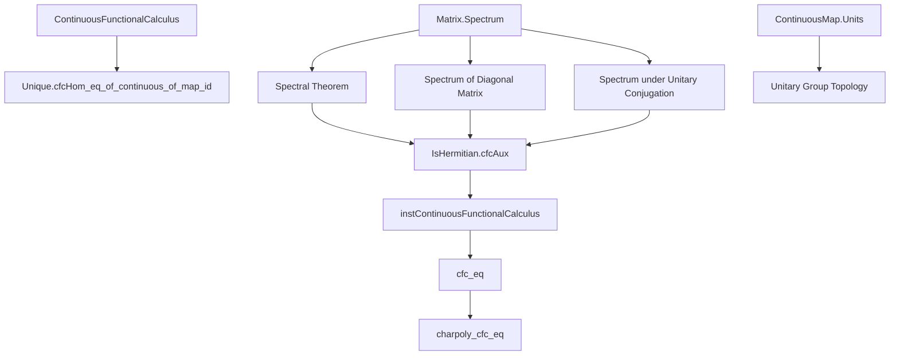

**Technical Brief: HermitianFunctionalCalculus.lean**

---

### 1. KEY DEFINITIONS & THEOREMS

| Name | Type / Signature | Purpose |
|------|------------------|---------|
| `cfcAux` | `C(spectrum ℝ A, ℝ) →⋆ₐ[ℝ] Matrix n n 𝕜` | Star algebra homomorphism implementing the functional calculus on *continuous* functions on the spectrum; auxiliary for constructing the instance. |
| `isClosedEmbedding_cfcAux` | `IsClosedEmbedding hA.cfcAux` | Proves `cfcAux` is a closed embedding (injective, continuous, and closed image), crucial for uniqueness and topological properties. |
| `cfcAux_id` | `hA.cfcAux (.restrict _ .id) = A` | Shows `cfcAux` sends the identity function on `spectrum ℝ A` to the original matrix `A`. |
| `instContinuousFunctionalCalculus` | `ContinuousFunctionalCalculus ℝ (Matrix n n 𝕜) IsSelfAdjoint` | Instance of the abstract continuous functional calculus for self-adjoint (Hermitian) matrices over `𝕜`. |
| `cfc` | `(f : ℝ → ℝ) → Matrix n n 𝕜` | Concrete realization of functional calculus for Hermitian matrices: `U * diag(f ∘ eigenvalues) * star U`. Works for *all* functions since spectrum is finite. |
| `cfc_eq` | `cfc f A = hA.cfc f` | Equates the concrete `cfc` definition with the abstract `ContinuousFunctionalCalculus.cfc` API. |
| `charpoly_cfc_eq` | `(cfc f A).charpoly = ∏ i, (X - C (f (hA.eigenvalues i)))` | Computes the characteristic polynomial of `cfc f A` in terms of eigenvalues transformed by `f`. |

---

### 2. NAMING CONVENTIONS

- **Prefixes**:
  - `cfc` — *continuous functional calculus* (e.g., `cfcAux`, `cfc`, `cfc_eq`)
  - `isClosedEmbedding_` — property of maps (e.g., `isClosedEmbedding_cfcAux`)
  - `eigenvalues`, `eigenvectorUnitary` — spectral data
  - `ofReal` — embedding `ℝ → 𝕜` for `RCLike 𝕜`
- **Suffixes**:
  - `_apply` — evaluation of homomorphism on argument (e.g., `cfcAux_apply`)
  - `_mem_spectrum_real` — membership proof for eigenvalues in spectrum
- **Structure**:
  - `hA : IsHermitian A` is the canonical hypothesis for all definitions in `IsHermitian` namespace.
  - `conjStarAlgAut` — conjugation by unitary (star-automorphism).

---

### 3. TACTIC STACK

Frequent tactics used:

- `simp` — heavily used with `only`, `←`, `congr!`, `ext`, `rw`
- `rfl` — for definitional equalities (especially in ring/structure homomorphism proofs)
- `rw` — rewriting using spectral theorem, spectrum lemmas, unitary properties
- `obtain ⟨x, hx⟩` / `⟨i, rfl⟩` — destructuring existential quantifiers and equalities
- `apply Set.eq_of_subset_of_subset` — for spectrum equality proofs
- `convert`, `congr!`, `congr` — for congruence closure and symmetry arguments
- `fun_prop` — for proving continuity in `ContinuousMap` contexts
- `FiniteDimensional.of_injective` — functional-analytic finite-dimensional arguments

---

### 4. PROOF LOGIC

**General proof strategy**:

1. **Spectral decomposition**: Use `hA.spectral_theorem` (diagonalization via unitary `eigenvectorUnitary`) to reduce matrix identities to diagonal cases.
2. **Reduction to diagonal matrices**: Leverage `diagonal_*` lemmas (`diagonal_mul_diagonal`, `diagonal_add`, `diagonal_conjTranspose`) to push operations through the diagonal embedding.
3. **Unitary invariance**: Exploit `Unitary.star_mul_self` and `conjStarAlgAut` properties to simplify conjugation expressions.
4. **Spectrum computation**: Use `spectrum_diagonal`, `Unitary.spectrum_star_right_conjugate`, and `AlgHom.spectrum_apply_subset` to relate spectra of transformed matrices to function images of eigenvalues.
5. **Finite spectrum simplification**: Since `spectrum ℝ A` is finite (due to `Fintype n`), *all* functions `ℝ → ℝ` are continuous on it, enabling `cfc` to be defined on bare functions.

**Typical proof flow**:
- Induction or case analysis on `n` (via `isEmpty_or_nonempty n`) for spectrum non-emptiness.
- Use `spectrum_real_eq_range_eigenvalues` to identify spectrum with eigenvalue list.
- Apply `diagonal_eq_diagonal_iff` to reduce matrix equality to pointwise equality on diagonal entries.

---

### 5. IMPORTS & DEPENDENCIES

| Module | Role |
|--------|------|
| `Mathlib.Analysis.CStarAlgebra.ContinuousFunctionalCalculus.Unique` | Abstract theory of continuous functional calculus, uniqueness results (`cfcHom_eq_of_continuous_of_map_id`) |
| `Mathlib.Analysis.Matrix.Spectrum` | Spectrum of matrices, eigenvalues, spectral theorem, `spectrum_diagonal`, `spectrum_real_eq_range_eigenvalues` |
| `Mathlib.Topology.ContinuousMap.Units` | Topological properties of `C(X, ℝ)`, especially unitary/ invertible structure |

**Core typeclass assumptions**:
- `[RCLike 𝕜]`: `𝕜` is a real-closed like field (e.g., `ℝ`, `ℂ`), enabling `ofReal`, `star`, real spectrum.
- `[Fintype n]`: Finite-dimensional matrices (ensures finite spectrum).
- `[DecidableEq n]`: For `Matrix` indexing.

---

### 6. MERMAID DIAGRAMS

#### Dependency Graph (High-Level Theory)



#### File Overview (Logical Flow)

```mermaid
flowchart LR
  subgraph Setup
    H[A : Matrix n n 𝕜, IsHermitian hA]
  end

  subgraph Construction
    I[cfcAux : C(spectrum A, ℝ) →⋆ₐ Matrix n n 𝕜]
    J[isClosedEmbedding_cfcAux]
    K[cfcAux_id]
  end

  subgraph Instance
    L[instContinuousFunctionalCalculus]
  end

  subgraph Concrete Realization
    M[cfc : (ℝ → ℝ) → Matrix n n 𝕜]
    N[cfc_eq : cfc = cfcAux ∘ restrict]
  end

  subgraph Applications
    O[charpoly_cfc_eq]
  end

  H --> I
  I --> J
  I --> K
  I & J & K --> L
  I --> M
  M --> N
  N --> O
```

---

### 7. SUMMARY

This file constructs the **concrete continuous functional calculus** for Hermitian matrices over `RCLike` fields, leveraging the spectral theorem. It bridges the abstract `ContinuousFunctionalCalculus` API with an explicit formula using eigen-decomposition. Key innovations:
- Uses `eigenvectorUnitary` to conjugate diagonal matrices.
- Proves the construction satisfies all axioms of a continuous functional calculus.
- Shows agreement with the abstract theory (`cfc_eq`).
- Computes characteristic polynomials of functional calculus outputs.

The file exemplifies Lean’s ability to unify abstract operator-algebraic constructions with concrete linear algebraic computations.
