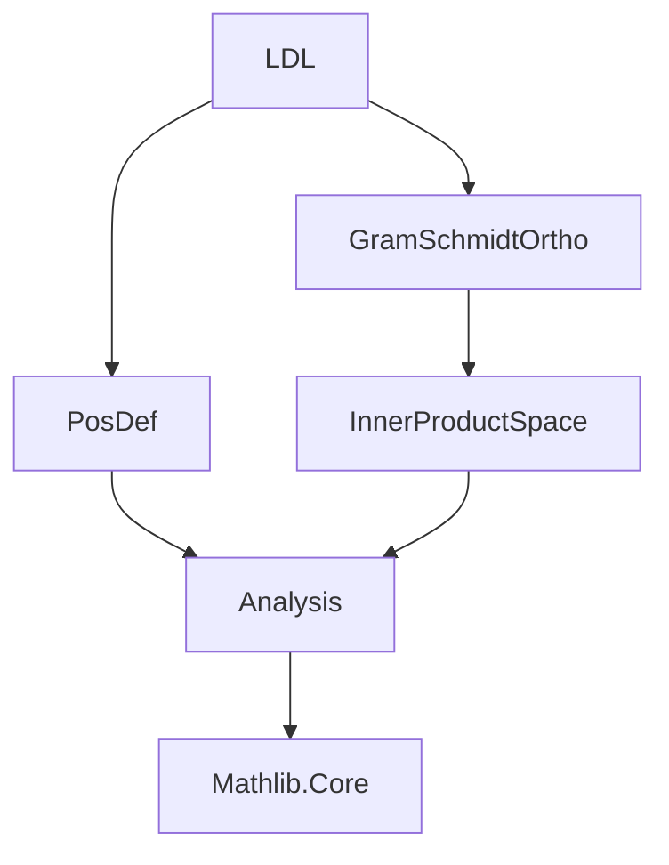

**Technical Brief: LDL Decomposition in Lean 4 (Source: `LDL.lean`)**

---

### 1. **Key Definitions & Theorems**

| Name | Type / Signature | Purpose |
|------|------------------|---------|
| `LDL.lowerInv` | `Matrix n n 𝕜` | Inverse of lower-triangular matrix $L$, constructed via Gram–Schmidt orthogonalization w.r.t. inner product induced by $S^\top$. |
| `LDL.lowerInv_eq_gramSchmidtBasis` | `=` | Identifies `LDL.lowerInv` as the transpose of the matrix of Gram–Schmidt basis vectors. |
| `LDL.invertibleLowerInv` | `Invertible (LDL.lowerInv hS)` | Proves `LDL.lowerInv` is invertible (via `Basis.invertibleToMatrix`). |
| `LDL.lowerInv_orthogonal` | `⟪LDL.lowerInv i, Sᵀ *ᵥ LDL.lowerInv j⟫ₑ = 0` for $i \ne j$ | Orthogonality of transformed basis vectors under $S^\top$-induced inner product. |
| `LDL.diagEntries` | `n → 𝕜`, $i \mapsto \langle \star(LDL.lowerInv\ i),\ S \cdot \star(LDL.lowerInv\ i) \rangle_e$ | Diagonal entries of $D$, computed as $S$-norms of transformed basis vectors. |
| `LDL.diag` | `Matrix n n 𝕜` | Diagonal matrix $D = \mathrm{diagonal}(\mathrm{diagEntries})$. |
| `LDL.lowerInv_triangular` | $i < j \implies LDL.lowerInv\ i\ j = 0$ | Shows `LDL.lowerInv` is *upper* triangular (hence `LDL.lower` is lower triangular). |
| `LDL.diag_eq_lowerInv_conj` | `LDL.diag = LDL.lowerInv * S * (LDL.lowerInv)ᴴ` | Core identity: $D = L^{-1} S (L^{-1})^H$. |
| `LDL.lower` | `Matrix n n 𝕜` | Lower-triangular matrix $L = (LDL.lowerInv)^{-1}$. |
| `LDL.lower_conj_diag` | `LDL.lower * LDL.diag * (LDL.lower)ᴴ = S` | **Main theorem**: $S = L D L^H$, the LDL decomposition. |

---

### 2. **Naming Conventions**

- **Prefixes**:
  - `LDL.` — module-level namespace.
  - `lowerInv_` — properties of the inverse of $L$ (e.g., `lowerInv_orthogonal`, `lowerInv_triangular`).
  - `diagEntries`, `diag` — diagonal data.
- **Suffixes**:
  - `_triangular` — triangularity property.
  - `_orthogonal` — orthogonality under $S^\top$-inner product.
  - `_eq_...` — equality lemmas (e.g., `diag_eq_lowerInv_conj`).
- **Notation**:
  - `⟪x, y⟫ₑ` — Euclidean inner product (via `WithLp.toLp 2`).
  - `star` — complex conjugation (or $*$-operation in `RCLike 𝕜`).

---

### 3. **Tactic Stack**

- `rw` — heavy use for rewriting definitions and lemmas.
- `ext` — extensionality for matrix equality.
- `by_cases` — case split on equality $i = j$.
- `simp only [...]` — targeted simplification using local hypotheses and definitions.
- `rfl` — reflexivity for definitional equalities.
- `infer_instance` — typeclass resolution for invertibility.
- `haveI := ...` — introduce instance for typeclass inference.
- `exact` — final proof step using a known theorem.

No heavy automation (e.g., `aesop`, `linarith`) — proofs are mostly structural and definition-driven.

---

### 4. **Proof Logic**

- **Construction**: Gram–Schmidt orthogonalization applied to standard basis w.r.t. $S^\top$-inner product yields `LDL.lowerInv`.
- **Triangularity**: Follows from `gramSchmidt_triangular` and `Pi.basisFun_repr`.
- **Orthogonality**: Directly from `gramSchmidt_orthogonal`.
- **Diagonalization identity** (`diag_eq_lowerInv_conj`):
  - Split into cases $i = j$ and $i \ne j$.
  - For $i = j$: simplify using definitions of `diag`, `diagEntries`, and inner product.
  - For $i \ne j$: use orthogonality and properties of `star`, `dotProduct`, and `mulVec`.
- **Main decomposition** (`lower_conj_diag`):
  - Rewrite `LDL.lower` as inverse of `LDL.lowerInv`.
  - Use `conjTranspose_nonsing_inv`, `Matrix.mul_assoc`, and invertibility lemmas.
  - Reduce to `diag_eq_lowerInv_conj`.

Induction is *not* used — relies on linear algebraic structure and properties of Gram–Schmidt.

---

### 5. **Imports & Dependencies**

| Import | Role |
|--------|------|
| `Mathlib.Analysis.InnerProductSpace.GramSchmidtOrtho` | Provides `gramSchmidt`, `gramSchmidtBasis`, `gramSchmidt_orthogonal`, `gramSchmidt_triangular`. |
| `Mathlib.Analysis.Matrix.PosDef` | Provides `PosDef`, `posSemidef`, `toInnerProductSpace`, `toNormedAddCommGroup`. |
| `Module`, `Matrix`, `InnerProductSpace`, `ComplexOrder` | Core libraries for matrices, modules, inner products, and complex order structure. |
| `RCLike`, `WithLp`, `EuclideanSpace` | For real/complex field structure and $L^2$-normed spaces. |

---

### 6. **Mermaid Diagrams**

#### **Dependency Graph (Module-Level)**



#### **Overview of LDL Module Structure**

```mermaid
flowchart LR
  A[Positive Definite S] --> B[Construct Sᵀ]
  B --> C[Gram–Schmidt on Pi.basisFun w.r.t. Sᵀ]
  C --> D[LDL.lowerInv]
  D --> E[Diagonal entries via S-norms]
  E --> F[LDL.diag]
  D --> G[InvertibleLowerInv]
  G --> H[LDL.lower = (LDL.lowerInv)⁻¹]
  D & F & H --> I[diag_eq_lowerInv_conj]
  I --> J[lower_conj_diag (main thm)]
```

#### **Proof Structure of `lower_conj_diag`**

```mermaid
flowchart LR
  A[Goal: LDL.lower * LDL.diag * (LDL.lower)ᴴ = S] 
  --> B[Expand LDL.lower = (LDL.lowerInv)⁻¹]
  --> C[Use conjTranspose_nonsing_inv]
  --> D[Reduce to LDL.diag = LDL.lowerInv * S * (LDL.lowerInv)ᴴ]
  --> E[Apply diag_eq_lowerInv_conj]
  --> F[QED]
```

---

### 7. **TODO & Future Work**

- Prove `LDL.lower` is lower triangular *directly* (currently inferred via `lowerInv_triangular` + invertibility).
- Explore algorithmic aspects (e.g., computational complexity, numerical stability).
- Extend to indefinite or singular matrices (requires generalized inverses or pivoting).

--- 

This module formalizes a classical result in numerical linear algebra using modern homotopy type theory and Lean’s dependent type framework, with heavy reliance on the `Mathlib` analysis and linear algebra libraries.
