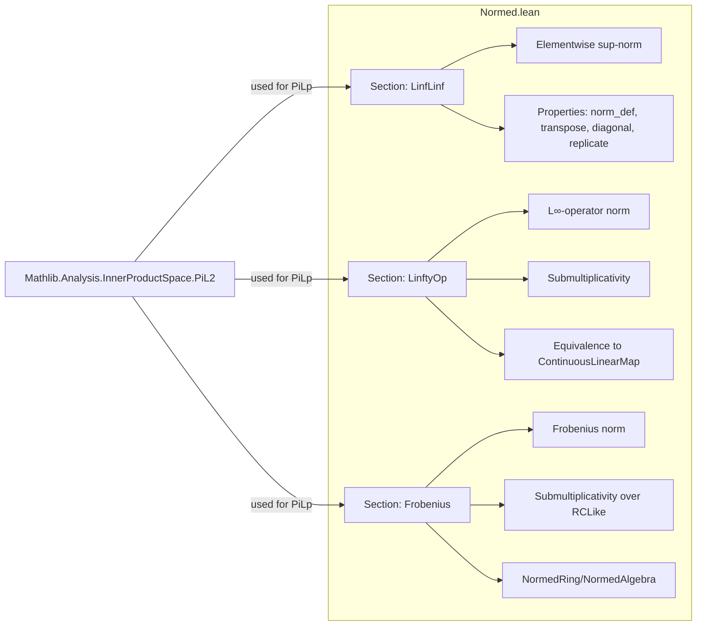

### Technical Brief: `Normed.lean` — Matrix Normed Structures in Lean 4

---

#### **1. Key Definitions & Theorems**

| Name | Type / Purpose |
|------|----------------|
| `Matrix.seminormedAddCommGroup` | `SeminormedAddCommGroup (Matrix m n α)` — elementwise sup-norm (i.e., $L^\infty$-sup of entries) |
| `Matrix.normedAddCommGroup` | `NormedAddCommGroup (Matrix m n α)` — same as above, for normed groups |
| `Matrix.normedSpace` | `NormedSpace R (Matrix m n α)` — for normed field `R` and normed space `α` |
| `Matrix.isBoundedSMul` | `IsBoundedSMul R (Matrix m n α)` — bounded scalar multiplication under elementwise norm |
| `Matrix.normSMulClass` | `NormSMulClass R (Matrix m n α)` — compatibility of scalar multiplication with norm |
| `Matrix.frobeniusSeminormedAddCommGroup` | `SeminormedAddCommGroup (Matrix m n α)` — Frobenius norm: $\|A\| = \sqrt{\sum_{i,j} \|A_{ij}\|^2}$ |
| `Matrix.frobeniusNormedAddCommGroup` | `NormedAddCommGroup (Matrix m n α)` — Frobenius normed group |
| `Matrix.frobeniusNormedSpace` | `NormedSpace R (Matrix m n α)` — Frobenius normed space |
| `Matrix.frobeniusNormedRing` | `NormedRing (Matrix n n α)` — submultiplicative Frobenius norm over `RCLike` (e.g., `ℝ`, `ℂ`) |
| `Matrix.frobeniusNormedAlgebra` | `NormedAlgebra R (Matrix n n α)` — Frobenius normed algebra |
| `Matrix.linftyOpSeminormedAddCommGroup` | `SeminormedAddCommGroup (Matrix m n α)` — $L^\infty$-operator norm: $\|A\| = \sup_i \sum_j \|A_{ij}\|$ |
| `Matrix.linftyOpNormedAddCommGroup` | `NormedAddCommGroup (Matrix m n α)` — same for normed groups |
| `Matrix.linftyOpNormedSpace` | `NormedSpace R (Matrix m n α)` — operator normed space |
| `Matrix.linftyOpNonUnitalSemiNormedRing` | `NonUnitalSeminormedRing (Matrix n n α)` — submultiplicative seminormed ring (non-unital) |
| `Matrix.linftyOpSemiNormedRing` | `SeminormedRing (Matrix n n α)` — unital version (requires `DecidableEq n`) |
| `Matrix.linftyOpNonUnitalNormedRing` | `NonUnitalNormedRing (Matrix n n α)` — normed ring (non-unital) |
| `Matrix.linftyOpNormedRing` | `NormedRing (Matrix n n α)` — normed ring (unital) |
| `Matrix.linftyOpNormedAlgebra` | `NormedAlgebra R (Matrix n n α)` — normed algebra |
| `norm_def`, `norm_eq_sup_sup_nnnorm` | Characterization of elementwise sup-norm: $\|A\| = \sup_i \sup_j \|A_{ij}\|$ |
| `linfty_opNorm_def`, `linfty_opNNNorm_def` | Characterization of $L^\infty$-operator norm: $\|A\| = \sup_i \sum_j \|A_{ij}\|$ |
| `frobenius_norm_def`, `frobenius_nnnorm_def` | Frobenius norm: $\|A\| = \left(\sum_{i,j} \|A_{ij}\|^2\right)^{1/2}$ |
| `linfty_opNNNorm_mul`, `frobenius_nnnorm_mul` | Submultiplicativity proofs for $L^\infty$-operator and Frobenius norms |
| `linfty_opNNNorm_eq_opNNNorm` | Equivalence of $L^\infty$-operator matrix norm and operator norm on `ContinuousLinearMap` |
| `norm_one`, `norm_diagonal`, `norm_replicateCol`, etc. | Norms of canonical matrices (identity, diagonal, replicate row/column) under each norm |

---

#### **2. Naming Conventions**

- **Prefixes**:
  - `seminormedAddCommGroup`, `normedAddCommGroup`, `normedSpace`, `isBoundedSMul`, `normSMulClass`: standard structure names.
  - `linftyOp_`, `frobenius_`, `Elementwise`: namespace prefixes for different norm choices.
- **Suffixes**:
  - `_def`: definition lemmas (e.g., `norm_def`, `frobenius_norm_def`).
  - `_le_iff`, `_lt_iff`: norm comparison lemmas.
  - `_map_eq`, `_transpose`, `_conjTranspose`, `_diagonal`, `_replicateCol`, `_replicateRow`: structural properties.
  - `_mul`, `_mulVec`: submultiplicativity and action on vectors.
- **Scoped instances**:
  - `open scoped Matrix.Norms.Elementwise`, `Matrix.Norms.Operator`, `Matrix.Norms.Frobenius` — to activate respective instances.

---

#### **3. Tactic Stack**

| Tactic | Usage Frequency | Purpose |
|--------|-----------------|---------|
| `simp_rw` | Very High | Rewriting with definitional equalities (e.g., norms, `Pi`/`PiLp` definitions) |
| `simp` | High | Simplifying using lemmas like `norm_def`, `finset.sum_comm`, etc. |
| `congr` / `congr_arg` | Medium | Proving equality of norms under maps (e.g., transpose, map, algebra map) |
| `gcongr` | Medium | Proving inequalities in sums/products (e.g., in `linfty_opNNNorm_mul`) |
| `rw` | Medium | Rewriting with known lemmas (e.g., `norm_mul_le`, `norm_one`) |
| `exact`, `refine`, `apply` | Medium | Completing proofs with known facts |
| `cases` / `obtain` | Low | Handling `DecidableEq`, `Nonempty`, `isEmpty_or_nonempty` |
| `change`, `dsimp` | Low | Adjusting goal to match known lemmas |
| `convert` | Rare | When converting between related norms (e.g., `nnnorm` ↔ `norm`) |

---

#### **4. Proof Logic**

- **Structure**: Modular, with sections for each norm type (`LinfLinf`, `LinftyOp`, `frobenius`).
- **Common proof pattern**:
  1. **Define** the norm via `Pi`/`PiLp` constructions (e.g., `Pi.seminormedAddCommGroup`, `PiLp.seminormedAddCommGroupToPi`).
  2. **Prove** norm definitions (`norm_def`, `linfty_opNorm_def`, `frobenius_norm_def`) using `simp_rw` and `Pi`/`PiLp` lemmas.
  3. **Verify** algebraic properties:
     - Submultiplicativity: `linfty_opNNNorm_mul`, `frobenius_nnnorm_mul` — often via `Finset.sum_le_sum`, `nnnorm_mul_le`, `inner_le_norm`.
     - Compatibility with scalar multiplication: `isBoundedSMul`, `normSMulClass` — via `PiLp` instances.
  4. **Check** structural properties:
     - Transpose/conjugate transpose invariance: `norm_transpose`, `norm_conjTranspose`.
     - Norms of special matrices: `diagonal`, `replicateRow`, `replicateCol`, `one`.
  5. **Relate** to known structures:
     - `linfty_opNNNorm_eq_opNNNorm`: show equivalence to operator norm on `ContinuousLinearMap`.
     - `NormedStarGroup`, `NormedRing`, `NormedAlgebra` instances via `⟨...⟩` with proofs.

- **Induction**: Not used — proofs rely on finite sums/products and properties of `Finset.sup`, `sum`, `Pi`, `PiLp`.

---

#### **5. Imports**

- **Primary**:
  ```lean
  Mathlib.Analysis.InnerProductSpace.PiL2
  ```
- **Implicit dependencies** (via `Pi`, `PiLp`, `WithLp`, `NNReal`, `Matrix`):
  - `Mathlib.Analysis.NormedSpace.Basic`
  - `Mathlib.Analysis.NormedRing.Basic`
  - `Mathlib.Algebra.Module.Basic`
  - `Mathlib.MeasureTheory.Integration.IntegralBasic` (via `PiLp`)
  - `Mathlib.LinearAlgebra.Matrix.Basic`
  - `Mathlib.Analysis.InnerProductSpace.HilbertNorm` (via `NormedStarGroup`)

---

#### **6. Mermaid Diagrams**

##### **Dependency Graph (High-Level)**

```mermaid
graph TD
  A[Matrix Normed Structures] --> B[Elementwise (L∞-sup)]
  A --> C[L∞-Operator (L1 over rows)]
  A --> D[Frobenius (L2 over entries)]

  B --> B1[Pi.seminormedAddCommGroup]
  B --> B2[Pi.normedAddCommGroup]
  B --> B3[Pi.normedSpace]

  C --> C1[PiLp.seminormedAddCommGroupToPi 1]
  C --> C2[linfty_opNorm_mul]
  C --> C3[linfty_opNNNorm_eq_opNNNorm]

  D --> D1[PiLp.seminormedAddCommGroupToPi 2]
  D --> D2[frobenius_nnnorm_mul]
  D --> D3[frobeniusNormedRing]

  C3 --> E[ContinuousLinearMap.OperatorNorm]
  D2 --> F[RCLike (ℝ, ℂ)]
```

##### **File Overview**



---

#### **7. Notes**

- **No global instances**: All structures are defined as `protected def`s or `@[local instance]` to avoid conflicts — users must `open scoped Matrix.Norms.*` to activate them.
- **Separation of ℓ² operator norm**: As noted, the ℓ² operator norm (induced by `EuclideanSpace`) is deferred to `Mathlib/Analysis/CStarAlgebra/Matrix.lean` to avoid heavy imports.
- **RCLike requirement**: Frobenius norm is submultiplicative only over `RCLike` (e.g., `ℝ`, `ℂ`), not general `SeminormedRing`.

--- 

Let me know if you'd like a formalized dependency graph (e.g., `.lean`-level import tree) or a tactic-level proof trace for a specific theorem.
