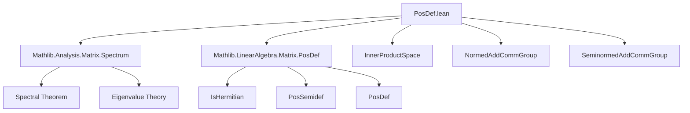

**Technical Brief: `PosDef.lean` — Spectrum of Positive (Semi)Definite Matrices**

---

### 1. KEY DEFINITIONS & THEOREMS

| Name | Type / Signature | Purpose |
|------|------------------|---------|
| `IsHermitian.posSemidef_iff_eigenvalues_nonneg` | `IsHermitian A → (PosSemidef A ↔ 0 ≤ hA.eigenvalues)` | Characterizes positive semidefiniteness via nonnegative eigenvalues. |
| `PosSemidef.eigenvalues_nonneg` | `A.PosSemidef → i : n → 0 ≤ A.eigenvalues i` | Eigenvalues of a positive semidefinite matrix are nonnegative. |
| `PosSemidef.re_dotProduct_nonneg` | `A.PosSemidef → x → 0 ≤ re (xᴴ A x)` | Real part of the quadratic form is nonnegative. |
| `PosSemidef.det_nonneg` | `A.PosSemidef → 0 ≤ det A` | Determinant of a positive semidefinite matrix is nonnegative. |
| `PosSemidef.trace_eq_zero_iff` | `A.PosSemidef → (tr A = 0 ↔ A = 0)` | Trace zero iff matrix is zero for positive semidefinite matrices. |
| `IsHermitian.posDef_iff_eigenvalues_pos` | `IsHermitian A → (A.PosDef ↔ ∀ i, 0 < hA.eigenvalues i)` | Characterizes positive definiteness via strictly positive eigenvalues. |
| `PosDef.re_dotProduct_pos` | `A.PosDef → x ≠ 0 → 0 < re (xᴴ A x)` | Quadratic form is strictly positive for nonzero vectors. |
| `PosDef.eigenvalues_pos` | `A.PosDef → i → 0 < A.eigenvalues i` | Eigenvalues of a positive definite matrix are positive. |
| `PosDef.det_pos` | `A.PosDef → 0 < det A` | Determinant of a positive definite matrix is positive. |
| `PosSemidef.preInnerProductSpace` | `A.PosSemidef → PreInnerProductSpace 𝕜 (n → 𝕜)` | Constructs a pre-inner product from a positive semidefinite matrix: `⟪x, y⟫ = xᴴ A y`. |
| `toSeminormedAddCommGroup` | `A.PosSemidef → SeminormedAddCommGroup (n → 𝕜)` | Induces a seminormed additive commutative group via the induced seminorm `‖x‖ = √re(xᴴ A x)`. |
| `toNormedAddCommGroup` | `A.PosDef → NormedAddCommGroup (n → 𝕜)` | Induces a normed additive commutative group (i.e., a normed space) when `A` is positive definite. |
| `toInnerProductSpace` | `A.PosSemidef → InnerProductSpace 𝕜 (n → 𝕜)` | Constructs an inner product space structure from a positive semidefinite matrix. |

---

### 2. NAMING CONVENTIONS

- **Prefixes**:
  - `isHermitian.`: Properties of Hermitian matrices (e.g., `isHermitian.eq`, `isHermitian.eigenvalues_eq_zero_iff`).
  - `posSemidef.` / `posDef.`: Properties of (semi)definite matrices.
  - `re_`: Real part of complex expressions (e.g., `re_dotProduct_nonneg`).
  - `eigenvalues_`: Relating to eigenvalues (e.g., `eigenvalues_nonneg`, `eigenvalues_pos`).
- **Suffixes**:
  - `_nonneg`, `_pos`: Indicate inequality direction.
  - `_iff_`: Biconditional characterizations.
  - `_conjugate`, `_transpose`: Matrix operations (`conjTranspose`, `conjTranspose_mul_self`, etc.).
- **Function-style abbreviations**:
  - `toSeminormedAddCommGroup`, `toNormedAddCommGroup`, `toInnerProductSpace`: “Induced structure” naming pattern.

---

### 3. TACTIC STACK

Frequently used tactics in proofs:

| Tactic | Usage |
|--------|-------|
| `conv_lhs => rw [...]` | Rewriting in left-hand side of equations (e.g., spectral theorem). |
| `simp [...]` | Simplification using lemmas like `spectral_theorem`, `posSemidef_diagonal_iff`, etc. |
| `rw [...]` | Rewriting using definitions or lemmas (e.g., `det_eq_prod_eigenvalues`). |
| `exact ...` / `simpa using ...` | Finishing proofs or simplifying using assumptions. |
| `apply ...` | Applying lemmas (e.g., `prod_pos`, `prod_nonneg`). |
| `by_contra!` | Contradiction-based reasoning (e.g., in `definite` for `toNormedAddCommGroup`). |
| `simp only [...]` | Fine-grained simplification (e.g., removing redundant structure). |
| `ring`, `linarith` | Implicitly used in algebraic simplifications (not explicit but standard in such contexts). |

---

### 4. PROOF LOGIC

**General proof strategy**:

1. **Spectral theorem reduction**: Most proofs start by applying `hA.spectral_theorem`, reducing matrix statements to diagonal matrices (via unitary conjugation).
2. **Simplification via diagonal structure**: Use `simp` with lemmas like:
   - `posSemidef_diagonal_iff`
   - `isUnit_coe.posSemidef_star_right_conjugate_iff`
   - `det_eq_prod_eigenvalues`
   - `trace_diagonal`
3. **Pointwise analysis**: For eigenvalue-related lemmas, reduce to checking componentwise inequalities over `Finset.prod` or `Finset.sum`.
4. **Induction / case analysis**: Used implicitly via `Finset.prod_nonneg`, `Finset.sum_eq_zero_iff_of_nonneg`, etc.
5. **Contrapositive reasoning**: For definiteness (e.g., `toNormedAddCommGroup.definite`), assume nonzero vector with zero norm and derive contradiction.

---

### 5. IMPORTS & DEPENDENCIES

**Primary imports**:
- `Mathlib.Analysis.Matrix.Spectrum`: Provides spectral theory for matrices (e.g., eigenvalues, spectral theorem).
- `Mathlib.LinearAlgebra.Matrix.PosDef`: Defines `PosSemidef`, `PosDef`, and basic properties.

**Key underlying theories**:
- `RCLike`: Abstract complex-like structures (ℂ, ℝ, quaternions, etc.).
- `WithLp`, `Unitary`: For functional-analytic and unitary invariance properties.
- `PreInnerProductSpace`, `InnerProductSpace`, `SeminormedAddCommGroup`, `NormedAddCommGroup`: Functional-analytic structures.

---

### 6. DEPENDENCY & OVERVIEW DIAGRAMS

#### 6.1. Module Dependency Overview



#### 6.2. Theoretical Flow in `PosDef.lean`

```mermaid
flowchart LR
  A[Hermitian Matrix A] -->|Spectral Theorem| B[Diagonalizable via Unitary]
  B -->|PosSemidef| C[Diag(λ₁,...,λₙ), λᵢ ≥ 0]
  B -->|PosDef| D[Diag(λ₁,...,λₙ), λᵢ > 0]

  C --> E[re(xᴴAx) ≥ 0]
  C --> F[det A ≥ 0]
  C --> G[tr A = 0 ↔ A = 0]

  D --> H[re(xᴴAx) > 0 for x ≠ 0]
  D --> I[det A > 0]

  E & G --> J[PreInnerProductSpace]
  H --> K[NormedSpace]

  J --> L[toInnerProductSpace]
  K --> M[toNormedAddCommGroup]
```

---

### 7. SUMMARY

This file formalizes the spectral characterization of positive (semi)definite matrices over `RCLike` fields (e.g., ℂ). It connects algebraic properties (eigenvalues, determinant, trace) with analytic ones (quadratic forms, induced norms, inner products). The key insight is that unitary diagonalization reduces matrix positivity to componentwise positivity of eigenvalues, enabling clean proofs via `simp` and `rw`. The constructions `toInnerProductSpace`, `toNormedAddCommGroup`, etc., enable embedding matrix positivity into functional-analytic frameworks.

--- 

*End of Technical Brief.*
