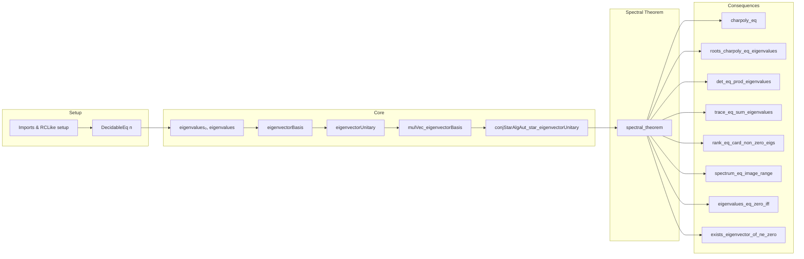

### Technical Brief: `Spectrum.lean`

---

#### **1. Key Definitions & Theorems**

| Name | Type / Signature | Purpose |
|------|------------------|---------|
| `eigenvalues₀` | `Fin (Fintype.card n) → ℝ` | Indexed eigenvalues of a Hermitian matrix `A`, ordered antitone. |
| `eigenvalues` | `n → ℝ` | Re-indexed eigenvalues using the matrix index type `n`. |
| `eigenvectorBasis` | `OrthonormalBasis n 𝕜 (EuclideanSpace 𝕜 n)` | Orthonormal basis of eigenvectors for `A`. |
| `eigenvectorUnitary` | `UnitaryGroup n 𝕜` | Unitary matrix whose columns are eigenvectors of `A`. |
| `mulVec_eigenvectorBasis` | `A *ᵥ v_j = λ_j • v_j` | Eigenvector equation for `eigenvectorBasis`. |
| `eigenvalues_mem_spectrum_real` | `eigenvalues i ∈ spectrum ℝ A` | Eigenvalues lie in the real spectrum. |
| `conjStarAlgAut_star_eigenvectorUnitary` | `A = U⁻¹ ⋆ A ⋆ U = diag(eigenvalues)` | Unitary diagonalization (core spectral theorem). |
| `spectral_theorem` | `A = U • diag(λ) • U*` | Full diagonalization: Hermitian matrix is unitarily diagonalizable. |
| `charpoly_eq` | `A.charpoly = ∏ (X - λ_i)` | Characteristic polynomial factorization via eigenvalues. |
| `roots_charpoly_eq_eigenvalues` | `A.charpoly.roots = map ofReal ∘ eigenvalues` | Roots of charpoly = eigenvalues (as multiset). |
| `det_eq_prod_eigenvalues` | `det A = ∏ λ_i` | Determinant = product of eigenvalues. |
| `trace_eq_sum_eigenvalues` | `tr A = ∑ λ_i` | Trace = sum of eigenvalues. |
| `rank_eq_card_non_zero_eigs` | `rank A = #{i | λ_i ≠ 0}` | Rank = number of nonzero eigenvalues. |
| `spectrum_eq_image_range` | `spectrum A = ofReal '' range eigenvalues` | Spectrum = image of eigenvalues under `ofReal`. |
| `spectrum_real_eq_range_eigenvalues` | `spectrum ℝ A = range eigenvalues` | Real spectrum = range of eigenvalues (since eigenvalues are real). |
| `eigenvalues_eq_zero_iff` | `λ = 0 ↔ A = 0` | Zero matrix iff all eigenvalues zero. |
| `exists_eigenvector_of_ne_zero` | `A ≠ 0 ⇒ ∃ v, λ ≠ 0 s.t. A v = λ v` | Nonzero Hermitian matrix has nonzero eigenpair. |

---

#### **2. Naming Conventions**

- **Prefixes**:
  - `eigenvalues₀`, `eigenvalues`: eigenvalue families (indexed differently).
  - `eigenvectorBasis`, `eigenvectorUnitary`: orthonormal eigenvector basis and associated unitary.
  - `mulVec_eigenvectorBasis`, `eigenvectorUnitary_mulVec`: action of `A` or `U` on basis vectors.
  - `conjStarAlgAut_star_...`: conjugation by unitary via `*`-automorphism.
  - `spectrum_...`: spectrum-related lemmas (e.g., `spectrum_toLpLin`, `spectrum_real_eq_range_eigenvalues`).
  - `rank_...`, `det_...`, `trace_...`: matrix invariants in terms of eigenvalues.

- **Suffixes**:
  - `_eq`: equality with eigenvalue-based expression.
  - `_mem_spectrum`: membership in spectrum.
  - `_iff`: biconditional characterizations.
  - `_antitone`: monotonicity property (`eigenvalues₀_antitone`).

- **Functional style**:
  - `RCLike.ofReal ∘ hA.eigenvalues`: composition for embedding eigenvalues into `𝕜`.
  - `diagonal (RCLike.ofReal ∘ hA.eigenvalues)`: diagonal matrix with eigenvalues.

---

#### **3. Tactic Stack**

Frequent tactics used in proofs:

| Tactic | Role |
|--------|------|
| `simp_rw` / `simp only` | Rewriting with definitional equalities and simplification. |
| `congr` | Congruence for function extensionality. |
| `ext` / `funext` | Extensionality for functions/matrices. |
| `apply ... ext` | Basis extensionality (e.g., `toBasis.ext`). |
| `rw [← ...]` | Reverse rewriting to match target form. |
| `exact`, `apply`, `assumption` | Direct proof steps. |
| `conv_lhs => rw [...]` | Convolution-style rewriting on LHS. |
| `simp [-isUnit_iff_ne_zero, -coe_star]` | Selective simplification (removing lemmas). |
| `apply PiLp.ext`, `apply EuclideanSpace.ofLp_single` | Structural extensionality in `Lp`/Euclidean spaces. |
| `apply Matrix.toEuclideanLin.injective` | Injectivity-based reduction. |
| `apply Multiset.map_inj`, `List.ofFn_inj` | Injectivity of mapping constructions. |
| `apply List.mergeSort_of_pairwise` | Sorting/monotonicity arguments. |
| `contrapose!` | Contrapositive reasoning (e.g., for `exists_eigenvector_of_ne_zero`). |
| `rwa [...]` | Rewrite + assumption. |

---

#### **4. Proof Logic**

The logical flow of the spectral theorem proof:

1. **Reduction to linear map case**:
   - Use `IsHermitian` ↔ `IsSymmetric` (over `RCLike` fields).
   - Apply `LinearMap.IsSymmetric.eigenvectorBasis_apply_self_apply` (known for linear maps).

2. **Basis & unitary construction**:
   - Construct orthonormal eigenvector basis (`eigenvectorBasis`) via reindexing.
   - Define unitary matrix `eigenvectorUnitary` from this basis.

3. **Diagonalization identity**:
   - Prove `U* A U = diag(λ)` via `conjStarAlgAut_star_eigenvectorUnitary`.
   - Use `toEuclideanLin.injective` + basis extensionality + `simp` over `PiLp`/Euclidean structure.

4. **Derive corollaries**:
   - `spectral_theorem`: invert the diagonalization.
   - `charpoly_eq`, `roots_charpoly_eq_eigenvalues`, `det_eq_prod_eigenvalues`, `trace_eq_sum_eigenvalues`: via standard algebraic identities (e.g., `charpoly_mul_comm`, `det_eq_prod_roots_charpoly_of_splits`).
   - `rank_eq_card_non_zero_eigs`: via `rank_diagonal` and nonzero eigenvalue count.

5. **Spectrum & monotonicity**:
   - `spectrum_eq_image_range`, `spectrum_real_eq_range_eigenvalues`: via diagonalization + spectrum invariance under unitary conjugation.
   - `eigenvalues₀_antitone`: inherited from linear map eigenvalue monotonicity.

6. **Equivalence & uniqueness**:
   - `eigenvalues_eq_eigenvalues_iff`: eigenvalue equality ↔ same charpoly.
   - `eigenvalues_eq_zero_iff`, `exists_eigenvector_of_ne_zero`: zero/nonzero matrix properties.

---

#### **5. Imports & Dependencies**

| Module | Role |
|--------|------|
| `Mathlib.Algebra.Star.UnitaryStarAlgAut` | `*`-automorphisms, `conjStarAlgAut`, unitary group. |
| `Mathlib.Analysis.InnerProductSpace.Spectrum` | Spectrum definitions, invariance under unitary equivalence. |
| `Mathlib.Analysis.Matrix.Hermitian` | `IsHermitian` definition and basic properties. |
| `Mathlib.LinearAlgebra.Eigenspace.Matrix` | Eigenspaces, eigenvalues, eigenvectors for matrices. |
| `Mathlib.LinearAlgebra.Matrix.Charpoly.Eigs` | Charpoly roots = eigenvalues (for diagonalizable matrices). |
| `Mathlib.LinearAlgebra.Matrix.Rank` | Rank properties, especially `rank_diagonal`. |

**Key ambient structures**:
- `RCLike 𝕜`: complex-like fields (ℂ, ℝ, etc.).
- `Fintype n`: finite index set for matrix dimensions.
- `DecidableEq n`: needed for spectrum finiteness and indexing.

---

#### **6. Mermaid Diagrams**

##### **Dependency Graph (High-Level)**

```mermaid
graph TD
  A[IsHermitian A] --> B[IsSymmetric A]
  B --> C[LinearMap.eigenvectorBasis]
  C --> D[eigenvectorBasis (OrthonormalBasis)]
  D --> E[eigenvectorUnitary (Unitary)]
  E --> F[conjStarAlgAut_star_eigenvectorUnitary]
  F --> G[spectral_theorem]
  G --> H[charpoly_eq]
  G --> I[det_eq_prod_eigenvalues]
  G --> J[trace_eq_sum_eigenvalues]
  G --> K[spectrum_eq_image_range]
  G --> L[rank_eq_card_non_zero_eigs]
  H --> M[roots_charpoly_eq_eigenvalues]
  M --> N[eigenvalues_eq_eigenvalues_iff]
```

##### **Overview of File Structure**



---

#### **7. Theory Context**

- **Goal**: Formalize the **spectral theorem for Hermitian matrices** over `RCLike` fields (e.g., ℂ).
- **Approach**: Leverage the *linear map* spectral theorem (`LinearMap.IsSymmetric.eigenvectorBasis_apply_self_apply`) and transport it to matrices via `toLpLin`/`toEuclideanLin`.
- **Key insight**: Hermitian matrices ↔ symmetric linear maps on Euclidean space; unitary diagonalization is equivalent to existence of orthonormal eigenbasis.
- **Applications**: Quantum mechanics (observables), optimization (Rayleigh quotients), numerical linear algebra.

--- 

Let me know if you'd like a formalized dependency graph (e.g., in `.lean` format) or a proof sketch of `conjStarAlgAut_star_eigenvectorUnitary`.
