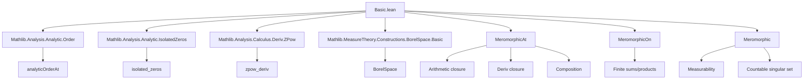
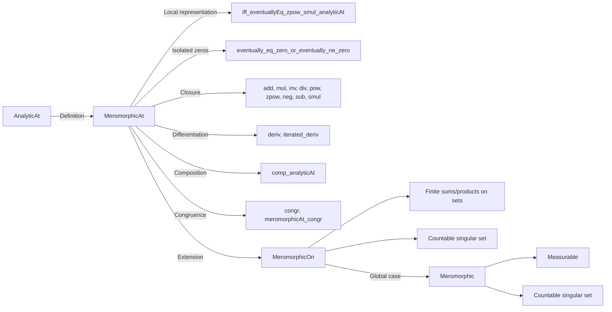

### Technical Brief: `Basic.lean` — Meromorphic Functions in Lean 4

---

#### **1. Key Definitions & Theorems**

| Name | Type / Signature | Purpose |
|------|------------------|---------|
| `MeromorphicAt` | `def MeromorphicAt (f : 𝕜 → E) (x : 𝕜) := ∃ n : ℕ, AnalyticAt 𝕜 (fun z ↦ (z - x) ^ n • f z) x` | Defines meromorphy at a point: $f$ becomes analytic after multiplication by $(z - x)^n$ for some $n \in \mathbb{N}$. |
| `MeromorphicAt.iff_eventuallyEq_zpow_smul_analyticAt` | `MeromorphicAt f x ↔ ∃ n : ℤ, ∃ g, AnalyticAt g x ∧ ∀ᶠ z ∈ 𝓝[≠] x, f z = (z - x) ^ n • g z` | Equivalence between the standard definition and the local representation $f(z) = (z - x)^n g(z)$ on a punctured neighborhood, with $g$ analytic and nonvanishing. |
| `MeromorphicAt.eventually_eq_zero_or_eventually_ne_zero` | `MeromorphicAt f z₀ → (∀ᶠ z ∈ 𝓝[≠] z₀, f z = 0) ∨ (∀ᶠ z ∈ 𝓝[≠] z₀, f z ≠ 0)` | Analogue of the identity theorem: a meromorphic function is either identically zero or nowhere zero near a point (on the punctured neighborhood). |
| `MeromorphicOn` | `def MeromorphicOn (f : 𝕜 → E) (U : Set 𝕜) := ∀ x ∈ U, MeromorphicAt f x` | Meromorphy on a set $U$: $f$ is meromorphic at every point of $U$. |
| `Meromorphic` | `def Meromorphic (f : 𝕜 → E) := ∀ x, MeromorphicAt f x` | Global meromorphy: $f$ is meromorphic at every point of $\mathbb{K}$. |
| `MeromorphicAt.add`, `mul`, `div`, `inv`, `pow`, `zpow`, `neg`, `sub`, `smul` | `to_fun (attr := fun_prop)` | Closure properties of meromorphic functions under arithmetic operations. |
| `MeromorphicAt.deriv`, `iterated_deriv` | `[CompleteSpace E] → MeromorphicAt f x → MeromorphicAt (deriv^[n] f) x` | Derivatives of meromorphic functions are meromorphic (requires completeness). |
| `MeromorphicAt.comp_analyticAt` | `MeromorphicAt f (g x) → AnalyticAt g x → MeromorphicAt (f ∘ g) x` | Composition of a meromorphic function with an analytic one is meromorphic. |
| `MeromorphicOn.countable_compl_analyticAt_inter` | `[SecondCountableTopology 𝕜] [CompleteSpace E] → MeromorphicOn f U → ({z | AnalyticAt f z}ᶜ ∩ U).Countable` | The singular set (where $f$ fails to be analytic) is countable on any domain $U$. |
| `Meromorphic.measurable` | `[MeasurableSpace 𝕜] [BorelSpace 𝕜] [MeasurableSpace E] [BorelSpace E] → Meromorphic f → Measurable f` | Meromorphic functions are measurable (under standard assumptions). |

---

#### **2. Naming Conventions**

- **Prefixes**:
  - `MeromorphicAt.`: for properties of meromorphy *at a point*.
  - `MeromorphicOn.`: for properties *on a set*.
  - `Meromorphic.`: for *global* meromorphy.
- **Suffixes**:
  - `_iff`: for biconditional lemmas (e.g., `neg_iff`, `inv_iff`).
  - `_congr`: for congruence lemmas (e.g., `congr`, `meromorphicAt_congr`).
  - `_iff_of_ne_zero`: for equivalences under nonvanishing assumptions (e.g., `meromorphicAt_smul_iff_of_ne_zero`).
- **Attribute `fun_prop`**: Used on lemmas to enable `fun_prop` tactic for automatic propagation of functorial properties (e.g., `add`, `mul`, `deriv`).
- **Attribute `to_fun`**: For lemmas that are used as “functorial” operations in typeclass inference (e.g., `add`, `mul`, `inv`).

---

#### **3. Tactic Stack**

Frequently used tactics in proofs:

| Tactic | Role |
|--------|------|
| `rcases` / `obtain` | Unpack existential quantifiers (e.g., from `MeromorphicAt` definition). |
| `rw`, `simp_rw`, `simp` | Rewrite using definitions and simplifiable lemmas. |
| `filter_upwards` | Prove statements about “eventually” in filters (e.g., punctured neighborhoods). |
| `congr` | Use congruence lemmas (e.g., `congr`, `congr_codiscreteWithin`). |
| `fun_prop` | Propagate `fun_prop`-annotated lemmas automatically. |
| `aesop` | Automated reasoning for simple goals (used in derivative computation). |
| `grind` | Custom tactic (likely from `Grind` library) for grinding through simple equalities. |
| `match_scalars` | Simplify scalar multiplication expressions. |
| `induction` | Structural induction on `Finset` or `ℕ`. |
| `convert ... using 2` | Match goals up to definitional equality, with custom substitution. |

---

#### **4. Proof Logic**

- **Structure of proofs**:
  1. **Unpack definition**: Use `rcases`/`obtain` to get $n$ and analyticity of $(z - x)^n f(z)$.
  2. **Reduce to known analytic facts**: Use closure properties (`analyticAt_id.sub`, `pow`, `smul`, etc.) to build analytic expressions.
  3. **Handle edge cases**:
     - Locally zero functions (`h_eq : ... =ᶠ[𝓝 x] 0`)
     - Nonvanishing functions (`hne : g x ≠ 0`)
  4. **Use filter arguments**:
     - `eventually_eq_zero_or_eventually_ne_zero` → split into zero or nonvanishing cases.
     - `congr` lemmas → replace $f$ with $g$ if they agree a.e. on punctured neighborhood.
  5. **Derivatives**: Use `MeromorphicAt.iff_eventuallyEq_zpow_smul_analyticAt` to get local representation, differentiate, and reapply equivalence.

- **Induction patterns**:
  - `Finset.induction` for finite sums/products.
  - `ℕ.induction` for `pow`, `zpow`, `iterated_deriv`.

- **Completeness assumption**: Required for `deriv`, `iterated_deriv`, and countability results (via `eventually_analyticAt`).

---

#### **5. Imports**

| Module | Purpose |
|--------|---------|
| `Mathlib.Analysis.Analytic.Order` | Tools for `analyticOrderAt`, local order of zeros/poles. |
| `Mathlib.Analysis.Analytic.IsolatedZeros` | Identity theorem analogues for analytic functions. |
| `Mathlib.Analysis.Calculus.Deriv.ZPow` | Derivatives of $z \mapsto (z - x)^n$ for $n \in \mathbb{Z}$. |
| `Mathlib.MeasureTheory.Constructions.BorelSpace.Basic` | Borel $\sigma$-algebra and measurability tools. |

---

#### **6. Mermaid Diagrams**

##### **Dependency Graph (High-Level)**

##### **Overview of Theory Flow**

---

#### **7. Summary**

This file formalizes the foundational theory of meromorphic functions in Lean 4, using a *local analyticity after clearing poles* approach. It establishes:

- **Local structure**: Meromorphic functions admit a representation $f(z) = (z - x)^n g(z)$ near each point, with $g$ analytic and nonvanishing.
- **Algebraic closure**: Closed under all standard arithmetic operations and composition with analytic functions.
- **Differentiation**: Derivatives remain meromorphic (with completeness).
- **Global properties**: Singular sets are countable (under separability), and meromorphic functions are measurable.

The formalization is highly structured, with careful attention to filter-theoretic reasoning (punctured neighborhoods), and leverages Lean’s typeclass inference (`fun_prop`, `to_fun`) for ergonomic closure properties.

--- 

Let me know if you'd like a formalization roadmap or suggestions for extending this theory (e.g., to Riemann surfaces, sheaf-theoretic perspective, or residue calculus).
