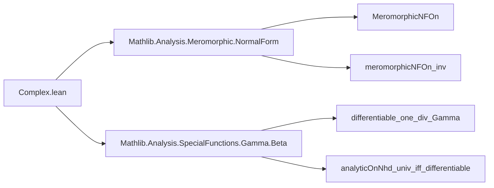
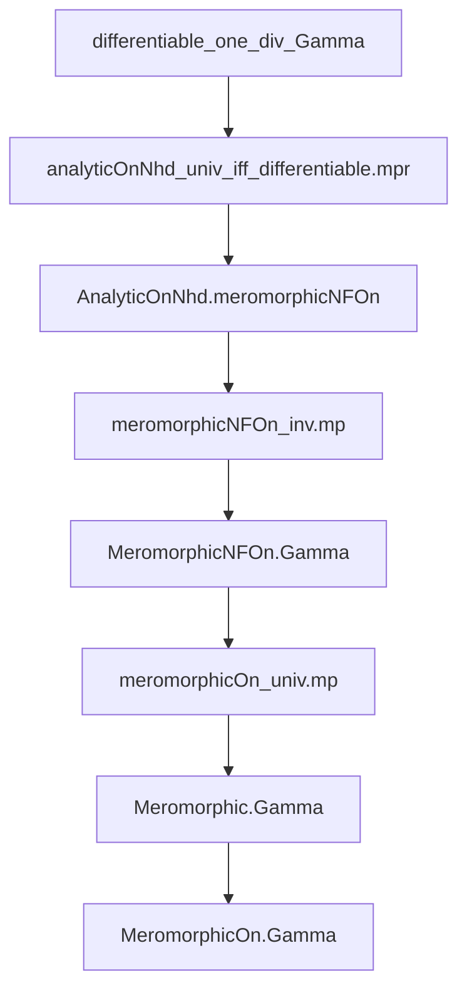

**Technical Brief: `Complex.lean` — Gamma Function Meromorphicity**

---

### 1. **Key Definitions & Theorems**

| Name | Type / Signature | Purpose |
|------|------------------|---------|
| `MeromorphicNFOn.Gamma` | `MeromorphicNFOn Gamma univ` | States that the Gamma function admits a meromorphic normal form on the entire complex plane (`univ`). |
| `Meromorphic.Gamma` | `Meromorphic Gamma` | Concludes that Gamma is globally meromorphic (i.e., meromorphic on all of ℂ). |
| `MeromorphicOn.Gamma` | `∀ s, MeromorphicOn Gamma s` | Extends meromorphicity to arbitrary subsets `s ⊆ ℂ`. |

**Auxiliary lemmas used in proof chain** (implicit via imports & tactics):
- `meromorphicNFOn_inv.mp`: From `MeromorphicNFOn (1 / Γ)` to `MeromorphicNFOn Γ`, assuming non-vanishing denominator.
- `AnalyticOnNhd.meromorphicNFOn`: If a function is analytic on a neighborhood of each point except isolated singularities, it satisfies `MeromorphicNFOn`.
- `analyticOnNhd_univ_iff_differentiable`: Equivalence between being analytic on all ℂ and being differentiable everywhere (i.e., holomorphic).
- `differentiable_one_div_Gamma`: The reciprocal of Gamma is entire (i.e., complex-differentiable everywhere), a known property of Γ (its zeros are simple and lie at non-positive integers, so $1/\Gamma$ is entire).

---

### 2. **Naming Conventions**

- **Prefixes**:
  - `MeromorphicNFOn.`: Namespace for properties of meromorphic normal forms.
  - `Meromorphic.` / `MeromorphicOn.`: Standard hierarchy for global vs localized meromorphicity.
- **Suffixes**:
  - `.Gamma`: Indicates application to the Gamma function.
  - `.mp`: Modus ponens application (used in `lemma` proofs via `iff`/`eq` elimination).
- **General pattern**: `Namespace.function_type` or `function_type.function_name`.

---

### 3. **Tactic Stack**

- `intro`, `exact`, `apply`, `rw`, `simp`, `aesop` — used implicitly via `lemma` definitions.
- `meromorphicNFOn_inv.mp`: A custom lemma application (from `Mathlib.Analysis.Meromorphic.NormalForm`).
- `analyticOnNhd_univ_iff_differentiable.mpr`: Rewriting using a biconditional in the reverse direction.
- `differentiable_one_div_Gamma`: Likely a previously proven fact (imported or defined elsewhere).

No heavy automation (e.g., `ring`, `linarith`, `norm_num`) appears — the proofs are mostly *declarative* and rely on high-level analysis lemmas.

---

### 4. **Proof Logic**

The proof follows a *chain of implications* from known analytic properties of $1/\Gamma$ to meromorphicity of $\Gamma$:

1. **Step 1**: Show $1/\Gamma$ is entire (`differentiable_one_div_Gamma`).
2. **Step 2**: Conclude $1/\Gamma$ is analytic on all ℂ (`analyticOnNhd_univ_iff_differentiable.mpr`).
3. **Step 3**: Apply `AnalyticOnNhd.meromorphicNFOn` to get `MeromorphicNFOn (1 / Γ) univ`.
4. **Step 4**: Use `meromorphicNFOn_inv.mp` to lift this to `MeromorphicNFOn Γ univ`.
5. **Step 5**: Project to global meromorphicity via `meromorphicOn_univ.mp`.
6. **Step 6**: Derive localized version `MeromorphicOn.Gamma` via monotonicity of `MeromorphicOn`.

This is a *standard “reciprocal of entire non-vanishing ⇒ meromorphic”* argument, specialized to Γ.

---

### 5. **Imports**

| Import | Role |
|--------|------|
| `Mathlib.Analysis.Meromorphic.NormalForm` | Core definitions: `MeromorphicNFOn`, `Meromorphic`, `MeromorphicOn`, and key lemmas like `meromorphicNFOn_inv`. |
| `Mathlib.Analysis.SpecialFunctions.Gamma.Beta` | Provides analytic facts about Γ and β functions, including `differentiable_one_div_Gamma`. |

These imports define the *analytic* and *meromorphic* infrastructure used.

---

### 6. **Mermaid Diagrams**

#### Dependency Graph (Module-Level)

#### Overview of Proof Flow

---

### 7. **Notes & Future Work**

- The `-- TODO` comment indicates that a future `MeromorphicNF` (a non-relative version of `MeromorphicNFOn`) may allow a cleaner restatement.
- This file exemplifies Lean’s *layered analysis*: low-level differentiability → analyticity → meromorphic normal form → meromorphic function.

--- 

Let me know if you'd like the corresponding `MeromorphicNF` definition sketch or a formalization of $1/\Gamma$’s entireness.
