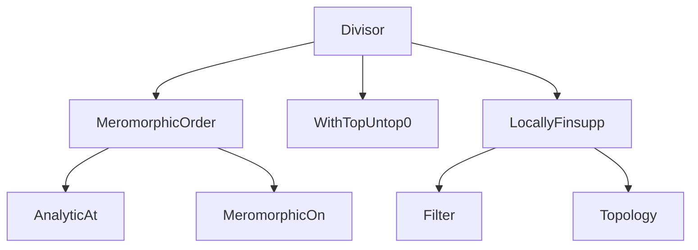
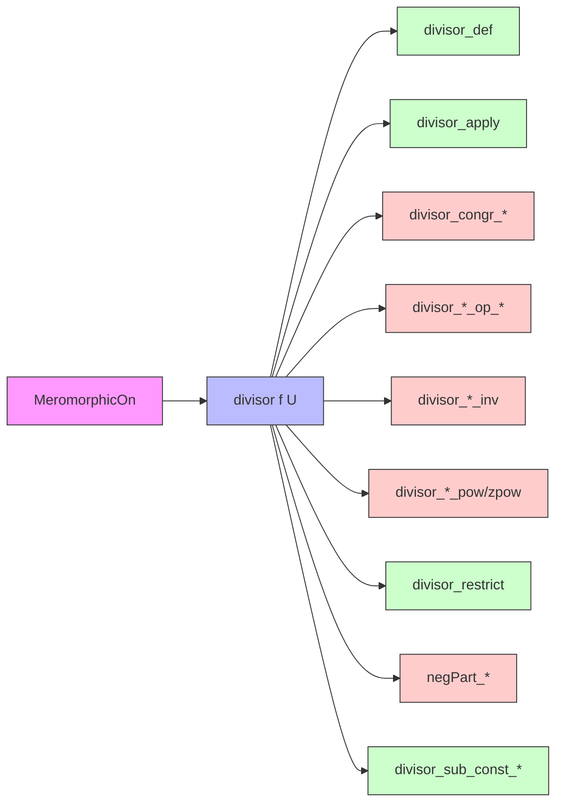
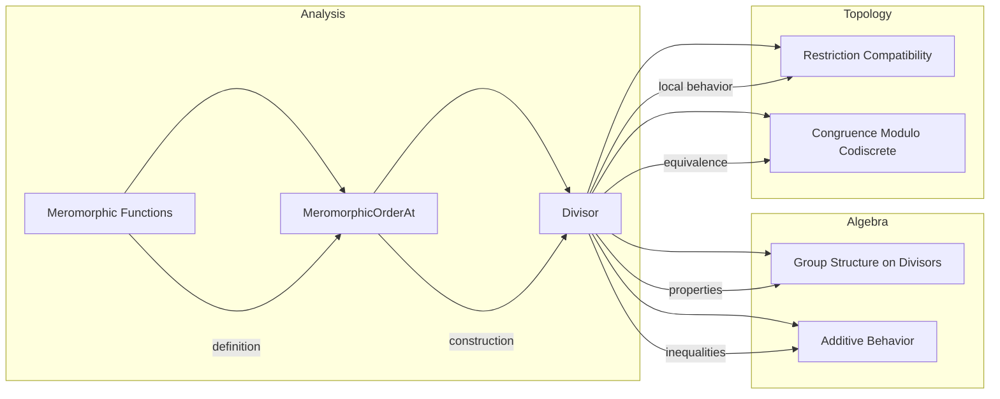

### Technical Brief: `Divisor.lean` — Divisor of a Meromorphic Function

---

#### **1. Key Definitions & Theorems**

| Name | Type / Signature | Purpose |
|------|------------------|---------|
| `divisor` | `divisor (f : 𝕜 → E) (U : Set 𝕜) : Function.locallyFinsuppWithin U ℤ` | Defines the divisor of a meromorphic function `f` on `U` as a finitely supported function assigning to each point the order (in ℤ ∪ {∞}), truncated to ℤ via `.untop₀`. |
| `divisor_def` | `divisor f U z = if MeromorphicOn f U ∧ z ∈ U then (meromorphicOrderAt f z).untop₀ else 0` | Explicit pointwise definition of `divisor`. |
| `divisor_apply` | `hf : MeromorphicOn f U → z ∈ U → divisor f U z = (meromorphicOrderAt f z).untop₀` | Simplifier lemma: evaluates `divisor` on points where `f` is meromorphic. |
| `divisor_congr_codiscreteWithin_of_eqOn_compl` | `MeromorphicOn f₁ U → f₁ =ᶠ[codiscreteWithin U] f₂ → Set.EqOn f₁ f₂ Uᶜ → divisor f₁ U = divisor f₂ U` | Congruence: if two meromorphic functions agree on a codiscrete subset of `U` and outside `U`, they have same divisor. |
| `divisor_congr_codiscreteWithin` | `f₁ =ᶠ[codiscreteWithin U] f₂ → IsOpen U → divisor f₁ U = divisor f₂ U` | Congruence under codiscrete equality on open sets. |
| `AnalyticOnNhd.divisor_nonneg` | `AnalyticOnNhd f U → 0 ≤ divisor f U` | Analytic functions have non-negative divisors (no poles). |
| `divisor_const` | `divisor (const e) U = 0` | Constant functions have zero divisor. |
| `min_divisor_le_divisor_add` | `hf₁ : MeromorphicOn f₁ U → hf₂ : MeromorphicOn f₂ U → z ∈ U → meromorphicOrderAt (f₁ + f₂) z ≠ ⊤ → min (divisor f₁ U z) (divisor f₂ U z) ≤ divisor (f₁ + f₂) U z` | Order of sum ≥ min of orders (finite case). |
| `negPart_divisor_add_le_max` / `negPart_divisor_add_le_add` | Bounds on pole parts of sums. | Control of pole behavior under addition. |
| `divisor_smul` / `divisor_mul` | Under finite orders: `divisor (f₁ • f₂) U = divisor f₁ U + divisor f₂ U` | Divisor of product/scalar multiple = sum of divisors. |
| `divisor_inv` | `divisor f⁻¹ U = -divisor f U` | Divisor of inverse = negative of divisor. |
| `divisor_pow` / `divisor_zpow` | `divisor (f ^ n) U = n • divisor f U` | Divisor of powers scales by integer exponent. |
| `divisor_restrict` | `hf : MeromorphicOn f U → V ⊆ U → (divisor f U).restrict hV = divisor f V` | Compatibility of divisor with restriction of domain. |
| `negPart_divisor_add_of_analyticNhdOn_right/left` | Adding analytic function doesn’t change pole divisor. | Poles unaffected by analytic perturbation. |
| `divisor_sub_const_of_ne` / `divisor_sub_const_self` | `divisor (· - z₀) U x = 0` if `x ≠ z₀`; `= 1` if `x = z₀ ∈ U` | Basic example: divisor of `z - z₀` is a simple zero at `z₀`. |

---

#### **2. Naming Conventions**

- **Prefixes**:
  - `divisor_`: main operations on divisors (`divisor_mul`, `divisor_pow`, `divisor_inv`, etc.)
  - `negPart_`: pole part of divisor (`negPart_divisor_add_le_max`, etc.)
  - `min_`: lower bound behavior (`min_divisor_le_divisor_add`)
- **Suffixes**:
  - `_def`: definition lemmas (`divisor_def`)
  - `_apply`: evaluation lemmas (`divisor_apply`)
  - `_congr`: congruence lemmas (`divisor_congr_codiscreteWithin`)
  - `_restrict`: restriction behavior (`divisor_restrict`)
  - `_of_` / `_self`: special cases (`divisor_sub_const_self`, `divisor_sub_const_of_ne`)
- **Function variants**:
  - `divisor_fun_*`: explicit lambda notation version (e.g., `divisor_fun_mul` vs `divisor_mul`)

---

#### **3. Tactic Stack**

Frequently used tactics in proofs:

| Tactic | Role |
|--------|------|
| `ext` | Extensionality for functions / locally finite support |
| `simp_all` / `simp only [...]` | Simplification using `divisor_def`, `divisor_apply`, `meromorphicOrderAt_*` lemmas |
| `by_cases` | Split on membership (`z ∈ U`) or finiteness of order (`≠ ⊤`) |
| `congr 1` / `congr` | Prove equality of orders/divisors by congruence |
| `rw [← untop₀_coe n]` | Lift integer to `WithTop ℤ` for comparison |
| `apply ...` + `exact` / `simpa` | Chain lemmas about `meromorphicOrderAt_*` |
| `filter_upwards` | Handle filter-based congruences (`=ᶠ[codiscreteWithin U]`) |
| `tauto` | Logical simplification in `ite_eq_*` and `Decidable` contexts |
| `by_contra` | Contradiction-based arguments (e.g., infinite support) |
| `convert` + `simp` | Transfer equalities via definitional equality (e.g., `ofNat` vs cast) |

---

#### **4. Proof Logic**

The logical flow across most proofs follows this pattern:

1. **Extensionality**: Prove equality of divisors by `ext z`.
2. **Case split on `z ∈ U`**:
   - If `z ∈ U`: use `divisor_apply` to reduce to `meromorphicOrderAt`.
   - If `z ∉ U`: use `divisor_def` and `apply_eq_zero_of_notMem`.
3. **Finite vs infinite order**:
   - Use `by_cases h : meromorphicOrderAt f z = ⊤` to separate pole vs regular point.
   - Apply lemmas like `meromorphicOrderAt_add`, `meromorphicOrderAt_smul`, `meromorphicOrderAt_inv`, etc.
4. **Congruence arguments**:
   - Use `EventuallyEq` and `codiscreteWithin` to relate functions.
   - Apply `meromorphicOrderAt_congr` or `meromorphicOn_congr_codiscreteWithin`.
5. **Order inequalities**:
   - Use `min_divisor_le_divisor_add` and `negPart_*` lemmas to compare pole/zero parts.
6. **Restriction compatibility**:
   - Use `divisor_restrict` and `hf.mono_set` to reduce to subset.

Induction appears only in `divisor_pow`/`divisor_zpow`, but mostly handled via `zpow`/`pow` definitions and simplification.

---

#### **5. Imports & Dependencies**

| Module | Role |
|--------|------|
| `Mathlib.Algebra.Order.WithTop.Untop0` | Provides `WithTop.untop₀`, truncation of `∞` to `0`. |
| `Mathlib.Analysis.Meromorphic.Order` | Defines `meromorphicOrderAt`, `MeromorphicOn`, analyticity notions. |
| `Mathlib.Topology.LocallyFinsupp` | Provides `Function.locallyFinsuppWithin`, the type of divisors (locally finite ℤ-valued functions). |
| `Filter`, `Topology` | For codiscrete filters, neighborhoods, and convergence. |
| `Classical` | Used for decidability and noncomputable definitions. |

---

#### **6. Mermaid Diagrams**

##### **Dependency Graph (Module-Level)**

##### **Overview of `Divisor.lean` Structure**

##### **Theory Context (High-Level)**

---

#### **7. Summary**

This file formalizes the **divisor** of a meromorphic function as a locally finite ℤ-valued function encoding zeros and poles. It establishes foundational algebraic and analytic properties: behavior under addition, multiplication, inversion, powers, scalar multiplication, restriction, and congruence. The proofs rely heavily on properties of `meromorphicOrderAt`, `WithTop`, and filter-based congruences (`codiscreteWithin`). The theory is designed to support further development in complex geometry (e.g., Riemann–Roch, principal divisor theory) within Lean’s `Mathlib`.
