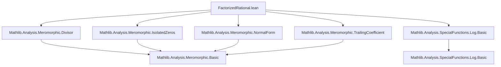
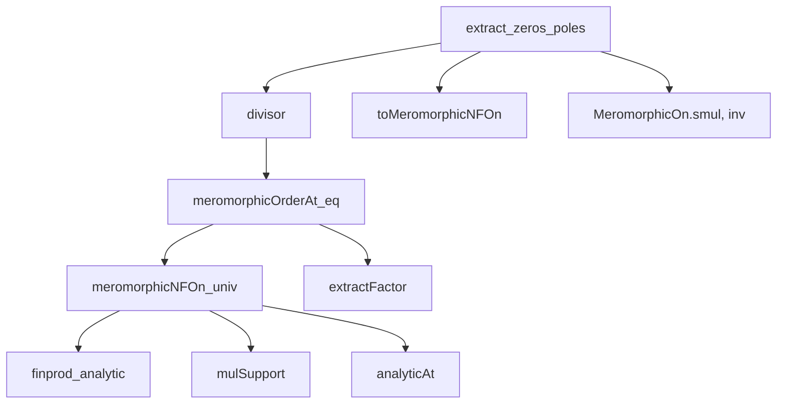

### Technical Brief: `FactorizedRational.lean`

---

#### **1. Key Definitions & Theorems**

| Name | Type / Signature | Purpose |
|------|------------------|---------|
| `Function.FactorizedRational` | `𝕜 → ℤ → 𝕜 → 𝕜` (via `∏ᶠ u, (· - u) ^ d u`) | Defines *factorized rational functions* as finitary products of powers of linear terms. |
| `mulSupport` | `(d : 𝕜 → ℤ) → (fun u ↦ (· - u) ^ d u).mulSupport = d.support` | Identifies the multiplicative support of the product with the support of the exponent function `d`. |
| `finprod_eq_fun` | `{d : 𝕜 → ℤ} → d.support.Finite → (∏ᶠ u, (· - u) ^ d u) = fun x ↦ ∏ᶠ u, (x - u) ^ d u` | Ensures evaluation commutes with finprod when support is finite. |
| `analyticAt` | `{d : 𝕜 → ℤ} → {x : 𝕜} → 0 ≤ d x → AnalyticAt … (∏ᶠ u, (· - u) ^ d u) x` | Shows analyticity at points where exponent ≥ 0. |
| `ne_zero` | `{d : 𝕜 → ℤ} → {x : 𝕜} → d x = 0 → (∏ᶠ u, (· - u) ^ d u) x ≠ 0` | Guarantees non-vanishing at points where exponent = 0. |
| `extractFactor` | `(u₀ : 𝕜) → d.support.Finite → (∏ᶠ u, (· - u) ^ d u) = ((· - u₀) ^ d u₀) * (∏ᶠ u, (· - u) ^ update d u₀ 0 u)` | Allows factoring out a single term for computation. |
| `meromorphicNFOn_univ` | `(d : 𝕜 → ℤ) → MeromorphicNFOn (∏ᶠ u, (· - u) ^ d u) univ` | Proves factorized rational functions are meromorphic in *normal form* on all of `𝕜`. |
| `meromorphicOrderAt_eq` | `(d : 𝕜 → ℤ) → d.support.Finite → meromorphicOrderAt (∏ᶠ u, (· - u) ^ d u) z = d z` | Relates the order of a factorized rational function at `z` to `d z`. |
| `divisor` | `{D : locallyFinsuppWithin U ℤ} → D.support.Finite → MeromorphicOn.divisor (∏ᶠ u, (· - u) ^ D u) U = D` | Shows the divisor of a factorized rational function equals its exponent function `D`. |
| `meromorphicTrailingCoeffAt_factorizedRational` | `(d : 𝕜 → ℤ) → d.support.Finite → … = ∏ᶠ u, (x - u) ^ update d x 0 u` | Computes the trailing coefficient at `x`. |
| `log_norm_meromorphicTrailingCoeffAt` | `(d : 𝕜 → ℤ) → d.support.Finite → log ‖…‖ = ∑ᶠ u, d u * log ‖x - u‖` | Gives a closed-form expression for log-norm of trailing coefficient. |
| `MeromorphicOn.extract_zeros_poles` | `(f : 𝕜 → E) → MeromorphicOn f U → … → ∃ g, AnalyticOnNhd g U ∧ g ≠ 0 ∧ f =ᶠ[codiscreteWithin U] (∏ᶠ u, (· - u) ^ divisor f U u) • g` | Main structural theorem: any meromorphic function with finite divisor support decomposes as factorized rational × nowhere-zero analytic function (modulo codiscrete equality). |
| `MeromorphicOn.extract_zeros_poles_log` | Similar to above, but for `log ‖f‖`. | Decomposes `log ‖f‖` as sum of logarithmic terms + `log ‖g‖`. |
| `MeromorphicOn.meromorphicTrailingCoeffAt_extract_zeros_poles` | Computes trailing coefficient of `f` via decomposition. | Links `trailingCoeff f` to `trailingCoeff factorized × g x`. |
| `MeromorphicOn.log_norm_meromorphicTrailingCoeffAt_extract_zeros_poles` | Log-norm version of above. | Final formula: `log ‖tcoeff f x‖ = ∑ᶠ u, D u * log ‖x - u‖ + log ‖g x‖`. |

---

#### **2. Naming Conventions**

- **Prefixes**:
  - `meromorphicOrderAt_`, `meromorphicTrailingCoeffAt_`, `divisor_`: relate to meromorphic function invariants.
  - `analyticAt_`, `ne_zero_`: local properties of the function.
  - `extractFactor_`, `mulSupport_`, `finprod_eq_fun_`: computational lemmas.
  - `FactorizedRational.`: namespace for core definitions/lemmas.

- **Suffixes**:
  - `_univ`: statements on full space `univ`.
  - `_off_support`: behavior outside support of `d`.
  - `_factorizedRational`: specific to factorized rational functions.
  - `_extract_zeros_poles`: decomposition results.

- **Helper patterns**:
  - `update d x 0`: used to zero out exponent at a point for extraction.
  - `mulSupport`, `support`, `support.Finite`: central to finiteness assumptions.

---

#### **3. Tactic Stack**

Frequently used tactics:
- `rw`, `simp`, `congr`, `ext`, `intro`, `cases`, `by_cases`
- `apply`, `exact`, `assumption`, `contrapose`, `by_contra`
- `filter_upwards`, `fun_prop`, `grind` (custom tactic in Mathlib)
- `finprod_eq_prod_of_mulSupport_subset`, `finsum_eq_sum_of_support_subset`
- `norm_num`, `ring`, `linarith`, `tauto`, `simp_all`

---

#### **4. Proof Logic**

- **Induction / case analysis** is rare; proofs rely on:
  - **Decomposition via `extractFactor`** to isolate behavior at a point.
  - **Finiteness assumptions** (`d.support.Finite`) to reduce `∏ᶠ` to finite `∏`.
  - **Meromorphic normal form theory** (`MeromorphicNFOn`, `divisor`, `meromorphicOrderAt`) to relate local and global structure.
  - **Codiscrete equality** (`=ᶠ[codiscreteWithin U]`) to handle equality almost everywhere (modulo codiscrete sets).
  - **Logarithmic identities** for trailing coefficients (e.g., `log_prod`, `log_zpow`).
- **Typical flow**:
  1. Assume finiteness of support.
  2. Reduce finprod to finite product.
  3. Apply known lemmas for powers, sums, products.
  4. Use `analyticAt`, `ne_zero`, `meromorphicOrderAt_eq` to verify conditions.
  5. For decomposition theorems: construct `g := toMeromorphicNFOn(φ⁻¹ • f)`, verify properties.

---

#### **5. Imports**

- `Mathlib.Analysis.Meromorphic.Divisor`
- `Mathlib.Analysis.Meromorphic.IsolatedZeros`
- `Mathlib.Analysis.Meromorphic.NormalForm`
- `Mathlib.Analysis.Meromorphic.TrailingCoefficient`
- `Mathlib.Analysis.SpecialFunctions.Log.Basic`

→ This module sits in the *meromorphic function theory* stack, building on normal forms, divisors, and trailing coefficients.

---

#### **6. Mermaid Diagrams**

##### **Dependency Graph (Module-Level)**



##### **Overview of Theory Flow**

```mermaid
graph LR
  A[Factorized Rational Functions] -->|define| B[∏ᶠ (· - u)^d u]
  B -->|prove| C[MeromorphicNFOn]
  C -->|link| D[Divisor = d]
  D -->|apply| E[Decomposition Theorem]
  E -->|log-norm| F[∑ d u · log ‖· - u‖ + log ‖g‖]
  E -->|trailing coeff| G[tcoeff f = tcoeff factorized • g x]
```

##### **Key Logical Dependencies (per theorem)**



---

#### **7. Summary**

This file formalizes the *factorization of meromorphic functions* into a canonical product part (encoding zeros/poles via integer exponents) and a nowhere-zero analytic part. It establishes:

- **Local structure**: orders, trailing coefficients, analyticity.
- **Global structure**: divisor equality, decomposition modulo codiscrete sets.
- **Logarithmic control**: closed formulas for `log ‖f‖` and its trailing coefficient.

The theory is foundational for deeper results in complex analysis (e.g., Weierstrass factorization, Mittag-Leffler), and is implemented in Lean using `finprod`, `divisor`, and `meromorphicNFOn` machinery.

--- 

Let me know if you'd like a **dependency graph of lemmas** or a **proof sketch of `MeromorphicOn.extract_zeros_poles`**.
