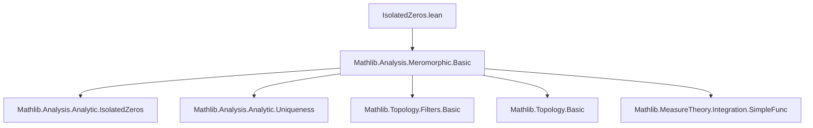
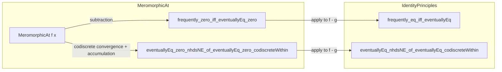
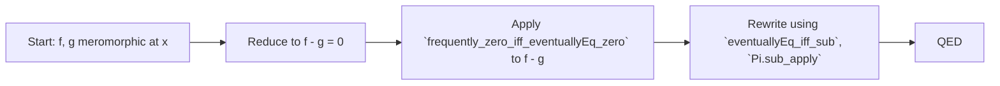

### Technical Brief: `IsolatedZeros.lean`

---

#### **1. Key Definitions & Theorems**

| Name | Type / Signature | Purpose |
|------|------------------|---------|
| `MeromorphicAt` | `𝕜 → E → Prop` | Predicate stating that a function `f : 𝕜 → E` is meromorphic at a point `x ∈ 𝕜`. |
| `frequently_zero_iff_eventuallyEq_zero` | `(hf : MeromorphicAt f x) → (∃ᶠ z in 𝓝[≠] x, f z = 0) ↔ f =ᶠ[𝓝[≠] x] 0` | Isolated zeros principle: vanishing frequently in punctured neighborhoods implies vanishing eventually (and vice versa). |
| `eventuallyEq_zero_nhdsNE_of_eventuallyEq_zero_codiscreteWithin` | `(hf : MeromorphicAt f x) → x ∈ U → AccPt x (𝓟 U) → f =ᶠ[codiscreteWithin U] 0 → f =ᶠ[𝓝[≠] x] 0` | Extension of isolated zeros to subsets `U` where `x` is a non-isolated accumulation point; uses codiscrete convergence. |
| `frequently_eq_iff_eventuallyEq` | `(hf : MeromorphicAt f x) → (hg : MeromorphicAt g x) → (∃ᶠ z in 𝓝[≠] x, f z = g z) ↔ f =ᶠ[𝓝[≠] x] g` | Identity principle: agreement frequently implies agreement eventually in punctured neighborhoods. |
| `eventuallyEq_nhdsNE_of_eventuallyEq_codiscreteWithin` | `(hf : MeromorphicAt f x) → (hg : MeromorphicAt g x) → x ∈ U → AccPt x (𝓟 U) → f =ᶠ[codiscreteWithin U] g → f =ᶠ[𝓝[≠] x] g` | Identity principle for subsets `U` with non-isolated `x ∈ U`. |

> **Note**: `𝓝[≠] x` denotes the *punctured* neighborhood filter at `x`.  
> `AccPt x (𝓟 U)` means `x` is an *accumulation point* of the filter `𝓟 U` (the neighborhood filter of `U`).  
> `codiscreteWithin U` is the *codiscrete filter within `U`*, i.e., the filter of sets whose complement in `U` is discrete.

---

#### **2. Naming Conventions**

- **Prefixes**:
  - `frequently_...`: refers to filters like `∃ᶠ z in l, P z`.
  - `eventually_...`: refers to filters like `f =ᶠ[l] g`.
  - `eventuallyEq_...`: equality up to a filter (e.g., `eventuallyEq_zero`).
  - `codiscreteWithin`: used for filters relative to subsets.

- **Suffixes**:
  - `_iff_eventuallyEq`: equivalence between frequent and eventual behavior.
  - `_of_eventuallyEq_zero_codiscreteWithin`: implication from codiscrete convergence to punctured-neighborhood convergence.

- **Function names**:
  - `sub`, `zero_apply`, `sub_eq_zero`: standard algebraic simplifications.
  - `mem_codiscreteWithin_iff_forall_mem_nhdsNE`: characterization of membership in codiscrete filter.

---

#### **3. Tactic Stack**

- **Core tactics**:
  - `rw`: repeated use for rewriting definitions (`eventuallyEq_iff_sub`, `Pi.sub_apply`, etc.).
  - `simp_rw`: for simplification with rewrite rules (e.g., `Pi.zero_apply`).
  - `filter_upwards`: to lift properties through filters.
  - `simp_all`, `simp`: for simplifying goals and hypotheses.
  - `apply`: for applying lemmas (e.g., `hf.eventually_eq_zero_or_eventually_ne_zero.resolve_right`).
  - `exact`, `intro`, `intro a`: standard intro/assumption handling.

- **Filter-specific**:
  - `and_eventually`: combines two eventual statements.
  - `mem_codiscreteWithin_iff_forall_mem_nhdsNE`: used to translate codiscrete membership into pointwise conditions.

- **No heavy automation** (e.g., `aesop`, `linarith`, `ring`) — proofs are mostly structural and rely on filter lemmas.

---

#### **4. Proof Logic**

- **Structure**:
  1. **Reduction to zero case**: For identity principles (`frequently_eq_iff_eventuallyEq`, `eventuallyEq_nhdsNE_of_eventuallyEq_codiscreteWithin`), reduce to the zero case via subtraction: `f = g ↔ f - g = 0`.
  2. **Application of meromorphic dichotomy**: Use `hf.eventually_eq_zero_or_eventually_ne_zero` to get dichotomy for meromorphic functions.
  3. **Filter-theoretic reasoning**:
     - Translate codiscrete convergence into pointwise convergence on a dense subset of `U`.
     - Use `AccPt x (𝓟 U) ↔ ∃ᶠ z in 𝓝[≠] x, z ∈ U` to connect accumulation with punctured neighborhoods.
  4. **Logical manipulation**:
     - Combine filters using `and_eventually`, `frequently`, and `eventually`.
     - Use `filter_upwards` to handle universal quantification over points.

- **Induction is not used** — all proofs are direct filter-theoretic arguments.

---

#### **5. Imports**

- **Primary dependency**:
  ```lean
  Mathlib.Analysis.Meromorphic.Basic
  ```
  Provides:
  - `MeromorphicAt`
  - Basic properties: `MeromorphicAt.sub`, `MeromorphicAt.eventually_eq_zero_or_eventually_ne_zero`
  - Filter tools: `𝓝[≠]`, `codiscreteWithin`, `AccPt`, `eventuallyEq`, `frequently`

- **Implicit imports** (via `Mathlib.Analysis.Meromorphic.Basic`):
  - `Mathlib.Analysis.Analytic.IsolatedZeros` (for comparison)
  - `Mathlib.Analysis.Analytic.Uniqueness`
  - `Mathlib.Topology.Filters.Basic`, `Mathlib.Topology.Basic`, `Mathlib.MeasureTheory.Integration.SimpleFunc`

---

#### **6. Mermaid Diagrams**

##### **Dependency Graph (Module Level)**



##### **Overview of Theoretical Flow**



##### **Proof Strategy Flow (Example: `frequently_eq_iff_eventuallyEq`)**



---

#### **7. Summary**

This module extends classical *isolated zeros* and *identity principles* from analytic to meromorphic functions. Due to the flexibility of meromorphic functions (they can be redefined on discrete sets), the statements require additional topological hypotheses (e.g., `AccPt x (𝓟 U)`) and use codiscrete filters to capture convergence along "large" subsets of `U`. The proofs are clean, filter-theoretic, and rely heavily on the dichotomy property of meromorphic functions (`eventually_eq_zero_or_eventually_ne_zero`).
