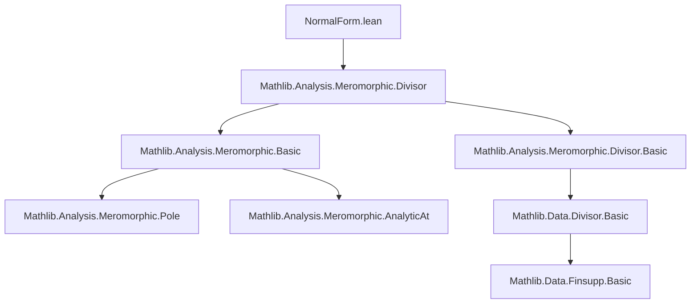

### Technical Brief: `NormalForm.lean`

---

#### **1. Key Definitions & Theorems**

| Name | Type / Signature | Purpose |
|------|------------------|---------|
| `MeromorphicNFAt f x` | `Prop` | `f` is *meromorphic in normal form* at `x`: either vanishes near `x`, or locally $ f = (· - x)^n • g $ with $g$ analytic and $g(x) ≠ 0$. |
| `MeromorphicNFOn f U` | `Prop` | `f` is meromorphic in normal form *on* `U`: holds at every point of `U`. |
| `toMeromorphicNFAt f x` | `𝕜 → E` | Converts `f` to a representative in normal form at `x` by adjusting its value at `x` (if `f` is meromorphic at `x`). |
| `toMeromorphicNFOn f U` | `𝕜 → E` | Converts `f` to normal form *on* `U`, adjusting values along a codiscrete subset of `U`. |
| `meromorphicNFAt_iff_analyticAt_or` | `↔` | Characterizes `MeromorphicNFAt` as: analytic at `x`, or meromorphic with negative order and value `0` at `x`. |
| `meromorphicNFAt_toMeromorphicNFAt` | `MeromorphicNFAt (toMeromorphicNFAt f x) x` | Guarantees that `toMeromorphicNFAt` produces a function in normal form at `x`. |
| `toMeromorphicNFAt_eq_self` | `↔` | `f = toMeromorphicNFAt f x` iff `f` is already in normal form at `x`. |
| `meromorphicNFOn_toMeromorphicNFOn` | `MeromorphicNFOn (toMeromorphicNFOn f U) U` | Guarantees that `toMeromorphicNFOn` yields a function in normal form on `U`. |
| `toMeromorphicNFOn_eq_self` | `↔` | `f = toMeromorphicNFOn f U` iff `f` is in normal form on `U`. |
| `MeromorphicNFAt.meromorphicOrderAt_eq_zero_iff` | `↔` | For `f` in normal form at `x`, order is zero iff `f(x) ≠ 0`. |
| `MeromorphicNFAt.inv` | `MeromorphicNFAt f x → MeromorphicNFAt f⁻¹ x` | Inversion preserves normal form (for scalar-valued `f`). |
| `meromorphicNFAt_inv` | `↔` | Equivalence: `f⁻¹` is in normal form at `x` iff `f` is. |
| `MeromorphicNFOn.zero_set_eq_divisor_support` | `=` | For `f` in normal form on `U$ and nowhere locally zero, zero set = support of divisor. |

---

#### **2. Naming Conventions**

- **Prefixes**:
  - `MeromorphicNFAt_`, `MeromorphicNFOn_`: properties of normal form at a point / on a set.
  - `toMeromorphicNFAt`, `toMeromorphicNFOn`: *conversion* functions to normal form.
  - `meromorphicNFAt_`, `meromorphicNFOn_`: lemmas about normal form (lowercase for lemmas).
- **Suffixes**:
  - `_iff_`: characterizations / equivalences.
  - `_of_`, `_on_`, `_at_`: specify context (e.g., `smul_analytic`, `toMeromorphicNFOn_eq_toMeromorphicNFAt_on_nhds`).
  - `_congr`: congruence lemmas (e.g., `meromorphicNFAt_congr`).
- **Operators**:
  - `•`, `*`, `inv`, `zpow n`: used in normal form expressions.

---

#### **3. Tactic Stack**

Frequently used tactics in proofs:

| Tactic | Role |
|--------|------|
| `rw` / `simp_rw` | Rewriting definitions, especially `meromorphicNFAt_iff_analyticAt_or`, `toMeromorphicNFAt`, `meromorphicOrderAt_eq_int_iff`. |
| `rcases` / `obtain` | Decomposing existential hypotheses (e.g., from `MeromorphicNFAt` or `meromorphicOrderAt_eq_int_iff`). |
| `filter_upwards` | Working with filters (eventual equality, codiscrete filters). |
| `funext` | Extensionality for function equality. |
| `by_cases` / `split_ifs` | Branching on decidables (e.g., `MeromorphicAt f x`, `z = x`, `0 ≤ n`). |
| `simp` / `simp_all` | Simplifying using lemmas like `zpow_zero`, `smul_eq_zero`, `inv_ne_zero`. |
| `exact` / `assumption` | Closing goals directly. |
| `tauto` | Tactic for propositional logic (e.g., handling `∨`, `¬`, `∧`). |
| `ring` | Simplifying algebraic expressions (e.g., in `inv` lemma). |
| `apply` / `intro` | Standard natural deduction. |
| `lift ... to ℤ using ...` | Lifting from `WithTop ℤ` to `ℤ` when order is finite. |

---

#### **4. Proof Logic**

- **Induction**: Not used (no inductive types involved).
- **Case analysis**: Dominant strategy:
  - Split on `MeromorphicAt f x`, `MeromorphicNFAt f x`, `z = x`, `0 ≤ n`, `meromorphicOrderAt f x = 0`, etc.
- **Filter-based reasoning**:
  - Use `eventually_eq` (`=ᶠ`) and `eventually_nhdsWithin` to handle local behavior.
  - `Filter.codiscreteWithin` used to express “discrete exceptional sets”.
- **Equivalence via congruence**:
  - Many lemmas prove `↔` by showing both directions via `rw`, `congr`, and `eventually_eq` manipulations.
- **Conversion lemmas**:
  - `toMeromorphicNFAt` and `toMeromorphicNFOn` are defined classically (via `Classical.choose`), and their correctness is shown via `toMeromorphicNFAt_eq_self`, `meromorphicNFAt_toMeromorphicNFAt`, etc.
- **Order analysis**:
  - `meromorphicOrderAt_eq_int_iff` is repeatedly used to extract the integer order and analytic witness `g`.

---

#### **5. Imports**

- `Mathlib.Analysis.Meromorphic.Divisor`: Core theory of meromorphic functions, divisors, orders, analyticity.

---

#### **6. Mermaid Diagrams**

##### **Dependency Graph (Module-Level)**



##### **Overview of Theory Flow**

```mermaid
flowchart LR
  A[MeromorphicAt f x] --> B[MeromorphicNFAt f x]
  B --> C[toMeromorphicNFAt f x]
  C --> D[MeromorphicNFAt (toMeromorphicNFAt f x) x]

  A' --> B'[MeromorphicNFOn f U]
  B' --> C'[toMeromorphicNFOn f U]
  C' --> D'[MeromorphicNFOn (toMeromorphicNFOn f U) U]

  D --> E[Divisor & Zero Set]
  D' --> E'[Divisor Invariance]

  style B fill:#e6f7ff,stroke:#1890ff
  style B' fill:#e6f7ff,stroke:#1890ff
  style C fill:#ffe58f,stroke:#faad14
  style C' fill:#ffe58f,stroke:#faad14
```

- **Blue boxes**: *Normal form definitions* (`MeromorphicNFAt`, `MeromorphicNFOn`)
- **Yellow boxes**: *Conversion functions* (`toMeromorphicNFAt`, `toMeromorphicNFOn`)
- **Goal**: Provide canonical representatives in each equivalence class under `=ᶠ[codiscreteWithin U]`.

---

#### **7. Summary**

This file formalizes the *normal form* of meromorphic functions: near any point $x$, a meromorphic function can be uniquely written as $(z - x)^n \cdot g(z)$, where $g$ is analytic and non-vanishing at $x$. The key contribution is the construction of a *canonical representative* (`toMeromorphicNFAt`, `toMeromorphicNFOn`) for each equivalence class under eventual equality modulo codiscrete subsets. This enables a clean API for working with meromorphic functions up to codiscrete equivalence, with applications in divisor theory and analytic continuation.

The formalization is highly structured, with:
- Clear separation of *pointwise* (`At`) and *global-on-set* (`On`) notions,
- Extensive use of filter-based reasoning (`=ᶠ`, `codiscreteWithin`),
- Classical definitions for conversion functions, with correctness proofs via `eventually_eq` and order analysis.

--- 

Let me know if you'd like a **dependency graph of definitions** or a **proof outline for `meromorphicNFAt_toMeromorphicNFAt`**.
