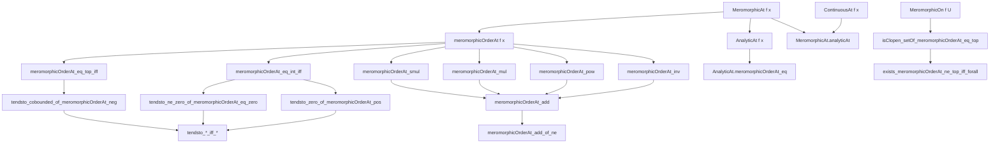
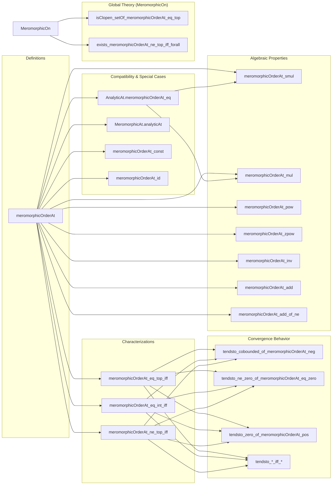

Here is the structured technical metadata extracted from the provided Lean 4 file `Order.lean`:

---

### **1. Key Definitions & Theorems**

| Name | Type / Signature | Purpose |
|------|------------------|---------|
| `meromorphicOrderAt` | `f : 𝕜 → E → x : 𝕜 → WithTop ℤ` | Defines the *order* of a meromorphic function at a point as an element of `ℤ ∪ {∞}`. |
| `meromorphicOrderAt_eq_top_iff` | `meromorphicOrderAt f x = ⊤ ↔ ∀ᶠ z in 𝓝[≠] x, f z = 0` | Characterizes infinite order as local vanishing in a punctured neighborhood. |
| `meromorphicOrderAt_eq_int_iff` | `meromorphicOrderAt f x = n ↔ ∃ g, AnalyticAt g x ∧ g x ≠ 0 ∧ f =ᶠ[𝓝[≠] x] (· - x) ^ n • g` | Characterizes finite integer order via local factorization. |
| `meromorphicOrderAt_ne_top_iff` | `meromorphicOrderAt f x ≠ ⊤ ↔ ∃ g, AnalyticAt g x ∧ g x ≠ 0 ∧ f =ᶠ[𝓝[≠] x] (· - x) ^ order • g` | Equivalence of finite order and existence of such a factorization. |
| `tendsto_cobounded_of_meromorphicOrderAt_neg` | `meromorphicOrderAt f x < 0 → Tendsto f (𝓝[≠] x) cobounded` | Negative order ⇒ function tends to ∞. |
| `tendsto_ne_zero_of_meromorphicOrderAt_eq_zero` | `MeromorphicAt f x → meromorphicOrderAt f x = 0 → ∃ c ≠ 0, Tendsto f (𝓝[≠] x) (𝓝 c)` | Zero order ⇒ nonzero finite limit. |
| `tendsto_zero_of_meromorphicOrderAt_pos` | `0 < meromorphicOrderAt f x → Tendsto f (𝓝[≠] x) (𝓝 0)` | Positive order ⇒ function tends to 0. |
| `tendsto_cobounded_iff_meromorphicOrderAt_neg` | `MeromorphicAt f x → (Tendsto f (𝓝[≠] x) cobounded ↔ meromorphicOrderAt f x < 0)` | iff version of negative order ⇝ ∞. |
| `tendsto_nhds_iff_meromorphicOrderAt_nonneg` | `MeromorphicAt f x → (∃ c, Tendsto f (𝓝[≠] x) (𝓝 c) ↔ 0 ≤ meromorphicOrderAt f x)` | iff version of nonnegative order ⇝ finite limit. |
| `tendsto_ne_zero_iff_meromorphicOrderAt_eq_zero` | `MeromorphicAt f x → (∃ c ≠ 0, Tendsto f (𝓝[≠] x) (𝓝 c) ↔ meromorphicOrderAt f x = 0)` | iff version of zero order ⇝ nonzero limit. |
| `tendsto_zero_iff_meromorphicOrderAt_pos` | `MeromorphicAt f x → (Tendsto f (𝓝[≠] x) (𝓝 0) ↔ 0 < meromorphicOrderAt f x)` | iff version of positive order ⇝ 0. |
| `meromorphicOrderAt_congr` | `f₁ =ᶠ[𝓝[≠] x] f₂ → meromorphicOrderAt f₁ x = meromorphicOrderAt f₂ x` | Order is insensitive to punctured-neighborhood equality. |
| `AnalyticAt.meromorphicOrderAt_eq` | `AnalyticAt f x → meromorphicOrderAt f x = analyticOrderAt f x.map (↑)` | Compatibility with analytic order. |
| `MeromorphicAt.analyticAt` | `MeromorphicAt f x → ContinuousAt f x → AnalyticAt f x` | Meromorphic + continuous ⇒ analytic. |
| `meromorphicOrderAt_const` | `meromorphicOrderAt (const e) z₀ = if e = 0 then ⊤ else 0` | Order of constant function. |
| `meromorphicOrderAt_id` | `meromorphicOrderAt id 0 = 1` | Order of identity at 0. |
| `meromorphicOrderAt_smul` | `MeromorphicAt f x → MeromorphicAt g x → meromorphicOrderAt (f • g) x = meromorphicOrderAt f x + meromorphicOrderAt g x` | Additivity under scalar multiplication. |
| `meromorphicOrderAt_mul` | `MeromorphicAt f x → MeromorphicAt g x → meromorphicOrderAt (f * g) x = ...` | Additivity under multiplication. |
| `meromorphicOrderAt_pow` | `MeromorphicAt f x → meromorphicOrderAt (f ^ n) x = n * meromorphicOrderAt f x` | Multiplicativity under natural powers. |
| `meromorphicOrderAt_zpow` | `MeromorphicAt f x → meromorphicOrderAt (f ^ n) x = n * meromorphicOrderAt f x` | Multiplicativity under integer powers. |
| `meromorphicOrderAt_inv` | `meromorphicOrderAt (f⁻¹) x = -meromorphicOrderAt f x` | Order of inverse is negative. |
| `meromorphicOrderAt_add` | `min(ord f₁, ord f₂) ≤ ord(f₁ + f₂)` | Subadditivity of order under addition. |
| `meromorphicOrderAt_add_of_ne` | `ord f₁ ≠ ord f₂ → ord(f₁ + f₂) = min(ord f₁, ord f₂)` | Exact formula when orders differ. |
| `isClopen_setOf_meromorphicOrderAt_eq_top` | `{u ∈ U | ord f u = ⊤}` is clopen in `U` if `f` is meromorphic on `U`. | Topological structure of infinite-order locus. |
| `exists_meromorphicOrderAt_ne_top_iff_forall` | On connected `U`, existence of one finite-order point ⇔ all finite-order. | Global finiteness on connected domains. |

---

### **2. Naming Conventions**

- **Prefixes**:
  - `meromorphicOrderAt_`: core definitions and lemmas about the order function.
  - `tendsto_*_of_*`: implication direction (→) from order to convergence behavior.
  - `tendsto_*_iff_*`: equivalence (↔) between convergence and order.
  - `AnalyticAt.*`: compatibility lemmas with analytic functions.
  - `MeromorphicOn.*`: global properties over sets.

- **Suffixes**:
  - `_eq_top_iff`, `_eq_int_iff`, `_ne_top_iff`: characterizations of order being ∞, finite, or finite respectively.
  - `_of_*`: one-directional implications (e.g., `neg`, `eq_zero`, `pos`, `nonneg`).
  - `_iff_*`: iff versions.
  - `_congr`, `_smul`, `_mul`, `_pow`, `_zpow`, `_inv`, `_add`: algebraic operations.

- **Other patterns**:
  - `eventually*` for neighborhood-based characterizations.
  - `untop₀`, `untopD`, `map`, `coe` for `WithTop ℤ` manipulations.

---

### **3. Tactic Stack**

Frequently used tactics in proofs:

| Tactic | Usage |
|--------|-------|
| `by_cases` | Splitting on decidability or membership (e.g., `hf : MeromorphicAt f x`, `h : ord f x = ⊤`) |
| `simp` / `simp only` | Simplifying definitions, especially `meromorphicOrderAt`, `WithTop`, `eventually`, `eventuallyEq` |
| `rw` / `rw [...] at *` | Rewriting using equivalences like `meromorphicOrderAt_eq_int_iff` |
| `filter_upwards` | Handling `∀ᶠ` statements in punctured neighborhoods |
| `exact`, `apply`, `intro` | Standard proof steps |
| `aesop` | Automated reasoning for trivial goals (e.g., after `norm_cast`, `ring`) |
| `norm_cast` | Managing coercion between `ℕ`, `ℤ`, `WithTop ℤ` |
| `ring` | Simplifying arithmetic in `ℤ` or `WithTop ℤ` |
| `convert`, `congr` | Proving equality of functions or expressions up to definitional equality |
| `lift ... to ℕ using ...` | Lifting integer order to natural when nonnegative |
| `obtain ⟨...⟩ := ...` | Destructuring existential or conjunctions |
| `rw [← WithTop.coe_*]` | Moving between `ℤ` and `WithTop ℤ` via coercion |

---

### **4. Proof Logic**

The logical flow across most proofs follows this pattern:

1. **Case split on meromorphicity** (`by_cases hf : MeromorphicAt f x`)
2. **Case split on order being ∞ or finite** (`by_cases h : ord f x = ⊤`, or `cases ord f x`)
3. **Apply characterization lemmas**:
   - Use `meromorphicOrderAt_eq_int_iff` or `meromorphicOrderAt_eq_top_iff` to get local factorization.
4. **Manipulate the factorization**:
   - Use algebraic lemmas (`zpow_add`, `smul_comm`, etc.) to combine or compare expressions.
5. **Use convergence lemmas**:
   - Translate order info to convergence behavior via `tendsto_*` lemmas.
6. **Use topological properties**:
   - For global results (`MeromorphicOn`), use clopenness and connectedness.

Induction is used for `pow`, and `zpow` requires separate handling of `n = 0`, `ord f x = ⊤`, and general case.

---

### **5. Imports**

| Import | Purpose |
|--------|---------|
| `Mathlib.Analysis.Meromorphic.Basic` | Core meromorphic function theory (definition of `MeromorphicAt`, `MeromorphicOn`, etc.) |
| `Mathlib.Algebra.Order.WithTop.Untop0` | Tools for working with `WithTop ℤ`, including `untop₀`, `map`, `coe`, etc. |

---

### **6. Mermaid Diagrams**

#### **Dependency Graph (High-Level)**

#### **Overview of File Structure**

--- 

Let me know if you'd like a formalized dependency graph in Lean or a more granular breakdown of proof dependencies.
