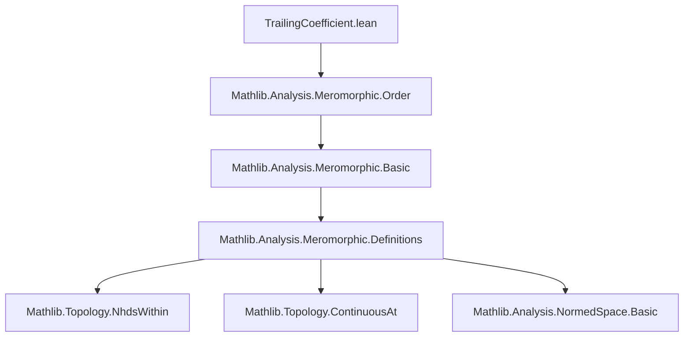
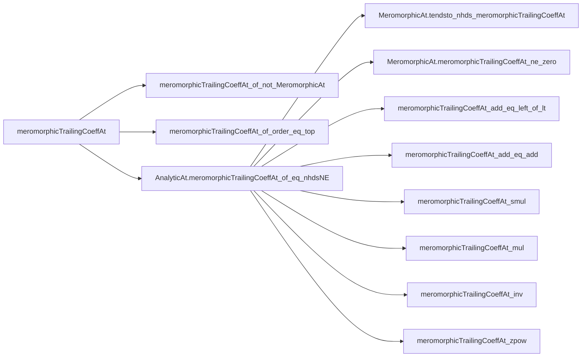

### Technical Brief: `TrailingCoefficient.lean`

---

#### **1. Key Definitions & Theorems**

| Name | Type / Signature | Purpose |
|------|------------------|---------|
| `meromorphicTrailingCoeffAt` | `𝕜 → E → E` | Defines the *trailing coefficient* of a meromorphic function `f` at a point `x`. If `f` is meromorphic of finite order at `x`, it picks the unique value `g x` from a presentation `f = (z - x)^order • g` with `g` analytic at `x`; otherwise returns `0`. |
| `meromorphicTrailingCoeffAt_of_not_MeromorphicAt` | `¬MeromorphicAt f x → meromorphicTrailingCoeffAt f x = 0` | Confirms the definition in the non-meromorphic case. |
| `MeromorphicAt.meromorphicTrailingCoeffAt_of_order_eq_top` | `meromorphicOrderAt f x = ⊤ → meromorphicTrailingCoeffAt f x = 0` | Confirms the definition for infinite-order meromorphic functions. |
| `AnalyticAt.meromorphicTrailingCoeffAt_of_eq_nhdsNE` | `AnalyticAt g x → f =ᶠ[𝓝[≠] x] (z - x)^order • g z → meromorphicTrailingCoeffAt f x = g x` | Characterizes the trailing coefficient via local representation. |
| `AnalyticAt.meromorphicTrailingCoeffAt_of_ne_zero_of_eq_nhdsNE` | `AnalyticAt g x → g x ≠ 0 → f =ᶠ[𝓝[≠] x] (z - x)^n • g z → meromorphicTrailingCoeffAt f x = g x` | Variant for finite integer order `n`. |
| `AnalyticAt.meromorphicTrailingCoeffAt_of_ne_zero` | `AnalyticAt f x → f x ≠ 0 → meromorphicTrailingCoeffAt f x = f x` | Trailing coefficient of a nonvanishing analytic function is its value. |
| `MeromorphicAt.tendsto_nhds_meromorphicTrailingCoeffAt` | `MeromorphicAt f x → Tendsto ((· - x)^(-order) • f) (𝓝[≠] x) (𝓝 (meromorphicTrailingCoeffAt f x))` | Expresses trailing coefficient as a limit in the punctured neighborhood. |
| `MeromorphicAt.meromorphicTrailingCoeffAt_ne_zero` | `MeromorphicAt f x → meromorphicOrderAt f x ≠ ⊤ → meromorphicTrailingCoeffAt f x ≠ 0` | Nonvanishing of trailing coefficient for finite-order meromorphic functions. |
| `meromorphicTrailingCoeffAt_const` | `meromorphicTrailingCoeffAt (const e) x = e` | Trailing coefficient of constant function is the constant. |
| `meromorphicTrailingCoeffAt_id_sub_const` | `meromorphicTrailingCoeffAt (· - y) x = if x = y then 1 else x - y` | Trailing coefficient of `z ↦ z - y`. |
| `meromorphicTrailingCoeffAt_congr_nhdsNE` | `f₁ =ᶠ[𝓝[≠] x] f₂ → meromorphicTrailingCoeffAt f₁ x = meromorphicTrailingCoeffAt f₂ x` | Congruence under punctured-neighborhood equality. |
| `MeromorphicAt.meromorphicTrailingCoeffAt_add_eq_left_of_lt` | `MeromorphicAt f₂ x ∧ order f₁ < order f₂ → trailingCoeff (f₁ + f₂) = trailingCoeff f₁` | Leading term dominates in sum when orders differ. |
| `MeromorphicAt.meromorphicTrailingCoeffAt_add_eq_add` | `order f₁ = order f₂ ∧ trailingCoeff f₁ + trailingCoeff f₂ ≠ 0 → trailingCoeff (f₁ + f₂) = trailingCoeff f₁ + trailingCoeff f₂` | Additivity when orders match and no cancellation. |
| `MeromorphicAt.meromorphicTrailingCoeffAt_smul` | `MeromorphicAt f₁ x ∧ MeromorphicAt f₂ x → trailingCoeff (f₁ • f₂) = trailingCoeff f₁ • trailingCoeff f₂` | Compatibility with scalar multiplication. |
| `MeromorphicAt.meromorphicTrailingCoeffAt_mul` | `MeromorphicAt f₁ x ∧ MeromorphicAt f₂ x → trailingCoeff (f₁ * f₂) = trailingCoeff f₁ * trailingCoeff f₂` | Multiplicativity of trailing coefficient. |
| `meromorphicTrailingCoeffAt_prod` | `∀ σ, MeromorphicAt (f σ) x → trailingCoeff (∏ f n) = ∏ trailingCoeff (f n)` | Extends multiplicativity to finite products. |
| `meromorphicTrailingCoeffAt_inv` | `trailingCoeff (f⁻¹) = (trailingCoeff f)⁻¹` | Behavior under inversion. |
| `MeromorphicAt.meromorphicTrailingCoeffAt_zpow` | `MeromorphicAt f x → trailingCoeff (f ^ n) = (trailingCoeff f) ^ n` | Behavior under integer powers. |
| `MeromorphicAt.meromorphicTrailingCoeffAt_pow` | `MeromorphicAt f x → trailingCoeff (f ^ n) = (trailingCoeff f) ^ n` | Behavior under natural powers (special case of `zpow`). |

---

#### **2. Naming Conventions**

- **Prefixes**:
  - `meromorphicTrailingCoeffAt_`: Core definition and lemmas.
  - `AnalyticAt.`: Lemmas assuming analyticity of a factor.
  - `MeromorphicAt.`: Lemmas assuming meromorphicity of input(s).
- **Suffixes**:
  - `_of_eq_nhdsNE`: When a local representation `f = (z - x)^n • g` is given.
  - `_of_ne_zero`: When nonvanishing of `g x` is assumed.
  - `_of_order_eq_top`: When order is infinite.
  - `_of_not_MeromorphicAt`: When function is not meromorphic.
  - `_add_eq_left_of_lt`, `_add_eq_add`, `_smul`, `_mul`, `_inv`, `_zpow`, `_pow`, `_prod`: Operation-specific behavior.

---

#### **3. Tactic Stack**

- **Core tactics**: `by_cases`, `obtain`, `rw`, `simp`, `apply`, `filter_upwards`, `rwa`, `tauto`, `aesop`.
- **Specialized tactics**:
  - `lift ... to ℤ using ...`: To promote `WithTop ℤ`-valued orders to integers when finite.
  - `fun_prop`: Propagation of functorial properties (e.g., analyticity, continuity).
  - `congrFun rfl`, `congrArg`: For extensionality and equality of functions/expressions.
  - `convert`: To reuse existing lemmas with minor adjustments.

---

#### **4. Proof Logic**

- **Structure**:
  - **Case analysis** on meromorphicity (`MeromorphicAt`) and order (`= ⊤` or finite).
  - **Representation lemma usage**: When a local representation `f = (z - x)^n • g` is available, apply `meromorphicTrailingCoeffAt_of_eq_nhdsNE` or variants.
  - **Limit-based arguments**: For convergence results, use `Tendsto.congr'` with equality in punctured neighborhoods.
  - **Additivity/multiplicativity proofs**:
    - Reduce to finite-order case via case analysis.
    - Use representations `f₁ = (z - x)^n₁ • g₁`, `f₂ = (z - x)^n₂ • g₂`.
    - Combine representations algebraically (e.g., `f₁ + f₂ = (z - x)^min(n₁,n₂) • (...)`).
    - Apply uniqueness of representation (via `meromorphicOrderAt_eq_int_iff`) to identify the trailing coefficient.
- **Induction**: Used in `prod` lemma via `Finset.induction`.

---

#### **5. Imports**

- `Mathlib.Analysis.Meromorphic.Order`: Core theory of meromorphic functions, orders, and analyticity at a point.

---

#### **6. Mermaid Diagrams**

##### **Dependency Graph (Module-Level)**



##### **Overview of Theory Flow**

```mermaid
flowchart LR
  A[MeromorphicAt f x] --> B[meromorphicOrderAt f x]
  B --> C{Finite?}
  C -->|Yes| D[∃ g analytic, f = (z-x)^n • g]
  C -->|No| E[trailingCoeff = 0]
  D --> F[trailingCoeff = g x]
  F --> G[Limit characterization]
  G --> H[Algebraic properties]
  H --> I[Addition, multiplication, inversion, powers]
```

##### **Key Lemma Dependencies**



---

This module formalizes the *trailing coefficient* of meromorphic functions — a key invariant in local analysis — and establishes its algebraic and analytic behavior, especially under arithmetic operations and limits. It builds on the foundational theory of meromorphic functions in `Mathlib`, particularly their order and analytic representations.
