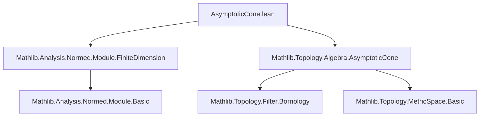

### Technical Brief: `AsymptoticCone.lean`

---

#### **1. Key Definitions & Theorems**

| Name | Type / Signature | Purpose |
|------|------------------|---------|
| `asymptoticNhds` | `asymptoticNhds ℝ P v : Filter P` | Filter of neighborhoods “at infinity” in direction `v ≠ 0`. Defined via scaling and translation: `asymptoticNhds ℝ P v = map (λ x => r • x +ᵥ p) (atTop ×ˢ 𝓝 v)` for any base point `p`. |
| `asymptoticCone` | `asymptoticCone ℝ s : Set P` | Asymptotic cone of a set `s ⊆ P`: set of points `v ∈ V` such that `v ∈ l` for some `l ∈ asymptoticNhds ℝ P v` and `s` is “asymptotically aligned” with `v`. In this formalization, it's defined via the cofilter of sets whose preimage under scaling/torsor action meets `s` eventually. |
| `cobounded` | `cobounded P : Filter P` | Filter of complements of bounded sets (i.e., sets whose complement is bounded). Used to characterize unbounded behavior. |
| `isBounded` | `IsBounded s : Prop` | Predicate stating `s` is bounded in the metric sense: `∃ C, ∀ x y ∈ s, dist x y ≤ C`. |
| `asymptoticNhds_le_cobounded` | `v ≠ 0 → asymptoticNhds ℝ P v ≤ cobounded P` | Any direction-based asymptotic neighborhood is co-bounded — i.e., eventually leaves every bounded set. |
| `asymptoticCone_subset_singleton_of_bounded` | `IsBounded s → asymptoticCone ℝ s ⊆ {0}` | Bounded sets have trivial asymptotic cone (only the zero vector). |
| `cobounded_eq_iSup_sphere_asymptoticNhds` | `cobounded P = ⨆ v ∈ sphere 0 1, asymptoticNhds ℝ P v` | In finite dimensions, the cobounded filter is generated by asymptotic neighborhoods over the unit sphere. |
| `isBounded_iff_asymptoticCone_subset_singleton` | `IsBounded s ↔ asymptoticCone ℝ s ⊆ {0}` | Main equivalence: boundedness ⇔ trivial asymptotic cone. |
| `not_bounded_iff_exists_ne_zero_mem_asymptoticCone` | `¬ IsBounded s ↔ ∃ v ≠ 0, v ∈ asymptoticCone ℝ s` | Contrapositive: unboundedness ⇔ existence of nonzero asymptotic direction. |

---

#### **2. Naming Conventions**

- **Prefixes**:
  - `asymptotic*`: for asymptotic cone / neighborhood–related concepts.
  - `is_*`: for properties (e.g., `isBounded`).
  - `*_le_*`: for filter inequalities (e.g., `asymptoticNhds_le_cobounded`).
  - `*_eq_*`: for equalities involving filters or sets (e.g., `cobounded_eq_iSup_sphere_asymptoticNhds`).

- **Suffixes**:
  - `_of_*`: for implications from assumptions (e.g., `subset_singleton_of_bounded`).
  - `_iff_*`: for biconditionals (e.g., `isBounded_iff_asymptoticCone_subset_singleton`).

- **Variables**:
  - `V`: normed vector space over `ℝ`.
  - `P`: normed affine space over `V`.
  - `s`: subset of `P`.
  - `v`: vector in `V`, often nonzero.

---

#### **3. Tactic Stack**

- **Core tactics**:
  - `rw`, `simp_rw`, `exact`, `intro`, `by_contra`, `tauto`, `refine`, `convert`, `change`, `simp`.
- **Topology/analysis-specific**:
  - `tendsto_*` lemmas (`tendsto_id'`, `Metric.tendsto_dist_right_atTop_iff`, `tendsto_map'_iff`, etc.)
  - `isCompact_sphere`, `elim_nhds_subcover`, `iSup₂_le`, `mem_iSup`, `Set.mem_preimage`, `dist_eq_norm_vsub'`, `norm_smul`, `norm_inv`, `inv_mul_cancel₀`.
- **Algebraic simplifications**:
  - `smul_mem_smul`, `Set.biInter_subset_of_mem`, `inter_mem`, `Ioi_mem_atTop`, `iInter_mem_sets`.
- **Automation**:
  - `aesop` not used explicitly here — proofs are mostly manual and rely on structured rewriting.

---

#### **4. Proof Logic**

- **Structure**:
  - Proofs proceed by **filter-theoretic reasoning**, leveraging:
    - Characterizations of convergence (`tendsto`), neighborhoods (`asymptoticNhds`), and boundedness (`cobounded`).
    - Compactness of the unit sphere in finite dimensions (via `isCompact_sphere`).
    - Subcover arguments for open covers of the sphere.
  - **Key proof pattern**:
    1. Reduce to normed vector space setting via torsor action (`vsub`, `vadd`, `dist_vadd_left`).
    2. Normalize vectors to unit sphere for uniform control.
    3. Use compactness to extract finite subcovers and combine local estimates into global ones.
    4. Apply filter inequalities (`≤`) and equalities (`=`) to relate `cobounded` and `asymptoticNhds`.
  - **Induction is not used** — proofs rely on compactness, continuity, and filter calculus.

---

#### **5. Imports**

- `Mathlib.Analysis.Normed.Module.FiniteDimension`: finite-dimensionality of normed spaces over `ℝ`.
- `Mathlib.Topology.Algebra.AsymptoticCone`: foundational definitions and basic properties of asymptotic cones and neighborhoods.

> **Scope**: This module bridges **asymptotic geometry** and **finite-dimensional normed affine geometry**, focusing on the characterization of boundedness via asymptotic cones.

---

#### **6. Mermaid Diagrams**

##### **Dependency Graph (Module-Level)**



##### **Overview of Theory Flow**

```mermaid
flowchart LR
  A[Finite-Dim Normed Space V] --> B[Asymptotic Neighborhoods asymptoticNhds]
  A --> C[Bounded Sets & cobounded Filter]
  B --> D[Asymptotic Cone asymptoticCone]
  C --> D
  D --> E[isBounded ↔ asymptoticCone ⊆ {0}]
  D --> F[¬isBounded ↔ ∃ v ≠ 0 ∈ asymptoticCone]
  style E fill:#d4f7e2,stroke:#27ae60
  style F fill:#d4f7e2,stroke:#27ae60
```

---

#### **7. Summary**

This file establishes a clean equivalence between **boundedness of subsets** in finite-dimensional real normed affine spaces and the **triviality of their asymptotic cones**. It leverages compactness of the unit sphere and filter-theoretic techniques to relate local asymptotic behavior (directions at infinity) with global boundedness. The results are foundational for geometric group theory and large-scale geometry, where asymptotic cones encode coarse structure.
