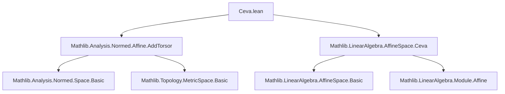

### Technical Brief: `Ceva.lean`

---

#### **1. Key Definitions & Theorems**

| Name | Type | Purpose |
|------|------|---------|
| `prod_dist_eq_prod_dist_of_mem_line_of_mem_line` | `lemma` | Proves equality of products of distances along cevians: $\prod_i d(t_{i+1}, p_i) = \prod_i d(p_i, t_{i+2})$, under collinearity conditions. |
| `prod_dist_div_dist_eq_one_of_mem_line_of_mem_line` | `lemma` | Reformulates Ceva’s condition as a product of ratios equaling 1: $\prod_i \frac{d(t_{i+1}, p_i)}{d(p_i, t_{i+2})} = 1$, assuming non-degeneracy (`p i ≠ t_{i+2}`). |

Both lemmas formalize **Ceva’s Theorem** in the setting of an affine triangle in a `NormedAddTorsor`, with metric structure.

---

#### **2. Naming Conventions**

- **Prefixes**:
  - `prod_dist_...`: Indicates product of distances.
  - `mem_line_...`: Indicates membership in an affine line (`line[𝕜, a, b]`).
- **Suffixes**:
  - `_of_mem_line_of_mem_line`: Reflects hypotheses about points lying on lines.
  - `_eq_one`: Indicates the conclusion is an equation equal to `1`.
- **Indexing**:
  - Uses `Fin 3` and modular arithmetic (`i + 1`, `i + 2`) to cyclically index triangle vertices and cevians.

---

#### **3. Tactic Stack**

- `simp_rw`: Heavily used to rewrite using definitions (`mem_affineSpan_pair_iff_exists_lineMap_eq`, `dist_lineMap_right`, etc.).
- `choose`: To extract witnesses from existential hypotheses (`hp`).
- `rw`: For manual rewriting, especially after `prod_univ_three`.
- `field_simp`: To simplify division expressions using nonzero assumptions.
- `exact`: To conclude with a previously derived equality.

No heavy automation (e.g., `aesop`, `linarith`) is used—proofs rely on algebraic simplifications and metric properties.

---

#### **4. Proof Logic**

- **Structure**:
  1. **Rewrite collinearity**: Use `mem_affineSpan_pair_iff_exists_lineMap_eq` to express points on lines as `lineMap` images.
  2. **Substitute and simplify**: Replace `p i` with `lineMap ... r i`, then simplify distances using `dist_lineMap_right`, `dist_left_lineMap`.
  3. **Apply algebraic identity**: Use `prod_eq_prod_one_sub_of_mem_line_point_lineMap` (from `Mathlib.LinearAlgebra.AffineSpace.Ceva`) to reduce to a product identity.
  4. **For ratio version**:
     - Prove denominators nonzero (`aux`).
     - Apply first lemma to get numerator/denominator product equality.
     - Use `field_simp` to convert equality of products to equality of ratios to `1`.

- **Induction**: Not used—proofs are direct algebraic manipulations leveraging `Fin 3` structure.

---

#### **5. Imports**

| Import | Role |
|--------|------|
| `Mathlib.Analysis.Normed.Affine.AddTorsor` | Provides `NormedAddTorsor`, `PseudoMetricSpace`, `MetricSpace`, and distance-related lemmas. |
| `Mathlib.LinearAlgebra.AffineSpace.Ceva` | Supplies foundational lemmas like `prod_eq_prod_one_sub_of_mem_line_point_lineMap`, used in the main proof. |

These imports define the ambient geometric and algebraic context: affine spaces over normed fields, metric structure via torsor action, and prior Ceva-related results.

---

#### **8. Mermaid Diagrams**

##### **Dependency Graph (File-Level)**



##### **Overview of Theoretical Flow**

```mermaid
flowchart LR
  A[NormedField 𝕜] --> B[NormedSpace 𝕜 V]
  B --> C[NormedAddTorsor V P]
  C --> D[PseudoMetricSpace P / MetricSpace P]
  D --> E[Triangle 𝕜 P]
  E --> F[Points p i on sides: line[𝕜, t_{i+1}, t_{i+2}]]
  E --> G[Concurrent cevians at p']
  F & G --> H[prod_dist_eq_prod_dist]
  H --> I[prod_dist_div_dist_eq_one]
```

- **Core idea**: Ceva’s condition (concurrency of cevians) ⇔ product of ratios = 1.
- This file formalizes the *metric* version (distance-based), assuming points lie on the correct lines and (for ratio version) are non-vertex.

--- 

Let me know if you'd like the dependency tree for `prod_eq_prod_one_sub_of_mem_line_point_lineMap` or a comparison with synthetic-geometry Ceva formalizations.
