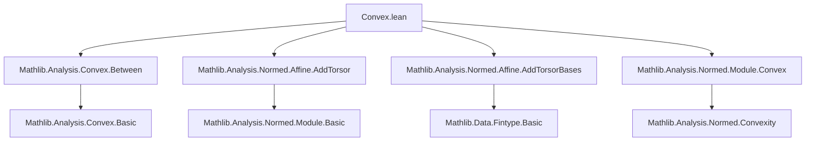

**Technical Brief: `Convex.lean` — Simplices and Polytopes in Normed Affine Spaces**

---

### 1. **Key Definitions & Theorems**

| Name | Type / Signature | Purpose |
|------|------------------|---------|
| `Wbtw.dist_add_dist` | `∀ {x y z : P}, Wbtw ℝ x y z → dist x y + dist y z = dist x z` | Characterizes collinearity with betweenness in affine spaces: if $y$ lies between $x$ and $z$, then distances add. |
| `dist_add_dist_of_mem_segment` | `∀ {x y z : E}, y ∈ [x -[ℝ] z] → dist x y + dist y z = dist x z` | Specialization of above to vector segments in normed spaces. |
| `exists_mem_interior_convexHull_affineBasis` | `∀ {s : Set E}, s ∈ 𝓝 x → ∃ b : AffineBasis (Fin (finrank ℝ E + 1)) ℝ E, x ∈ interior (convexHull ℝ (range b)) ∧ convexHull ℝ (range b) ⊆ s` | For any neighborhood $s$ of $x$, there exists a simplex (convex hull of an affine basis) containing $x$ in its interior and lying inside $s$. |
| `Convex.exists_subset_interior_convexHull_finset_of_isCompact` | `∀ {s t : Set E}, Convex ℝ s → IsCompact s → t ∈ 𝓝ˢ s → ∃ u : Finset E, s ⊆ interior (convexHull ℝ u) ∧ convexHull ℝ u ⊆ t` | For a compact convex set $s$ and neighborhood $t$ of $s$, there exists a convex polytope (convex hull of a finite set) containing $s$ in its interior and lying in $t$. |

---

### 2. **Naming Conventions**

- **Prefixes**:
  - `exists_...`: Existential lemmas (e.g., `exists_mem_interior_convexHull_affineBasis`)
  - `dist_...`, `Wbtw_...`: Distance-related properties
  - `mem_...`: Membership criteria (e.g., `mem_segment_iff_wbtw`)
- **Suffixes**:
  - `_of_...`: Conditions or assumptions (e.g., `of_isCompact`, `of_finiteDimensional`)
  - `_iff_...`: Biconditional characterizations (e.g., `mem_segment_iff_wbtw`)
- **Module-level**:
  - `public import` indicates core dependencies; no internal naming conventions beyond standard Mathlib style.

---

### 3. **Tactic Stack**

Frequently used tactics in proofs:

| Tactic | Role |
|--------|------|
| `wlog` | Without loss of generality (used to translate to origin) |
| `obtain` / `rcases` | Extract witnesses from existential hypotheses |
| `set` | Introduce local definitions (e.g., `cnorm`, `ε'`) |
| `simp` / `simpa` | Simplify goals using lemmas and rewrite rules |
| `refine` | Construct proofs with holes (`?_`) to be filled later |
| `calc` / `grw` | Chain equalities/inequalities (using `grw` for guarded rewriting) |
| `gcongr` | Apply congruence for inequalities |
| `pos` / `linarith` | Prove positivity or linear arithmetic goals |
| `lift` | Upgrade a finite type to `Finset` via coercion |

---

### 4. **Proof Logic**

#### `exists_mem_interior_convexHull_affineBasis`:
1. **Translation to origin**: Use `wlog` to assume $x = 0$; reduce to translated neighborhood.
2. **Existence of affine basis**: Use `exists_affineBasis_of_finiteDimensional` to get a maximal simplex.
3. **Centroid adjustment**: Translate basis so that centroid becomes origin → ensures $0$ lies in interior.
4. **Scaling**: Scale basis vectors to fit inside neighborhood $s$, using radius bound from `cnorm`.
5. **Verification**: Check interior containment and inclusion in $s$ via scaling properties.

#### `Convex.exists_subset_interior_convexHull_finset_of_isCompact`:
1. **Local neighborhood decomposition**: Extract open set $U$ with $s + V \subseteq t$ using `compact_open_separated_add_left`.
2. **Apply simplex lemma**: For each $x \in s$, get a simplex around $x$ inside $V + x$.
3. **Compactness argument**: Extract finite subcover of $s$ using finite subcover lemma.
4. **Union of simplices**: Construct polytope as Minkowski sum of finite union of simplices and $s$.
5. **Containment checks**: Use convexity and continuity of addition to verify interior and inclusion.

---

### 5. **Imports & Dependencies**

| Import | Purpose |
|--------|---------|
| `Mathlib.Analysis.Convex.Between` | Betweenness (`Wbtw`), segment membership, distance properties |
| `Mathlib.Analysis.Normed.Affine.AddTorsor` | Affine torsor structure over normed additive groups |
| `Mathlib.Analysis.Normed.Affine.AddTorsorBases` | Affine bases, centroids, finite-dimensional existence |
| `Mathlib.Analysis.Normed.Module.Convex` | Convex hulls, convex sets, Minkowski sums, interior properties |

**Core structures assumed**:
- `SeminormedAddCommGroup E`, `NormedSpace ℝ E`, `PseudoMetricSpace P`, `NormedAddTorsor E P`
- `FiniteDimensional ℝ E` (for existence of affine basis)

---

### 6. **Mermaid Diagrams**

#### **Dependency Graph (Module Level)**



#### **Overview of Theoretical Flow**

```mermaid
flowchart LR
  A[Finite-Dimensional Normed Space E] --> B[Existence of Affine Basis]
  B --> C[Centroid-based Translation]
  C --> D[Interior Containment of Origin]
  D --> E[Scaling to Fit Neighborhood]
  E --> F[Simplex around Point]

  G[Compact Convex Set s] --> H[Neighborhood t of s]
  H --> I[Decompose t as s + V]
  I --> J[Cover s with simplices in V + x]
  J --> K[Finite Subcover via Compactness]
  K --> L[Union of simplices = Polytope]
  L --> M[s ⊆ interior(polytope) ⊆ t]
```

---

### 7. **Summary**

This module formalizes foundational approximation results in convex geometry over finite-dimensional normed affine spaces:
- A **local simplex approximation** near any point in its neighborhood.
- A **global polytope approximation** for compact convex sets.

Both rely on:
- Finite-dimensionality → existence of affine bases,
- Continuity of scalar multiplication and addition,
- Compactness for finite subcovers.

The proofs follow a standard pattern: reduce to a canonical case (origin), construct a canonical object (centroid-centered simplex), scale/translate to meet constraints, and use compactness for global results.

--- 

Let me know if you'd like a formalized dependency graph for the entire `Mathlib.Analysis.Convex` hierarchy.
