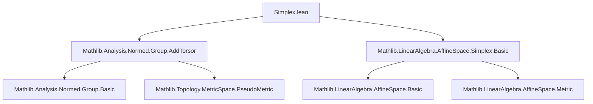
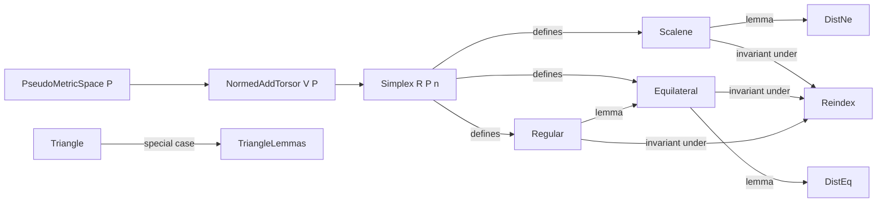

### Technical Brief: `Simplex.lean`

---

#### **1. Key Definitions & Theorems**

| Name | Type | Purpose |
|------|------|---------|
| `Scalene` | `Simplex R P n → Prop` | A simplex is *scalene* if all pairwise distances between distinct points are distinct (i.e., the distance function on unordered distinct pairs is injective). |
| `Equilateral` | `Simplex R P n → Prop` | A simplex is *equilateral* if all pairwise distances between distinct points are equal (i.e., ∃ *r* ∈ ℝ, ∀ *i* ≠ *j*, `dist (s.points i) (s.points j) = r`). |
| `Regular` | `Simplex R P n → Prop` | A simplex is *regular* if for every permutation of its vertices, there exists an isometry of the space mapping the original point sequence to the permuted one. |
| `Scalene.dist_ne` | `Scalene s → i₁ ≠ i₂ → i₃ ≠ i₄ → ¬(i₁ = i₃ ∧ i₂ = i₄) → ¬(i₁ = i₄ ∧ i₂ = i₃) → dist (s.points i₁) (s.points i₂) ≠ dist (s.points i₃) (s.points i₄)` | Formalizes that in a scalene simplex, *non-identical* edges have *distinct* lengths. |
| `Equilateral.dist_eq` | `Equilateral s → i₁ ≠ i₂ → i₃ ≠ i₄ → dist (s.points i₁) (s.points i₂) = dist (s.points i₃) (s.points i₄)` | All edges in an equilateral simplex have equal length. |
| `Scalene/equilateral/regular_reindex_iff` | `↔` characterizations under reindexing by equivalences | Shows these properties are invariant under relabeling of vertices. |
| `Regular.equilateral` | `Regular s → Equilateral s` | Every regular simplex is equilateral. |
| `Triangle.scalene_iff_dist_ne_and_dist_ne_and_dist_ne` | `Triangle → Prop` | For triangles, scalene ⇔ all three edge lengths pairwise distinct. |
| `Triangle.equilateral_iff_dist_eq_and_dist_eq` | `Triangle → Prop` | For triangles, equilateral ⇔ two edges equal implies all three equal (via symmetry). |
| `Triangle.equilateral_iff_dist_01_eq_02_and_dist_01_eq_12` | `Triangle → Prop` | Specialization of above to canonical indices 0,1,2. |

---

#### **2. Naming Conventions**

- **Predicates**: `is_`-style prefixes are *not* used; instead, direct adjectives: `Scalene`, `Equilateral`, `Regular`.
- **Lemma names**:
  - `*_dist_ne`, `*_dist_eq`: properties about distances in scalene/equilateral simplices.
  - `*_reindex_iff`: invariance under reindexing (vertex relabeling).
  - `Triangle.*`: triangle-specific simplifications.
- **Variable naming**:
  - `s`, `t`: simplices/triangles.
  - `i`, `j`, `k`, `i₁`, `i₂`, `i₃`, `i₄`: indices in `Fin (n+1)`.
  - `e`: equivalence (reindexing), `σ`: permutation.
  - `x`: isometry in `Regular`.

---

#### **3. Tactic Stack**

| Tactic | Usage Frequency | Purpose |
|--------|------------------|---------|
| `simp` / `simp_rw` | Very High | Simplify using definitional equalities, especially `dist_comm`, `comp_apply`, `Equiv.*_apply_*`. |
| `rcases` / `cases` | High | Extract witnesses from ∃, decompose disjunctions/conjunctions, especially in `Scalene.dist_ne`. |
| `convert` | Medium | Align goals modulo definitional equality (e.g., using `x.dist_eq` in `Regular.equilateral`). |
| `nth_rw` | Medium | Repeated use of `dist_comm` to align terms. |
| `intro` / `ext` | Medium | Standard intro/extensionality for function equality. |
| `decide` | Medium (Triangle lemmas) | Solve propositional tautologies about `Fin` indices (e.g., `0 ≠ 1`, `1 ≠ 2`). |
| `aesop` | Not present | Not used in this file. |
| `ring` | Not present | Not needed (distances live in ℝ, but no polynomial reasoning). |

---

#### **4. Proof Logic**

- **Structure of proofs**:
  - **Scalene**: Prove injectivity of distance map on ordered pairs with `i < j`. Use `Scalene.dist_ne` to derive inequality of distances for non-identical edges.
  - **Equilateral**: Directly from definition: extract radius `r`, then apply to any pair.
  - **Regular**:
    - *Reindex invariance*: Construct conjugation of permutations via equivalence `e`.
    - *Regular ⇒ Equilateral*: Use permutation `σ = swap 0 j` or composite swaps to map any pair `(i,j)` to `(0,1)`, then use isometry to preserve distances.
  - **Triangle lemmas**:
    - Use exhaustive case analysis on `Fin 3` indices (`fin_cases`) + `decide` to reduce to finite checks.
    - Leverage symmetry (`dist_comm`) and transitivity of equality.

- **Common pattern**:
  > *Show property holds for canonical indices (e.g., 0,1), then use permutation + isometry invariance to generalize.*

---

#### **5. Imports & Dependencies**

| Import | Role |
|--------|------|
| `Mathlib.Analysis.Normed.Group.AddTorsor` | Provides `NormedAddTorsor` structure (distance, metric, vector space action). |
| `Mathlib.LinearAlgebra.AffineSpace.Simplex.Basic` | Defines `Simplex`, `reindex`, `points`, basic affine simplex theory. |

**Key typeclass assumptions**:
- `Ring R`: base ring (for module structure).
- `SeminormedAddCommGroup V`: vector space with seminorm (induces metric).
- `PseudoMetricSpace P`: space of points with pseudometric.
- `NormedAddTorsor V P`: torsor structure linking vectors (`V`) to points (`P`), enabling `dist(p,q) = ‖v‖` where `v = q - p`.

---

#### **6. Mermaid Diagrams**

##### **Dependency Graph (Module-Level)**



##### **Overview of Theory Flow**



##### **Proof Strategy Flow (Regular ⇒ Equilateral)**

```mermaid
flowchart TD
  HR[Regular s] -->|∀σ, ∃x: isometry| SWAP[σ = swap 0 j]
  SWAP -->|apply HR| ISOM[∃x: isometry s.t. x(s.points 0) = s.points j, x(s.points 1) = s.points 0]
  ISOM -->|x preserves dist| DIST[x.dist_eq]
  DIST -->|substitute| EQ[dist(s.points 0, s.points 1) = dist(s.points i, s.points j)]
  EQ -->|∀ i≠j| EQUI[Equilateral s]
```

---

#### **7. Summary**

This file formalizes three key geometric notions of *uniformity* for simplices in a torsor over a normed vector space:  
- **Scalene**: no repeated edge lengths.  
- **Equilateral**: all edge lengths equal.  
- **Regular**: symmetry under all vertex permutations (via isometries).  

It establishes foundational properties (e.g., regular ⇒ equilateral), invariance under relabeling, and concrete characterizations for triangles. The proofs rely heavily on the torsor structure (to translate between points and vectors), the pseudometric space axioms (especially `dist_comm`), and permutation/isometry interactions. The triangle lemmas use finite-case analysis to simplify general definitions.
