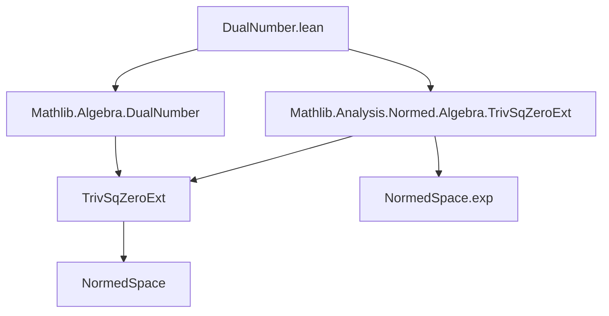
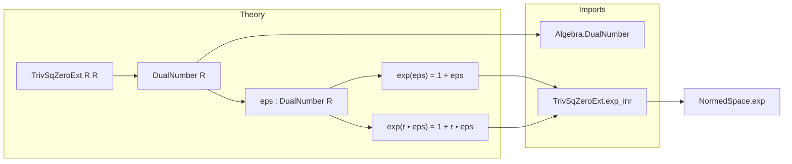

**Technical Brief: `DualNumber.lean`**

---

### 1. Key Definitions & Theorems

| Name | Type / Statement | Purpose |
|------|------------------|---------|
| `DualNumber R` | `TrivSqZeroExt R R` (implicit via import) | The type of *dual numbers* over a commutative ring `R`, i.e., `R ⊕ R·ε` with `ε² = 0`. |
| `eps : DualNumber R` | `inr 1` (i.e., `0 + 1 • ε`) | The canonical nilpotent element satisfying `ε^2 = 0`. |
| `exp_eps` | `exp (eps : DualNumber R) = 1 + eps` | Exponential of the nilpotent `ε` truncates to first order: `e^ε = 1 + ε`. |
| `exp_smul_eps` | `exp (r • eps) = 1 + r • eps` | Generalization: exponential of a scalar multiple of `ε` is linear in `r`. |

Both theorems are `@[simp]`, indicating they are used automatically by the simplifier.

---

### 2. Naming Conventions

- **Prefixes**:  
  - `exp_` — for exponential-related lemmas (`exp_eps`, `exp_smul_eps`).  
- **Suffixes**:  
  - `_eps` — for properties involving the canonical nilpotent `eps`.  
  - `_smul_eps` — for scalar multiplication variants.  
- **Module-level**: `public import` — indicates this module re-exports and extends existing infrastructure.

---

### 3. Tactic Stack

- `simp` (via `@[simp]` attribute)  
- `rw` — used in `exp_smul_eps` to rewrite using definitions (`eps`, `inr_smul`)  
- `simp` is *not* explicitly called in the proof of `exp_smul_eps`, but the proof is short and relies on `rw` + implicit simplification via `exp_inr`.

No heavy automation (e.g., `aesop`, `ring`, `linarith`) is used — the proofs are definitional.

---

### 4. Proof Logic

- **`exp_eps`**: Directly follows from `exp_inr _`, a general lemma about the exponential map on `TrivSqZeroExt R M` applied to the right injection (`inr`) of the base ring element `1`.  
- **`exp_smul_eps`**:  
  1. Rewrite `r • eps` using the definition of `eps` (`eps = inr 1`) and scalar multiplication properties (`← inr_smul`).  
  2. Apply `exp_inr` again, which simplifies `exp (inr r)` to `1 + inr r`, i.e., `1 + r • eps`.

Both proofs rely on the *trivial square-zero extension* structure: `exp(inr x) = 1 + inr x` for any `x`, because higher powers of `inr x` vanish.

---

### 5. Imports

| Import | Role |
|--------|------|
| `Mathlib.Algebra.DualNumber` | Defines `DualNumber R` as `TrivSqZeroExt R R`, with algebraic structure. |
| `Mathlib.Analysis.Normed.Algebra.TrivSqZeroExt` | Provides analytic structure on trivial square-zero extensions, including `exp` and `exp_inr`. |

Additional assumptions:
- `[CommRing R] [Algebra ℚ R]`: Ensures `R` is a ℚ-algebra (needed for exponential series convergence in normed setting).
- `[UniformSpace R] [IsTopologicalRing R] [T2Space R]`: Ensures `R` is a Hausdorff topological ring with uniform structure — required for `NormedSpace.exp` to be well-defined.

---

### 6. Mermaid Diagrams

#### Dependency Graph (Module-Level)

#### Overview of File Structure

---

### 7. Summary

This file establishes *first-order* exponential identities for dual numbers, leveraging the general theory of trivial square-zero extensions. It is concise and definitional, relying on `exp_inr` from `TrivSqZeroExt`, and serves as a bridge between algebraic dual numbers and analytic constructions (e.g., in synthetic differential geometry or automatic differentiation).
