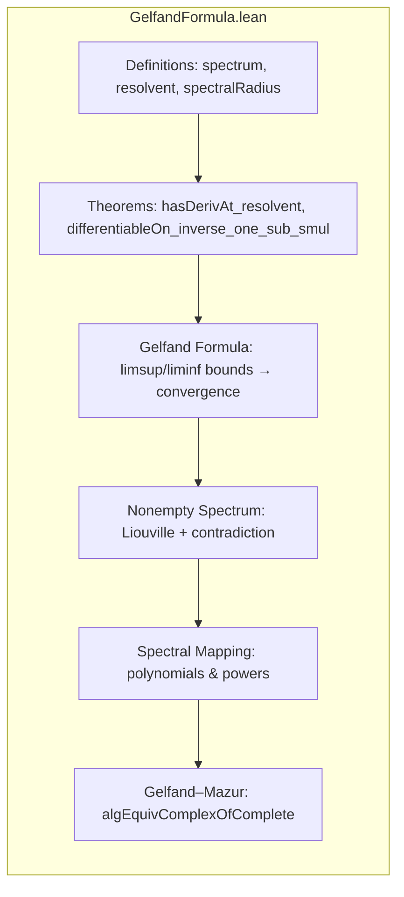

### Technical Brief: `GelfandFormula.lean`

---

#### **1. Key Definitions & Theorems**

| Name | Type / Signature | Purpose |
|------|------------------|---------|
| `resolvent a` | `𝕜 → A` | Maps $ z \mapsto (z \cdot 1 - a)^{-1} $ on the resolvent set |
| `resolventSet 𝕜 a` | `Set 𝕜` | Set of $ z \in 𝕜 $ where $ z \cdot 1 - a $ is invertible |
| `spectrum 𝕜 a` | `Set 𝕜` | Complement of `resolventSet`; points where $ z \cdot 1 - a $ is *not* invertible |
| `spectralRadius 𝕜 a` | `ℝ≥0∞` | $ r(a) = \limsup_{n \to \infty} \|a^n\|^{1/n} $ |
| `hasDerivAt_resolvent` | `HasDerivAt (resolvent a) (-resolvent a k ^ 2) k` | Differentiability of resolvent on resolvent set |
| `differentiableOn_inverse_one_sub_smul` | `DifferentiableOn ...` | Differentiability of $ z \mapsto (1 - z a)^{-1} $ on small closed balls |
| `limsup_pow_nnnorm_pow_one_div_le_spectralRadius` | `limsup ≤ spectralRadius` | Upper bound for limsup in Gelfand formula proof |
| `pow_nnnorm_pow_one_div_tendsto_nhds_spectralRadius` | `Tendsto ... (𝓝 (spectralRadius))` | **Gelfand’s formula**: convergence of $ \|a^n\|^{1/n} \to r(a) $ |
| `gelfand_formula` | alias for above | Standard name for Gelfand’s spectral radius formula |
| `pow_norm_pow_one_div_tendsto_nhds_spectralRadius` | Same as above but with `norm` instead of `nnnorm` | Equivalent formulation using standard norm |
| `spectrum.nonempty` | `(spectrum ℂ a).Nonempty` | Every element in a complex Banach algebra has nonempty spectrum |
| `exists_nnnorm_eq_spectralRadius` | $ \exists z \in \sigma(a),\ \|z\| = r(a) $ | Spectral radius is attained on spectrum |
| `spectralRadius_lt_of_forall_lt` | If all spectrum norms < $ r $, then $ r(a) < r $ | Strict inequality propagation |
| `map_polynomial_aeval` | $ \sigma(p(a)) = p[\sigma(a)] $ | **Spectral mapping theorem** for polynomials |
| `map_pow` | $ \sigma(a^n) = \{z^n : z \in \sigma(a)\} $ | Special case of spectral mapping for monomials |
| `algEquivComplexOfComplete` | $ \mathbb{C} \simeq_\mathbb{C} A $ | **Gelfand–Mazur theorem**: complex Banach division algebra ≅ ℂ |

---

#### **2. Naming Conventions**

- **Prefixes**:
  - `hasDerivAt_`, `differentiableOn_`, `differentiableAt_`: differentiability properties.
  - `pow_`, `norm_`, `nnnorm_`: sequences involving powers and norms.
  - `spectralRadius_`: properties of spectral radius.
  - `map_`: spectral mapping theorems.
  - `nonempty`: existence of spectrum points.

- **Suffixes**:
  - `_le_`, `_lt_`, `_eq_`: inequality/equality statements.
  - `_tendsto_nhds_`: convergence to a point (often spectral radius).
  - `_of_`: implications from assumptions (e.g., `of_nonempty`, `of_forall_lt`).

- **Function names**:
  - `resolvent`, `resolventSet`, `spectrum`: core objects.
  - `aeval`: algebra evaluation of polynomial.
  - `algEquivComplexOfComplete`: canonical algebra isomorphism.

---

#### **3. Tactic Stack**

Frequently used tactics in proofs:

| Tactic | Usage |
|--------|-------|
| `simpa` | Simplify using assumptions or rewrite rules. |
| `rw` / `rwa` | Rewrite using equalities, often with `at` or `using`. |
| `convert` | Match goal up to definitional equality (e.g., norm vs nnnorm). |
| `exact`, `assumption`, `intro`, `intro!` | Basic proof steps. |
| `have`, `suffices`, `by_contra!` | Intermediate claims and contradiction arguments. |
| `apply`, `exact`, `refine` | Apply lemmas with holes. |
| `simp only [...]` | Simplify with precise lemmas. |
| `convert ... using 1` | Adjust proof obligations. |
| `ext n` / `ext1` | Extensionality for functions/sequences. |
| `rwa`, `rfl`, `congr` | Rewriting and congruence. |
| `nontriviality`, `cases'`, `rcases` | Handle nontriviality and structure. |
| `aesop` / `linarith` | Not heavily used here — mostly manual analysis. |

---

#### **4. Proof Logic**

- **Structure of main proofs**:
  - **Differentiability of resolvent**: Chain rule for Fréchet derivative + derivative of linear map.
  - **Gelfand formula**:
    - Prove liminf ≥ spectral radius (standard).
    - Prove limsup ≤ spectral radius via power series expansion of resolvent and radius of convergence.
    - Combine to get convergence.
  - **Nonempty spectrum**:
    - Assume empty spectrum ⇒ resolvent entire.
    - Show resolvent vanishes at ∞ ⇒ Liouville ⇒ resolvent ≡ 0.
    - Contradiction: resolvent values are invertible.
  - **Gelfand–Mazur**:
    - Use nonempty spectrum + uniqueness of inverse in division algebra.
    - Define inverse of algebra map via spectrum selector.

- **Induction**: Not used directly — relies on analysis (Liouville, power series, limsup/liminf).

- **Key logical flow**:
  - Analytic properties (differentiability, convergence) → spectral properties (nonemptiness, radius attainment) → algebraic consequences (isomorphism to ℂ).

---

#### **5. Imports & Dependencies**

| Module | Purpose |
|--------|---------|
| `Mathlib.Analysis.Normed.Algebra.Spectrum` | Core definitions: spectrum, resolvent, spectral radius |
| `Mathlib.Analysis.Calculus.Deriv.Basic` | Differentiability in normed spaces |
| `Mathlib.Analysis.Complex.Liouville` | Liouville’s theorem (entire bounded ⇒ constant) |
| `Mathlib.Analysis.Complex.Polynomial.Basic` | Polynomial evaluation (`aeval`, `eval`) |
| `Mathlib.Analysis.Analytic.RadiusLiminf` | Power series radius of convergence via liminf |

- **Private imports**: Complex analysis files are imported privately to avoid overloading contexts (e.g., C*-algebras).

---

#### **6. Mermaid Diagrams**

##### **Dependency Graph (High-Level)**

```mermaid
graph TD
  A[Complex Banach Algebra A] --> B[Spectrum & Resolvent]
  B --> C[Differentiability of Resolvent]
  B --> D[Power Series Expansion]
  D --> E[Radius of Convergence = 1/r(a)]
  C --> F[Liouville Argument]
  E --> G[Gelfand Formula]
  F --> H[Nonempty Spectrum]
  G --> I[Spectral Radius Attained]
  H --> J[Spectral Mapping Theorem]
  J --> K[Gelfand–Mazur Theorem]
  K --> L[algEquivComplexOfComplete]
```

##### **File Overview**



---

#### **7. Summary**

This file formalizes foundational spectral theory in complex Banach algebras, culminating in:
- **Gelfand’s formula** for spectral radius,
- **Nonemptiness of spectrum** (via complex analysis),
- **Spectral mapping theorem** for polynomials,
- **Gelfand–Mazur theorem** characterizing complex Banach division algebras as ℂ.

It leverages:
- Complex analysis (Liouville, power series),
- Normed algebra structure,
- Filter-based analysis (`limsup`, `tendsto`).

The formalization is modular and reusable — e.g., `spectrum.nonempty` is used in later developments like C*-algebras and Gelfand duality.

--- 

Let me know if you'd like a dependency graph for the entire `Mathlib` or a specific module like `CStarAlgebra`.
