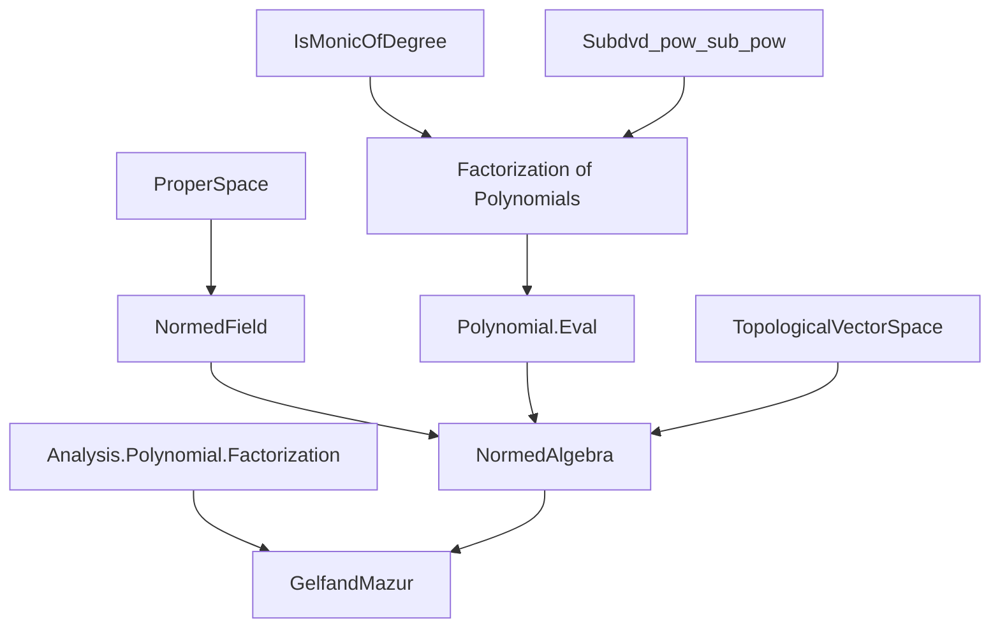
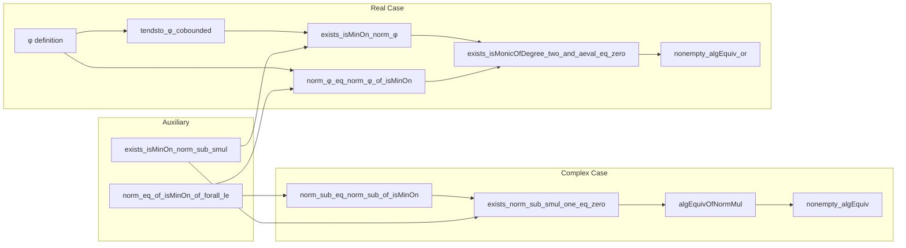

### Technical Brief: `GelfandMazur.lean`

---

#### **1. Key Definitions & Theorems**

| Name | Type / Signature | Purpose |
|------|------------------|---------|
| `norm_eq_of_isMinOn_of_forall_le` | `∀ {X E} [...] {f : X → E} {M : ℝ} [...] (hM : 0 < M) (hx : ‖f x‖ = M) [...] (H : ...) (y), ‖f y‖ = M` | Core technical lemma: shows constancy of norm under positivity, minimum, and growth condition. Used in both complex and real cases. |
| `exists_isMinOn_norm_sub_smul` | `∃ z, IsMinOn (‖x - algebraMap ·‖) univ z` | Guarantees existence of a minimizer for `z ↦ ‖x - z·1‖` in proper normed fields (e.g., `ℝ`, `ℂ`). |
| `norm_sub_eq_norm_sub_of_isMinOn` | `∀ z', ‖x - z'·1‖ = ‖x - z·1‖` (under min + nonzero) | Shows the norm function is constant on `ℂ` if it attains a positive minimum. Leads to contradiction via growth at infinity. |
| `exists_norm_sub_smul_one_eq_zero` | `∃ z, ‖x - z·1‖ = 0` | Key intermediate: every element is scalar (i.e., lies in the image of the algebra map). |
| `algEquivOfNormMul` | `ℂ ≃ₐ[ℂ] F` | Constructed `ℂ`-algebra equivalence under multiplicative norm and nontriviality. |
| `nonempty_algEquiv` | `Nonempty (ℂ ≃ₐ[ℂ] F)` | Existential version of Gelfand–Mazur for complex case. |
| `φ` | `φ x (a, b) = x² - a·x + b·1` | Abbreviation for quadratic evaluation; central in real case. |
| `le_aeval_of_isMonicOfDegree` (real) | `M^n ≤ ‖aeval x p‖` for `p` monic of degree `2n` | Extends lower bounds from quadratics to all even-degree monic polynomials. |
| `norm_φ_eq_norm_φ_of_isMinOn` | `∀ w, ‖φ x w‖ = ‖φ x z‖` (under min + nonzero) | Real analogue of `norm_sub_eq_norm_sub_of_isMinOn`; shows constancy of `‖φ x ·‖`. |
| `tendsto_φ_cobounded` | `Tendsto (φ x ·) (cobounded) (cobounded)` | Shows `‖φ x (a,b)‖ → ∞` as `|(a,b)| → ∞`, assuming lower bound on linear terms. |
| `exists_isMinOn_norm_φ` | `∃ z, IsMinOn (‖φ x ·‖) univ z` | Existence of minimizer for `φ x` over `ℝ²`. |
| `exists_isMonicOfDegree_two_and_aeval_eq_zero` | `∃ p, IsMonicOfDegree p 2 ∧ aeval x p = 0` | Every element satisfies a monic quadratic over `ℝ`. |
| `nonempty_algEquiv_or` | `Nonempty (F ≃ₐ[ℝ] ℝ) ∨ Nonempty (F ≃ₐ[ℝ] ℂ)` | Real Gelfand–Mazur: a normed real algebra field is `ℝ` or `ℂ`. |

---

#### **2. Naming Conventions**

- **Prefixes**:
  - `norm_`: properties of norms (e.g., `norm_eq`, `norm_φ`, `norm_sub`).
  - `le_`: lower bounds on norms (e.g., `le_aeval_of_isMonicOfDegree`).
  - `exists_`: existence of minimizers or roots (e.g., `exists_isMinOn`, `exists_norm_sub_smul_one_eq_zero`).
  - `tendsto_`: convergence/growth behavior (e.g., `tendsto_φ_cobounded`).
- **Suffixes**:
  - `_of_isMinOn`: statements derived assuming a function achieves a minimum.
  - `_of_forall_le`: statements using a universal upper bound condition.
  - `_eq_zero`: conclusions that a norm (or value) is zero.
- **Structure**:
  - `⟨namespace⟩._⟨lemma/theorem⟩`: e.g., `NormedAlgebra.Complex.norm_sub_eq_norm_sub_of_isMinOn`.
  - `noncomputable def` used for equivalences (e.g., `algEquivOfNormMul`).

---

#### **3. Tactic Stack**

| Tactic | Usage Frequency | Purpose |
|--------|-----------------|---------|
| `simp` / `simp only` | Very High | Simplify expressions involving `aeval`, `algebraMap`, `φ`, norms, and polynomial arithmetic. |
| `rw` / `grw` | High | Rewrite using lemmas, definitions, and algebraic identities (e.g., `map_mul`, `norm_mul`). |
| `fun_prop` | High | Prove continuity, measurability, etc., in topological/measure contexts. |
| `norm_cast` | Medium | Handle coercion between `ℝ`, `ℂ`, and `ℝ≥0`. |
| `linarith` | Medium | Resolve linear inequalities after norm estimates. |
| `gcongr` | Medium | Handle monotonicity in inequalities involving norms and scalars. |
| `compute_degree` / `degree` simplifications | Medium | Simplify degrees of polynomials (e.g., `2 * n - 2 = 2 * (n - 1)`). |
| `filter_upwards` | Medium | Work with filters (e.g., `atTop`, `cobounded`). |
| `apply_fun` | Medium | Apply a function (e.g., `‖·‖`) to both sides of an equation. |
| `grind` | Low | Custom tactic for ring/field arithmetic (likely internal). |
| `by_contra!` | Medium | Proof by contradiction (used in both cases). |

---

#### **4. Proof Logic**

- **Complex Case**:
  1. For any `x : F`, consider `z ↦ ‖x - z·1‖`.
  2. Show it attains a minimum at some `z₀` (`exists_isMinOn_norm_sub_smul`).
  3. If minimum is zero, done.
  4. Otherwise, use `norm_sub_eq_norm_sub_of_isMinOn` to show the function is constant.
  5. Derive contradiction via growth: `‖x - z·1‖ ≥ |z| - ‖x‖` → unbounded as `|z| → ∞`.
  6. Conclude `x = z·1` for some `z ∈ ℂ`, hence algebra map is surjective.

- **Real Case**:
  1. Define `φ x (a,b) = x² - a·x + b·1`.
  2. Show `‖φ x ·‖` attains a minimum (`exists_isMinOn_norm_φ`).
  3. If minimum is zero, done: `x` satisfies monic quadratic.
  4. Otherwise, use `norm_φ_eq_norm_φ_of_isMinOn` to show `‖φ x ·‖` is constant.
  5. Use `tendsto_φ_cobounded` to show `‖φ x (a,b)‖ → ∞` as `|(a,b)| → ∞` (contradiction).
  6. Conclude every `x` satisfies a monic quadratic ⇒ algebraic of degree ≤ 2.
  7. Apply known classification: real normed division algebras of dimension ≤ 2 are `ℝ` or `ℂ`.

- **Common Pattern**:
  - *Step 1*: Existence of minimizer.
  - *Step 2*: Positivity ⇒ constancy via auxiliary lemma `norm_eq_of_isMinOn_of_forall_le`.
  - *Step 3*: Constancy contradicts growth at infinity ⇒ minimum must be zero.

---

#### **5. Imports & Dependencies**

- **Core Imports**:
  ```lean
  Mathlib.Analysis.Polynomial.Factorization
  ```
- **Implicit Dependencies** (via `NormedAlgebra`, `NormedField`, etc.):
  - `Mathlib.Analysis.NormedSpace.Basic`
  - `Mathlib.Analysis.NormedRing.Basic`
  - `Mathlib.Algebra.Polynomial.Eval`
  - `Mathlib.Topology.MetricSpace.Basic`
  - `Mathlib.MeasureTheory.Integration.Bochner`
  - `Mathlib.Algebra.Polynomial.RingDivision`
  - `Mathlib.Algebra.Module.Algebra`
  - `Mathlib.Topology.Bornology.Cobounded`
  - `Mathlib.Topology.Separation.Connected`

---

#### **6. Mermaid Diagrams**

##### **Dependency Graph (High-Level)**



##### **Overview of File Structure**



---

#### **7. Notes on Formalization Strategy**

- **Avoids Adjoining `i`**: Unlike classical proofs, the real case avoids constructing `F[i]` (no `TensorProduct` or `AdjoinRoot` needed), leveraging factorization of even-degree polynomials instead.
- **Minimal Imports**: Uses only `Factorization` and basic normed algebra theory, aligning with Lean’s modular library design.
- **Constructive Flavor**: While `algEquivOfNormMul` is `noncomputable`, the core lemmas are constructive and rely on continuity and compactness arguments.
- **Ostrowski Connection**: The proof is inspired by Ostrowski’s functional equation approach and Scholze’s MO answer, adapted to normed algebra context.

--- 

Let me know if you'd like a formal dependency graph (e.g., `leanpkg tree` output) or a tactic-level proof trace.
