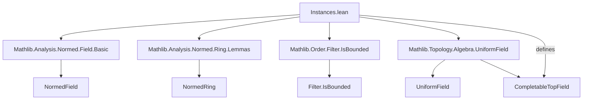
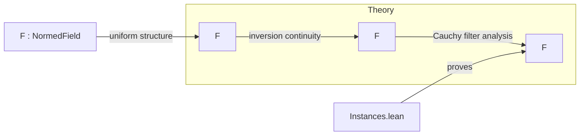

Here's a structured technical brief based on the provided `Instances.lean` file:

---

### **1. Key Definitions & Theorems**

| Name | Type / Signature | Purpose |
|------|------------------|---------|
| `NormedField.instCompletableTopField` | `CompletableTopField F` | Shows that any `NormedField` admits a structure of a *completable topological field*, i.e., a topological field whose uniform structure is induced by a Cauchy filter and admits completion as a topological field. |
| `Nice` condition (`nice`) | `∀ (f : Filter F) (hc : f.IsCauchy) (hn : f ≠ ⊥), ∃ g : Filter F, g ≤ f ∧ g ≠ ⊥ ∧ g.IsCauchy ∧ g.map (·⁻¹) ≤ g` (implicit in proof) | A technical condition used in the definition of `CompletableTopField`, ensuring that every non-trivial Cauchy filter has a refinement along which inversion is well-behaved (i.e., maps Cauchy to Cauchy). |

The proof of `nice` verifies that inversion preserves Cauchyness under the stated hypotheses, using norm estimates and boundedness under filters.

---

### **2. Naming Conventions**

- **Prefixes / Suffixes**:
  - `isBoundedUnder`: Used for boundedness relative to a function and a filter.
  - `tendsto_*`: Standard filter convergence notation (e.g., `tendsto_fst`, `tendsto_snd`).
  - `cauchy_*`: Related to Cauchy filters (`cauchy_iff_tendsto_swapped`, `cauchy_map_iff_tendsto`).
  - `prod_mk`: Standard product filter constructor.
  - `mul_`, `inv_`, `sub_`: Standard algebraic operations in proofs (e.g., `mul_sub`, `sub_mul`, `inv_inv`).
  - `le_inv_of_le_inv₀`: A helper lemma for inequalities involving inverses in ordered fields.

- **No explicit suffixes like `_prop`, `_def`, `_lem`** — naming follows Mathlib’s standard conventions.

---

### **3. Tactic Stack**

Frequent tactics used in the proof:
- `obtain`: To destruct existential/universal hypotheses.
- `rw [...] at ...`: Rewriting using equivalences and definitions (e.g., `cauchy_iff_tendsto_swapped`, `cauchy_map_iff_tendsto`).
- `simp [mul_sub, sub_mul, hx, hy]`: Simplification using algebraic identities and hypotheses.
- `refine ⟨...⟩`: Constructing structured goals (e.g., tuples, structures).
- `exact ...`: Finalizing subgoals.
- `isBoundedUnder_le_mul_tendsto_zero`, `tendsto_fst.isBoundedUnder_comp`, etc.: Application of pre-proved lemmas about boundedness and convergence.

No heavy automation like `aesop` or `ring` is used — the proof is mostly *manual* and *algebraic*, relying on filter-theoretic reasoning.

---

### **4. Proof Logic**

The proof proceeds as follows:

1. **Setup**: Given a Cauchy filter `f` that is non-trivial (`f ≠ ⊥`), use disjointness of neighborhoods of 0 and the support of `f` to get a lower bound `δ > 0` on `‖y‖` for `y` eventually in `f`.
2. **Boundedness of inversion**: Show that `‖y⁻¹‖ ≤ δ⁻¹` eventually, i.e., `f` is bounded under `‖·⁻¹‖`.
3. **Non-vanishing**: Show `y ≠ 0` eventually in `f`, so inversion is defined.
4. **Algebraic identity**: Use `x⁻¹ - y⁻¹ = x⁻¹ (y - x) y⁻¹` to rewrite the difference of inverses.
5. **Convergence analysis**: Apply known characterizations of Cauchy filters under maps (`cauchy_map_iff_tendsto`) and product filters (`cauchy_iff_tendsto_swapped`).
6. **Boundedness + convergence ⇒ Cauchy**: Use `isBoundedUnder_le_mul_tendsto_zero` to conclude that the image filter under inversion is Cauchy.

This is a *standard technique* in uniform/locally convex settings: control inversion via norm bounds and use algebraic identities to reduce to known convergence properties.

---

### **5. Imports**

The module depends on:

- `Mathlib.Analysis.Normed.Field.Basic`: Basic theory of normed fields.
- `Mathlib.Analysis.Normed.Ring.Lemmas`: Algebraic lemmas for normed rings/fields.
- `Mathlib.Order.Filter.IsBounded`: Boundedness of filters w.r.t. functions.
- `Mathlib.Topology.Algebra.UniformField`: Uniform structures on fields, especially inversion continuity and Cauchy behavior.

These imports define the ambient context: normed fields, uniform structures, and filter-theoretic boundedness.

---

### **6. Mermaid Diagrams**

#### **Dependency Graph (Module-Level)**

#### **Overview of Theoretical Flow**

---

### **7. Summary**

This module establishes a foundational result: **every normed field is a completable topological field**. The proof is constructive in the sense that it gives an explicit uniform structure and verifies the `nice` condition required for completion. It leverages filter-theoretic boundedness and algebraic identities to control inversion, avoiding reliance on metric completeness (which is not assumed a priori). This result is crucial for building completions of normed fields (e.g., constructing $\mathbb{R}$ from $\mathbb{Q}$ in a uniform-theoretic way).

--- 

Let me know if you'd like the same analysis for related files (e.g., `Completion.lean`, `NormedField.Completion.lean`).
