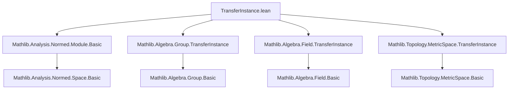

**Technical Brief: `TransferInstance.lean`**

---

### 1. **Key Definitions & Theorems**

| Name | Type / Signature | Purpose |
|------|------------------|---------|
| `Equiv.normedField` | `protected abbrev normedField [NormedField β] (e : α ≃ β) : NormedField α` | Transfers a `NormedField` structure from `β` to `α` along an equivalence `e : α ≃ β`, using the `induced` construction via `ringEquiv` and injectivity. |

> **Note**: The definition relies on prior transfers: `e.field` (from `Mathlib.Algebra.Field.TransferInstance`) and `e.ringEquiv` (from `Mathlib.Algebra.Group.TransferInstance`), and uses `induced` (from `Mathlib.Analysis.Normed.Module.Basic`) to lift the normed field structure.

---

### 2. **Naming Conventions**

- **Prefixes**:
  - `normedField`: follows `normed*` naming for normed algebraic structures.
  - `field`, `ringEquiv`, `injective`: inherited from `TransferInstance` hierarchy.
- **Module-level pattern**:
  - `Equiv.*` namespace for transfer lemmas/abbrevs across equivalences.
  - `protected abbrev` used for structure transfers (not proofs), indicating *definition* rather than *lemma*.

---

### 3. **Tactic Stack**

- **No explicit tactics** appear in the visible snippet.
- Implicit tactic usage (via `induced`, `ringEquiv`, etc.) likely involves:
  - `simp`, `rw`, `exact`, `intro`, `apply` — standard for structure transfer proofs.
  - `aesop` or `norm_cast` may be used in underlying `induced` infrastructure (not shown here).
- The `letI := e.field` line suggests typeclass inference (`[NormedField β]`) is used heavily.

---

### 4. **Proof Logic / Construction Strategy**

- **High-level logic**:
  1. Given `e : α ≃ β` and `[NormedField β]`,
  2. Use `e.field` to get a `Field α` (via prior transfer),
  3. Use `e.ringEquiv` (induced by `e`) and `e.injective` (from equivalence),
  4. Apply `.induced` to define the norm on `α` so that `e` becomes a *normed field isomorphism*.
- **Key idea**: Transfer via *induced structure* along a bijection — standard in Lean for transporting algebraic + topological structures.

---

### 5. **Imports**

| Import | Role |
|--------|------|
| `Mathlib.Analysis.Normed.Module.Basic` | Provides `induced` norm construction and basic normed module theory. |
| `Mathlib.Algebra.Group.TransferInstance` | Supplies group/ring transfer (e.g., `e.ringEquiv`, `e.injective`). |
| `Mathlib.Algebra.Field.TransferInstance` | Supplies field transfer (`e.field`). |
| `Mathlib.Topology.MetricSpace.TransferInstance` | Likely for metric/normed space transfer infrastructure (used indirectly). |

> **Scope**: This module extends *structure transfer* from algebraic (group, ring, field) and topological (metric, normed) settings to *normed fields*.

---

### 6. **Mermaid Diagrams**

#### **Dependency Graph (Module-Level)**



#### **Overview of File Content**

```mermaid
flowchart LR
  subgraph "Input"
    β [β : Type*] 
    e [e : α ≃ β]
    NFβ [NormedField β]
  end

  subgraph "Construction"
    e.field [e.field : Field α]
    e.ringEquiv [e.ringEquiv : Ring α ≃+* Ring β]
    induced [induced norm via e]
  end

  subgraph "Output"
    NFα [NormedField α]
  end

  β --> e
  e --> NFβ
  NFβ --> e.field
  e.field --> e.ringEquiv
  e.ringEquiv --> induced
  NFβ --> induced
  induced --> NFα
```

---

### Summary

This file completes the transfer of `NormedField` structures across equivalences, building on a chain of `TransferInstance` modules. It exemplifies Lean’s *structure transport* pattern: use bijections (`Equiv`) to induce algebraic + analytic structure on isomorphic types, ensuring the equivalence becomes an isomorphism of the transferred structure. The core mechanism is the `induced` norm (from `NormedModule.Basic`) applied to the ring isomorphism induced by the equivalence.
